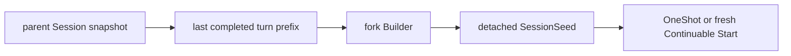

# Fork Seed Builder

本包实现 `fork` SeedBuilder。它复制 parent Session 截至最后一个 `turn/end` 的完整前缀，排除当前尚未完成的 turn；没有已完成 turn 时等价于 fresh child。

prefix 是 detached event snapshot。Continuable 只在首次创建时调用 Builder；后续 cold resume 重放 child 自己的持久化历史。Plugin 只拥有 Builder registration，不拥有 Execution 或 Agent Handle。

跨包契约见[技术方案](../../zh-CN/Subagent架构与生命周期重构技术方案.md)，实现证据见[进度矩阵](../../zh-CN/Subagent重构进度矩阵.md)。
