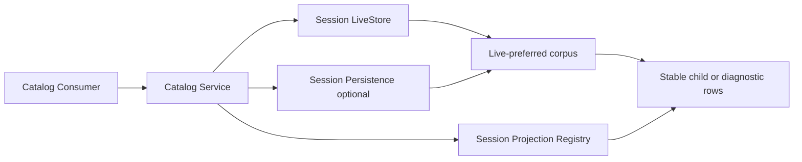

# Subagent Catalog

本包实现只读的 durable Subagent 目录。它从 `session.LiveStore` 与可选 `session/persistence.Persistence` 构造一次 live-preferred Session 语料，通过 Session Projection Registry 解释 `subagent` identity，并实现 `ListChildren` 与 `ListDescendants`。普通 Session 与 one-shot child 会继续作为树遍历节点，但只有 `origin=subagent` 的候选会产生目录项。

本包不恢复或创建 Agent，不读取 Provider Registry、Activation 或 continuation residency，也不解析完整 descriptor 来泄漏 provider、persona、模型或 Tool restriction。列表只返回 mode、label、Session activity 和 `hasChildren`；单个候选的损坏或读取失败被收敛为 diagnostic。

live Session 直接读取 Registry 的同一切面 snapshot；cold Session 以最多四个并发 inspection 读取完整日志，再由 Registry 从 seq 0 权威重折叠。inspection header 必须与枚举时的 lifecycle witness 一致，否则该候选标记为 `corrupt`。live child 尚未产生 identity 时属于创建窗口并暂不返回；cold child 缺少可信 identity 时标记为 `corrupt`。

Sibling 先按 `createdAt` 升序，再按固定 en-US collation 比较 `SessionId`，与固定源的默认 `localeCompare` 观测一致；Unicode collation 相等时保留 live-preferred corpus 中该 ID 的首次插入次序。persisted record 被同 ID live Session 覆盖时只替换内容，不改变这个次序。

调用取消在全局读取和每个 cold inspection 周围检查，并统一映射为 `CANCELLED`。Persistence 的全局 `List` 失败会终止整个查询；单个 `Inspect` 失败只产生 `unavailable` diagnostic。缺少 Projection Registry 或 LiveStore 分别返回稳定的 control error。

跨包契约见[领域设计](../../docs/design.zh-CN.md)，实现证据见[进度](../../docs/implementation-progress.zh-CN.md)。
