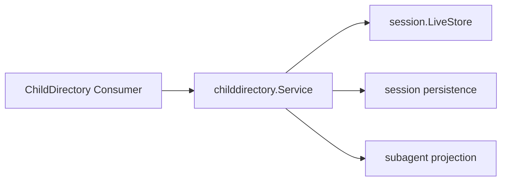

# Child Directory

本包实现公开 `subagent.ChildDirectory`。它合并 live Session、持久化 Header/Event 和 Subagent Projection，返回 direct children 或完整 descendants 的只读快照。

live Session 优先于同 ID 的持久记录；cold inspection 有固定并发上限。单个候选损坏、版本不支持或读取失败被收敛为该候选的 diagnostic entry，不污染其他结果。Context 取消或全局依赖缺失才使整个查询失败。

本包不创建或恢复 Agent，不处理执行准入，也不把目录快照当作控制授权。跨包契约见[技术方案](../../../zh-CN/Subagent架构与生命周期重构技术方案.md)，实现证据见[进度矩阵](../../../zh-CN/Subagent重构进度矩阵.md)。
