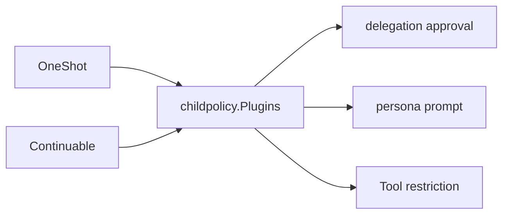

# Child Policy

本包把 Subagent 的 delegation approval、persona 和 Tool restriction 转换成 child-scoped Plugin，供 OneShot 与 Continuable 共用。它只拥有这三项 policy adapter 及其确定顺序。

fresh child 可以写入 delegation approval override；cold resume 已从 Session 重放该 durable policy，因此不会再次 seed。persona 与 Tool restriction 在每个 resident Agent Scope 中重新安装。

本包不组合 Provisioner，不创建 Agent，也不拥有 OneShot/Continuable 生命周期。模式专属 provisioning 分别位于 `internal/oneshot` 和 `internal/continuable`。跨包契约见[技术方案](../../../zh-CN/Subagent架构与生命周期重构技术方案.md)，实现证据见[进度矩阵](../../../zh-CN/Subagent重构进度矩阵.md)。
