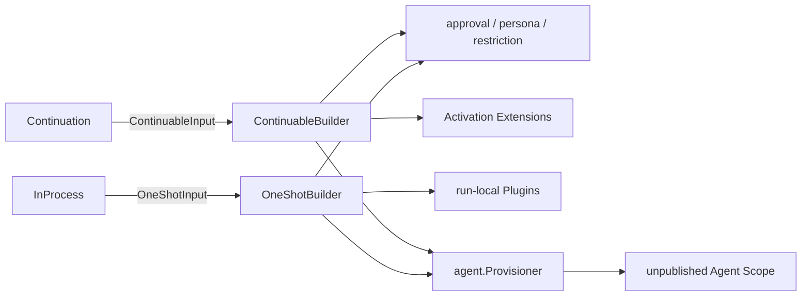

# Child Scope

本包决定一个尚未发布的 Subagent child Scope 安装什么能力。`ContinuableBuilder` 与 `OneShotBuilder` 是两个独立对象：前者组合 Activation Extension，后者组合 run-local Plugin；两者只共享 fresh child 的 delegation policy、persona 与 Tool restriction 解释。

本包拥有 `ContinuableInput`、`OneShotInput` 和对应 `agent.Provisioner` 的构造，不拥有 child identity 分配、Agent 创建、Run/Activation 生命周期、Provider 选择或 Extension registration。

任一 Provisioner part 失败时，本包用非取消上下文逆序释放尚未转交的 `agent.Provisioning`；已转交 Scope 的 Plugin effect 由 Agent 创建事务回滚。cold resume 不重复写 durable delegation policy，但会从 descriptor 恢复 persona 与 Tool restriction。

跨包合同见[领域设计](../../docs/design.zh-CN.md)，实现证据见[进度](../../../zh-CN/08-implementation-progress.md)。
