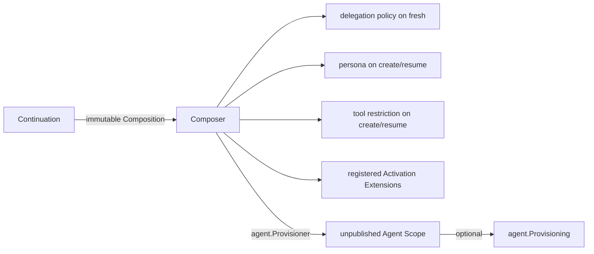

# Child Composition

本包决定 continuable child 的未发布 Scope 包含什么：fresh creation 才写 delegation approval policy，fresh 与 cold resume 都恢复 descriptor 中的 persona 和 Tool restriction，并在最后组合 `internal/extension` 的 child-scoped 能力。它不拥有 child identity、Activation residency、Agent publication 或 Extension registration。

任一部分 Provision/Commit 失败时，组合对象按逆序释放已取得的 Provisioning；已经转交 Scope 的 effect 最终由 Agent 创建事务回滚整棵树。跨包 contract 见[领域设计](../../docs/design.zh-CN.md)，实现证据见[进度](../../docs/implementation-progress.zh-CN.md)。
