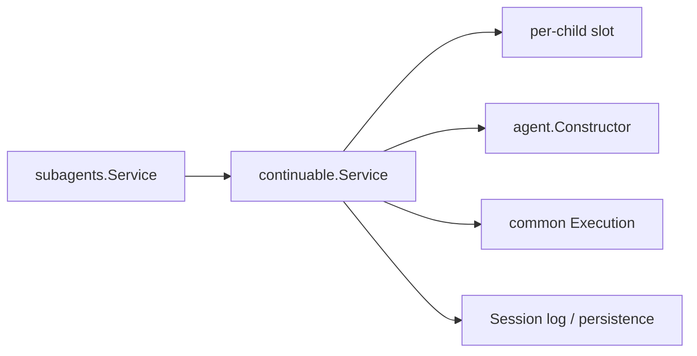

# Continuable

本包是 Continuable Subagent 的具体实现。它拥有 fresh create、durable child cold resume、per-child 串行化、后续消息、报告、当前 turn 中断和 resident epoch settlement。

`childSlot` 只串行化同一 durable child 的 materialization；它不是第二套 Agent registry。每次 resident epoch 都使用 common `Execution`，Agent 仍拥有 exact epoch、运行父子关系、Inbox、状态和 Scope。cold resume 不再次调用 SeedBuilder，而是从 authoritative descriptor 和 Session log 重建。

关闭准入只由统一 `subagents.Service` 负责；它等待已准入调用退出后才调用本 Service 的 `Close`。Continuable `Close` 只停止当前 Executions，并等待 exact Agents 进入 Closing；不维护第二套模块准入状态，不递归关闭 descendants，也不执行 Plugin Scope teardown。创建与恢复分别调用本包拥有的 `EnvironmentBuilder` 端口；policy Plugin 与 Extension Provisioner 的组合位于 `subagent/plugin`。跨包契约见[技术方案](../../../zh-CN/Subagent架构与生命周期重构技术方案.md)，实现证据见[进度矩阵](../../../zh-CN/Subagent重构进度矩阵.md)。
