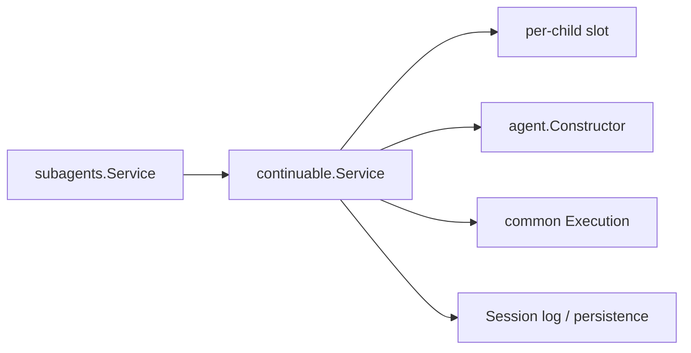

# Continuable

本包是 Continuable Subagent 的生命周期实现。它拥有 fresh create、durable child cold resume、per-child materialization 串行化、当前 turn 中断和 resident epoch settlement。

`childSlot` 只串行化同一 durable child 的 materialization；它不是第二套 Agent registry。每次 resident epoch 都使用 common `Execution`，Agent 仍拥有 exact epoch、运行父子关系、Inbox、状态和 Scope。resident 消息由统一 Service 直接调用 child `agent.Agent`；cold resume 不再次调用 SeedBuilder，而是从 authoritative descriptor 和 Session log 重建，并在发布新 Execution 前原子接受首条消息。并发恢复若先观察到已经 resident 的 exact child，也仍通过该 child Agent 的 `Followup` 收口。

本包不实现 child-to-parent report。report Tool 根据当前 child Agent 的 Session parent identity 查找 exact live parent，再直接使用 parent Agent 的 Inbox 能力；OneShot 与 Continuable 共用该路径。

关闭准入只由统一 `subagents.Service` 负责；它等待已准入调用退出后才调用本 Service 的 `Close`。Continuable `Close` 只停止当前 Executions，并等待 exact Agents 进入 Closing；不维护第二套模块准入状态，不递归关闭 descendants，也不执行 Plugin Scope teardown。创建与恢复分别调用本包拥有的 `EnvironmentBuilder` 端口；policy Plugin 与 Extension Provisioner 的组合位于 `subagent/plugin`。跨包契约见[技术方案](../../../zh-CN/Subagent架构与生命周期重构技术方案.md)，实现证据见[进度矩阵](../../../zh-CN/Subagent重构进度矩阵.md)。
