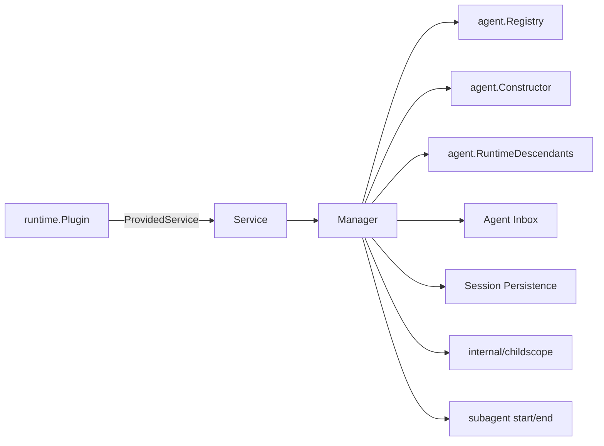

# Continuation

本包拥有 continuable child 的创建与冷恢复、exact parent authorization、唯一 Inbox 投递、Activation residency、interrupt、report、settlement 和模块卸载关闭策略。Session log 是 durable truth；`Activation` 只表示一个进程内驻留 epoch。运行期父子关系、descendant admission、构造等待和 child-first 关闭由 `agent.LifecycleCoordinator` 拥有；Manager 只通过 Agent 模块统一定义的只读 `agent.RuntimeDescendants` 查询当前 Agent 是否还有运行中后代，以决定是否可以 settlement。

稳定的 `Service` 实现 `ContinuableService`，并在 Plugin activation 期间启用一个 `Manager`；缺少可选 Agent Registry 或 Session LiveStore 时，Service 保持可解析但 continuable 操作返回稳定 unavailable 错误。`Manager` 通过 consumer-owned ports 使用 Agent Registry、Session LiveStore、Persistence、Provider Registry、`ScopeBuilder`、生命周期发布器与 contained failure reporter。它不实现 Agent Loop、Provider 算法、持久化 I/O，也不拥有 Extension registration、child Scope 内容或 Catalog。

| 文件 | 职责 |
| --- | --- |
| `service.go`、`service_api.go`、`service_events.go` | 稳定 capability、Manager 启停、Consumer API 与 Agent Event 入口 |
| `manager.go` | 依赖端口与进程内 continuation coordinator |
| `activation.go` | `activationRegistry`、Activation、per-child lock 与模块级关闭准入状态 |
| `manager_start.go`、`manager_materialization.go` | fresh Start、cold resume 与 Handle publication |
| `manager_delivery.go` | Followup、Interrupt、Report 与 Inbox acceptance |
| `manager_settlement.go` | idle convergence 与 parent settlement notice |
| `manager_disposal.go`、`failures.go` | memoized Activation release transaction 与 contained asynchronous failure |
| `outcome.go`、`output.go` | Activation event suffix 的 StopReason 映射与最终输出捕获 |
| `manager_admission.go` | child identity、exact parent 与模块关闭准入校验，以及 per-child serialization |
| `manager_close.go` | Plugin 卸载时为 resident Activation 发起 managed close 请求 |
| `start_request.go`、`start_descriptor.go` | caller input snapshot、descriptor 与 Provider preparation |
| `identity.go`、`errors.go` | Session/Run identity 与稳定操作错误 |

取消调用只影响 Inbox 接受前的 admission。`Interrupt` 使用 `KeepInbox=true` 发出取消后立即返回。Continuation 不公开 selected-child 或 descendant close 命令；自然 settlement 和 Plugin 卸载都只释放 Manager 持有的 exact `agent.Handle`，父级关闭与 child-first 顺序由 Agent 生命周期自行传播。`RequestClose` 关闭模块准入，为 resident Activation 分别启动 managed close，并只等待各 exact Agent 进入 `Closing`。自然 settlement、Plugin 卸载请求与外部 Agent disposal 都以同一个 `disposal` 状态收敛 Activation 业务结果。

跨包合同见[领域设计](../../docs/design.zh-CN.md)，实现证据见[进度](../../../zh-CN/08-implementation-progress.md)，服务端测试暴露的问题见[问题记录](../../docs/server-test-findings.zh-CN.md)。
