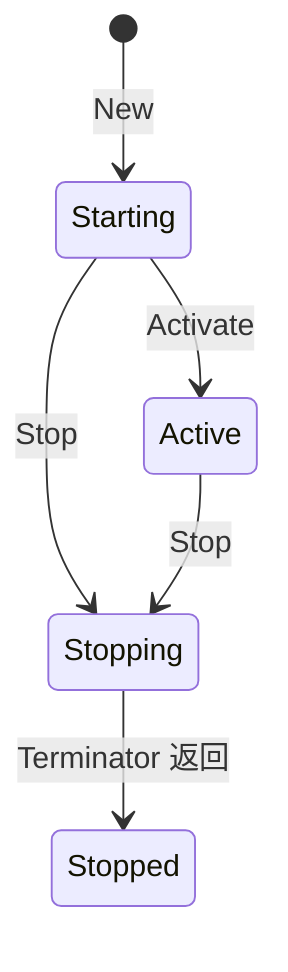
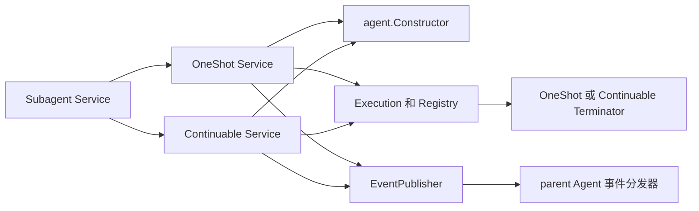

# Subagent Execution

本包保存 OneShot 与 Continuable 当前正在运行的 Subagent，并保证同一次运行只执行一次结束处理。它还提供两种实现共同使用的最终 assistant 输出选择规则。

本包不创建或恢复 Agent。OneShot 或 Continuable 先通过 `agent.Constructor` 得到 child Agent，再创建本包的 `Execution`。本包也不写 Session，不决定何时给 child Agent 发送消息，不决定 Continuable 是否可以再次恢复。

## 本文术语

- **parent Agent**：发起 Subagent 请求的 Agent，也是接收 `subagent/start`、`subagent/end` 以及 Continuable 完成通知的 Agent。
- **child Agent**：为执行 Subagent 请求而创建或恢复的 Agent。它的 ID 与其 Session ID 相同。
- **child Session**：child Agent 使用的 Session。Session 事件可以持久化；本包保存的 `Execution` 和 `Registry` 内容只存在于当前进程。
- **OneShot**：创建 child Agent、完成一次请求并释放该 Agent 的实现。结束后不能用同一个 OneShot 执行继续发送消息。
- **Continuable**：创建或恢复 child Session 的实现。一次运行结束后释放当前 child Agent，但保留 child Session，后续消息可以从该 Session 创建新的运行。
- **一次运行**：从一个 child Agent 接受本次第一条消息开始，到该 child Agent 的结束处理完成为止。Continuable 每次恢复都会产生新的一次运行。
- **`RunID`**：一次运行的标识，只用于配对该次运行的 `subagent/start` 和 `subagent/end`。它不是 child Session ID；同一个 Continuable child Session 的不同运行具有不同 `RunID`。
- **`Terminal`**：一次运行的最终结果，包含 assistant 输出、可选结构化输出、可选诊断信息和对调用方可见的停止原因。

## `Execution`：一次运行的状态与最终结果

`Execution` 是一次运行的进程内状态对象。它保存：

- `RunID`；
- child Session ID；
- `ExecutionState`；
- 一个由 OneShot 或 Continuable 实现的 `Terminator`；
- 一个完成信号；
- `Terminator` 最终返回的 `Terminal` 和 error。

`Execution` 负责以下行为：

1. `New` 校验 `RunID`、child Session ID 和 `Terminator`，创建 `Starting` 状态的对象。
2. `Activate` 只允许把 `Starting` 改为 `Active`。OneShot/Continuable 在 child Agent 已接受本次第一条消息后调用它。
3. `Stop` 接受停止原因。第一次调用把状态改为 `Stopping`，并异步调用一次 `Terminator.Terminate`；后续调用不会再次执行结束处理。
4. `Terminate` 返回后，`Execution` 复制并保存 `Terminal`，保存 error，把状态改为 `Stopped`，然后通知所有等待者。
5. `AwaitTerminal`、`Dispose` 和 `StopAndWait` 都读取同一份已保存结果，不会各自生成结果。

`Execution` 不复制 Agent 自身的运行状态，不保存 Session 事件，不拥有 Agent 的消息队列，也不持有 Agent 创建或恢复所返回的 `agent.Handle`。这些对象由 OneShot 或 Continuable 持有。

## `Terminator`：两种实现各自完成结束处理

`Terminator` 只有一个方法：

```go
Terminate(context.Context, StopCause) (subagent.Terminal, error)
```

`Execution` 决定该方法只调用一次；OneShot 和 Continuable 决定具体做什么。

OneShot 的实现按以下顺序结束一次运行：

1. 如果不是正常完成，取消 child Agent 当前工作；
2. 等待 child Agent 不再执行模型或工具步骤；
3. 从本次运行产生的 Session 事件生成 `Terminal`；
4. 发布 `subagent/end`；
5. 从 `Registry` 删除这次运行；
6. 如果 child Agent 不是已经由 Agent 关闭流程释放，则释放它的 `agent.Handle`。

Continuable 的实现按以下顺序结束一次运行：

1. 如果不是正常完成或等待消息结束，取消 child Agent 当前工作；
2. 等待 child Agent 不再执行模型或工具步骤；
3. 请求 Session Service 刷新 child Session；
4. 从本次运行产生的 Session 事件生成 `Terminal`；
5. 向仍然存在的 parent Agent 发送完成通知；
6. 发布 `subagent/end`；
7. 从 `Registry` 删除这次运行；
8. 如果 child Agent 不是已经由 Agent 关闭流程释放，则释放它的 `agent.Handle`；
9. 清除 Continuable 保存的当前运行，使后续消息可以恢复同一个 child Session。

`StopCause` 是传给 `Terminator` 的内部原因：正常完成、child Agent 已空闲且没有待处理消息和运行中的后代、interrupt、调用方 `Dispose`、Subagent Service 关闭，或者 Agent 关闭流程已经开始。`StopReason` 是写入 `Terminal` 的调用方可见结果，例如 `completed`、`aborted` 或 `error`。二者用途不同，不能相互替代。

## `Registry`：按 child Session ID 查找当前运行

`Registry` 是一个进程内 map，一个 child Session ID 最多对应一个当前 `Execution`。`Entry` 保存：

- `Execution`：要等待或停止的当前运行；
- `Mode`：`one-shot` 或 `continuable`，供公共 Subagent Service 把 interrupt 路由给对应实现；
- `Parent`：创建这次运行的 parent Agent，供 interrupt 检查调用方是不是允许控制该 child；
- `Subject`：本次运行使用的 child Agent，供 Agent 关闭事件确认被关闭的是同一个 Agent 对象，而不只是 ID 相同；
- `Closing`：child Agent 开始关闭时会关闭的 channel，供 OneShot Service 在模块关闭时等待 Agent 进入关闭过程。

`Publish` 只接受 `Active` 状态的 `Execution`，并检查 `Execution.ChildID()` 等于 `Subject.ID()`。如果同一个 child Session ID 已有当前运行，发布失败。

`Find` 供公共 Subagent Service、OneShot 和 Agent 关闭事件查找当前运行。`List` 只用于 OneShot Service 关闭时取得当前 OneShot 运行的快照，不承诺返回顺序。`Remove` 同时比较 child Session ID 和 `Execution` 指针，保证旧运行结束较晚时不会删除同一 child Session 后来创建的新运行。

`Registry` 不是 child Session 目录。进程重启后，它不会从持久化数据恢复；持久 child Session 的查询由 `internal/childdirectory` 负责。

## `EventPublisher`：把生命周期事实交给 parent Agent

`EventPublisher` 是业务代码消费、Runtime Plugin 实现的内部接口：

- `PublishStarted(parent, fact)` 把 `subagent.Started` 发送到 parent Agent 的运行时事件分发器；
- `PublishEnded(parent, fact)` 把 `subagent.Ended` 发送到同一个分发器。

OneShot/Continuable 在 `Execution` 已放入 `Registry` 后发布 started，在 `Terminator` 生成 `Terminal` 后发布 ended。`Execution` 状态对象不依赖 Plugin，也不直接发送事件。当前事件分发是通知，不参与 `Execution` 状态提交；监听者失败不会回滚已创建或已结束的运行。

## 最终 assistant 输出选择

`SelectAssistantOutput(events)` 接收调用方已经截取好的“本次运行产生的 Session 事件”：

1. 顺序解析 `assistant/message` 和 `assistant/chunk`；
2. 如果存在非空的完整 assistant message，返回最后一个非空完整消息；
3. 如果没有非空完整消息，拼接所有 text delta；
4. reasoning delta、Tool result 和其他事件不作为退化输出；
5. 事件 JSON 不合法、位置字段不合法或事件内容类型不匹配时返回 error。

OneShot 和 Continuable 自己决定事件从哪里开始，本包不推断起点。这样既复用同一套输出规则，也不会把两种实现不同的 Session 边界塞进 `Execution` 状态对象。

## 状态变化



- `Starting`：对象已创建，但还没有发布到 `Registry`；
- `Active`：可以发布到 `Registry`，公共控制接口可以查找到它；
- `Stopping`：某个 `StopCause` 已经取得唯一结束权，`Terminator` 正在执行；
- `Stopped`：`Terminal` 和 error 已保存，所有等待者都可以返回。

## 等待、取消与错误传播

- `AwaitTerminal(ctx)` 只等待结果。`ctx` 取消只结束当前等待，不会停止 child Agent 或 `Execution`。
- `Dispose(ctx)` 请求 `StopDisposed`，然后等待结束结果；它不会删除 Continuable 的 child Session。
- `StopAndWait(ctx, cause)` 供内部关闭流程使用。它请求停止，并等待同一个结束处理完成。
- 第一次 `Stop` 启动结束处理后，`Terminator` 使用独立的 `context.Background()`。等待者的 Context 取消不会中断已经开始的资源释放和索引删除。
- `Terminal` 中的 `Output`、`Structured` 和 `Diagnostic` 在保存和返回时会复制，调用方不能修改其他等待者看到的结果。
- `Terminator` 返回的 error 被保存并返回给所有后续等待者。事件监听者错误不通过 `EventPublisher` 返回，因此不进入这个 error。
- Continuable 的最后一次 Session 刷新失败会交给其失败报告接口，不会覆盖已经计算出的 `Terminal`；本包不负责处理该报告。

## 与其他包的调用关系



- `agent.Constructor` 创建或恢复 Agent；本包不调用它。
- OneShot/Continuable 创建、激活并发布 `Execution`，也实现 `Terminator`。
- 公共 Subagent Service 通过 `Registry` 完成 interrupt 授权、实现选择以及 Agent 关闭通知。
- Runtime Plugin 实现 `EventPublisher`，只把业务事实接到 Agent 事件机制。
- Session 保存可持久化事件；本包只读取 OneShot/Continuable 传入的事件片段。

跨包稳定契约见[技术方案](../../../zh-CN/Subagent架构与生命周期重构技术方案.md)，当前实现和验证证据见[进度矩阵](../../../zh-CN/Subagent重构进度矩阵.md)。
