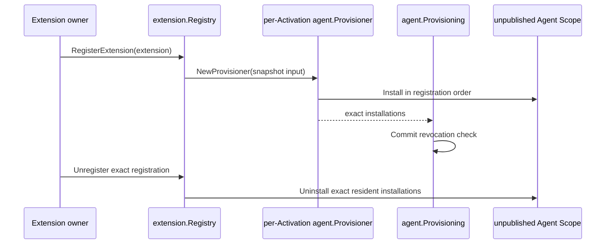

# Activation Extension

本包拥有 continuable `ActivationExtension` 的有序 registration、per-Activation installation、publication commit 撤销复核和 resident child 的即时精确撤销。`Registry` 实现 `ExtensionRegistry` 并由 runtime Plugin 发布；它不决定具体扩展内容，不操作 Plugin Runtime binding，也不创建或恢复 Agent。

固定 DSH 基线把这项能力称为 `registerContinuableSetup` 和 `AgentSetupCommit`。Go 实现保留可观察错误码 `ACTIVATION_SETUP_REVOKED`、安装顺序与撤销语义，但用 Extension 表达 child-scoped 能力，用 Provisioning 表达 Agent 发布事务，避免一个 `Setup` 名称同时承担两种职责。

Provision 失败会在返回前释放未转交 Scope 的 partial installations。撤销先关闭 registration，再尝试释放全部 installation；失败聚合为稳定 Subagent error。child teardown 与 registration removal 汇合到同一幂等 installation。跨包 contract 见[领域设计](../../docs/design.zh-CN.md)，实现证据见[进度](../../docs/implementation-progress.zh-CN.md)。
