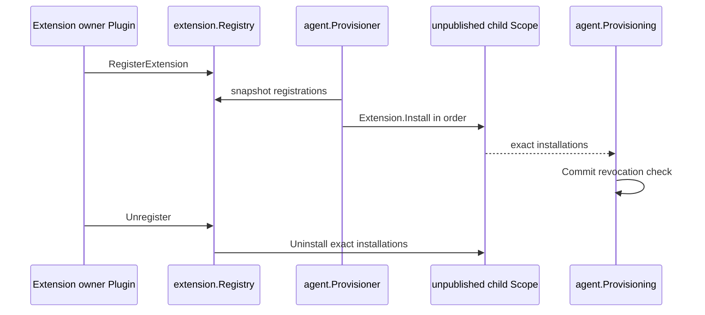

# Continuable Extension Registry

本包拥有 `ContinuableExtension` 的有序 registration，以及每个 unpublished continuable Agent Scope 的 installation、publication commit 复核和精确撤销。

`Registry` 实现公开 `ExtensionRegistry`。它只保存 Extension registrations 和已经安装的 exact effects；它不决定 Extension 内容，不参与 Plugin lifecycle，也不创建或恢复 Agent。

Extension 与当前 exact Agent epoch 一一安装，但不再称为 Activation Extension。Go 使用 `ContinuableExtension` 表达 child-scoped contribution，使用 `Provisioner`/`Provisioning` 表达 Agent publication transaction。兼容错误码字符串继续保留，不反向改变 Go 类型命名。

Install 失败会在返回前释放本次已经取得的 partial installations。registration 撤销先标记 removed，使尚未 Commit 的 Provisioning 失败，再撤销已 resident 的 exact installations。child Scope teardown 与 registration removal 都调用同一个幂等 installation release。

跨包契约见[领域设计](../../docs/design.zh-CN.md)，实现证据见[进度矩阵](../../../zh-CN/Subagent重构进度矩阵.md)。
