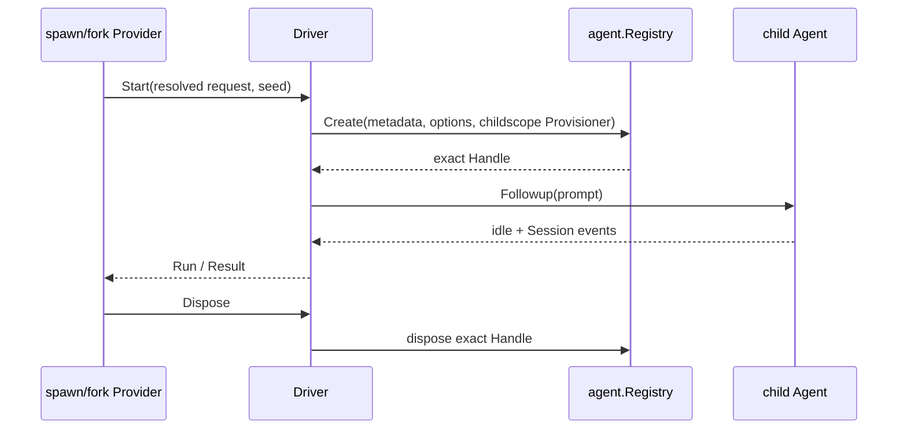

# In-process One-shot Driver

本包建立并驱动一个本地 one-shot child：通过 `agent.Registry.Create` 发布独立 Agent，提交一次 prompt，等待 idle，再从 activation boundary 之后的 Session events 计算 `Result`。spawn 与 fork 只决定 seed；本包统一处理 child identity、lineage、descriptor append、structured output、取消交接和 `Run.Dispose`。

`Start` context 是底层 Run 的取消来源；`AwaitResult` context 只取消等待。Dispose 与 result settlement 并发收敛，返回前等待两者完成。fork seed 之前的历史不会进入结果选择。structured output 只在权威 `tools/result` 成功后提交；Code Mode nested capture 未纳入当前版本。

本包不拥有 Provider registration、one-shot admission、Agent Loop 或 continuable Activation。跨包合同见[领域设计](../../docs/design.zh-CN.md)，实现证据见[进度](../../../zh-CN/08-implementation-progress.md)。
