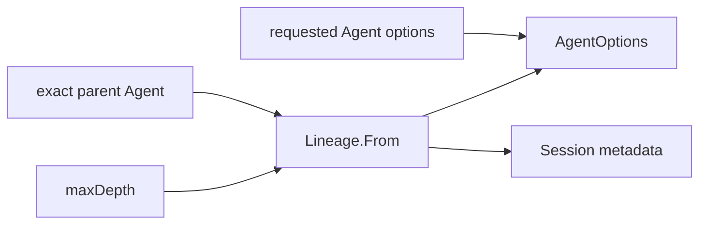

# Child Lineage

本包从 exact parent Agent 推导一个 child 的不可变 lineage：选择 parent options/header 中较深的 delegation depth，检查 `maxDepth` 与安全整数边界，解析 child `agent.Options`，并生成 fresh Session metadata。

one-shot Driver 与 continuation Manager 共同消费本包，避免各自解释 depth、cwd、parent Session、origin、preset 和 seed length。本包不校验 parent 是否仍在 Registry，也不创建 Session 或 Agent；exact-live authorization 仍由调用用例负责。

跨包合同见[领域设计](../../docs/design.zh-CN.md)，实现证据见[进度](../../docs/implementation-progress.zh-CN.md)。
