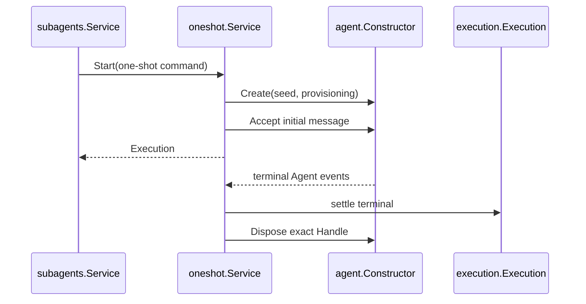

# OneShot

本包是 OneShot Subagent 的具体实现。`Service` 实现统一 Service 私有的 mode implementation 契约：构造 fresh child seed，创建 Agent，接受初始消息，发布 common `Execution`，选择 terminal output，并在 terminal 后自动释放 exact Agent Handle。

本包不拥有 SeedBuilder registration、Continuable cold resume、后续消息或 Plugin publication。它通过自己的 `EnvironmentBuilder` 消费 child-local 环境；descriptor appender、结构化输出 Tool 和 policy Plugin 的具体组合位于 `subagent/plugin`。跨包契约见[技术方案](../../../zh-CN/Subagent架构与生命周期重构技术方案.md)，实现证据见[进度矩阵](../../../zh-CN/Subagent重构进度矩阵.md)。
