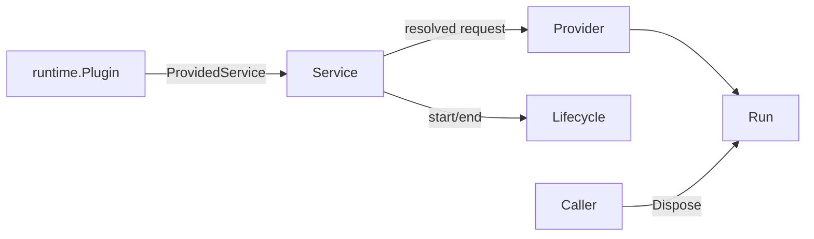

# One-shot

本包拥有 one-shot 请求校验与快照、Provider dispatch、Run 一致性检查及成对 lifecycle observation。`Start` 成功返回后 Run 所有权交给 caller；等待 terminal result 的 goroutine 只负责发布 `subagent/end`，不拥有 Agent Loop。

本包不修改 Provider Registry，不处理 continuable Session、Activation Extension 或 catalog。`Service` 本身实现 `OneShotService` 并由 runtime Plugin 发布；生命周期事实通过 Plugin 事件适配器提供的窄端口发布。

跨包合同见[领域设计](../../docs/design.zh-CN.md)，实现证据见[进度](../../docs/implementation-progress.zh-CN.md)。
