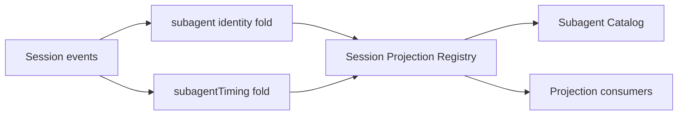

# Subagent Projection

本包拥有 Subagent 注册到 Session Projection Registry 的两个纯投影单元：

- `subagent`：从最新 `subagent/descriptor` 折叠仅含 mode、label、seq 的安全 identity；无效或未知 descriptor 重置为可序列化的 `null`；
- `subagentTiming`：以每个 descriptor 为新边界，累计其后的已结束 turn 时长，并保留当前 open turn 的 `since/through`。

本包不保存 Session、不拥有 projection registry 或 checkpoint 持久化，也不决定 Catalog 的 activity 与 diagnostic。Runtime 只负责在 Plugin activation 时注册单元、在 Dispose 时逆序释放 registration。

两个单元的 state version 都是 `2`。Checkpoint state 和 wire view 使用严格 JSON 解码；未知字段、非法 variant、负 timing 或 malformed state 会使 Registry fold 失败，由上游读取者按自己的隔离策略处理。Identity 采用 last-wins，是因为 fork seed 可能带有 ancestor descriptor，而 child 自己的 descriptor 必须覆盖它。

跨包契约见[领域设计](../../docs/design.zh-CN.md)，实现证据见[进度](../../docs/implementation-progress.zh-CN.md)。
