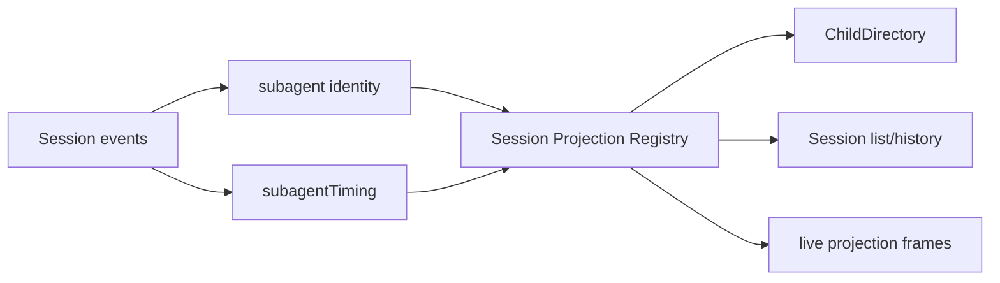

# Subagent Projection

本包定义 Subagent 注册到 Session Projection Registry 的两个纯投影单元：

- `subagent`：从最新 `subagent/descriptor` 折叠 mode、label、seq；无效或未知 descriptor 把 view 重置为 `null`；
- `subagentTiming`：以每个 descriptor 为 child 自身边界，累计之后已结束 turn 的时长，并保留当前 open turn 的 `since/through`。

本包拥有 projection 定义和对应 value codec；Session Projection Registry 拥有每个 Session 的 state、checkpoint、Snapshot、Restore 和 change publication。Runtime Plugin 通过 `Units()` 注册/释放本包的完整 Unit 集合，不知道具体 Unit。ChildDirectory 通过 `ReadIdentity()` 读取 identity，不知道 projection key 或 raw JSON codec；完整 values 还会通过 Session API 和 live frames 对外发布，因此 timing 不是内部死代码。

两个 Unit 的 state version 都是 `2`。Checkpoint state 和 wire view 使用严格 JSON 解码；损坏 state 使 fold/restore 失败，由具体 Consumer 决定是返回错误还是隔离为 diagnostic。

Identity 使用 descriptor last-wins，因为 fork seed 可能带有 ancestor descriptor，而 child 自己的 descriptor 必须覆盖它。Continuable resume 则先按 `Header.SeedLength` 排除 seed，再读取当前 child descriptor；不能用一个不带边界信息的 fold 替代两者。

具体 Unit、key 和 raw codec 均为包内实现；`Units()` 是 Runtime 的 registration seam，`ReadIdentity()` 是 ChildDirectory 的 read seam。两者不公开可让 Consumer 自行选择投影规则的接口。当前验证证据见[进度矩阵](../../../zh-CN/Subagent重构进度矩阵.md)，跨包契约见[领域设计](../../docs/design.zh-CN.md)。
