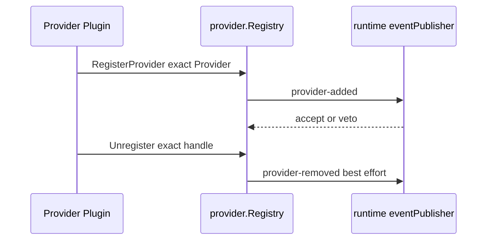

# Provider Registry

本包拥有 Provider 的精确注册、稳定顺序、重复名称拒绝和 registration 幂等撤销。注册先进入可见表，再经 runtime Plugin 的事件适配器发布 vetoable `provider-added`；发布失败回滚。撤销先提交删除，再 best-effort 发布 `provider-removed`。

它不拥有 Plugin 生命周期、one-shot admission 或 continuable 状态。Registry 本身实现 `ProviderRegistry`，由 `subagent/runtime.Plugin` 发布，Plugin 不转发它的业务方法。

跨包合同见[领域设计](../../docs/design.zh-CN.md)，实现证据见[进度](../../../zh-CN/08-implementation-progress.md)。
