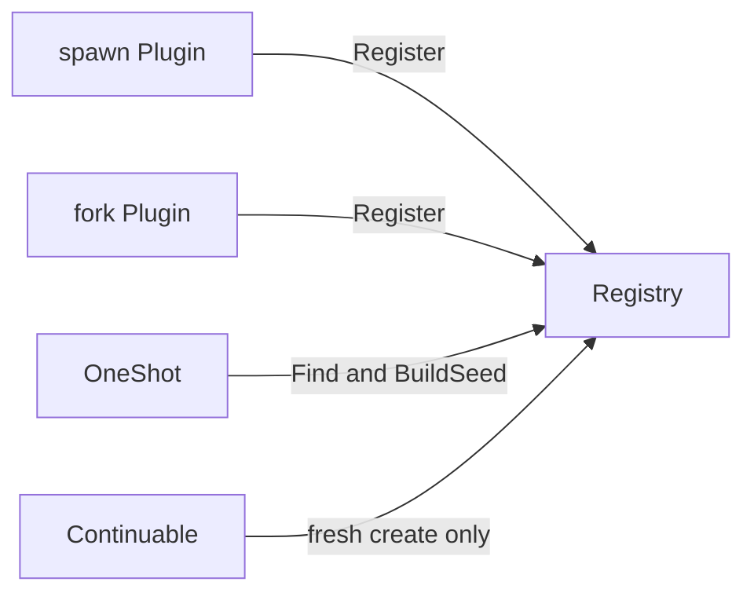

# Seed Builder Registry

本包拥有 `SeedBuilder` 的名称唯一性、精确 registration 和 added/removed 事件边界。Builder 只生成首次创建 child Session 时使用的 `SessionSeed`；seed 自己持有 event prefix 快照，Registry 不复制或解释内容。

added 事件失败会回滚未发布 registration；removed 事件发生在移除提交后并按 best-effort 观察。Registry 不创建 Agent、不持有 Execution，也不因 Builder 卸载而停止已启动的 child。固定源事件与配置中的 `provider` 字段仅作为兼容名称保留。跨包契约见[技术方案](../../../zh-CN/Subagent架构与生命周期重构技术方案.md)，实现证据见[进度矩阵](../../../zh-CN/Subagent重构进度矩阵.md)。
