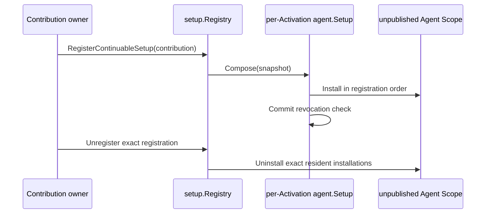

# Setup Registry

本包拥有 continuable Setup 的有序 registration、per-Activation installation、commit-time 撤销复核和 resident child 的即时精确撤销。Registry 本身实现 `SetupRegistry` 并由 runtime Plugin 发布；它不决定具体贡献内容，不操作 Plugin Runtime binding，也不创建或恢复 Agent。

撤销先关闭 registration，再尝试释放全部 installation；失败聚合为稳定 Subagent error。child teardown 与 registration removal 汇合到同一幂等 installation。跨包 contract 见[领域设计](../../docs/design.zh-CN.md)，实现证据见[进度](../../docs/implementation-progress.zh-CN.md)。
