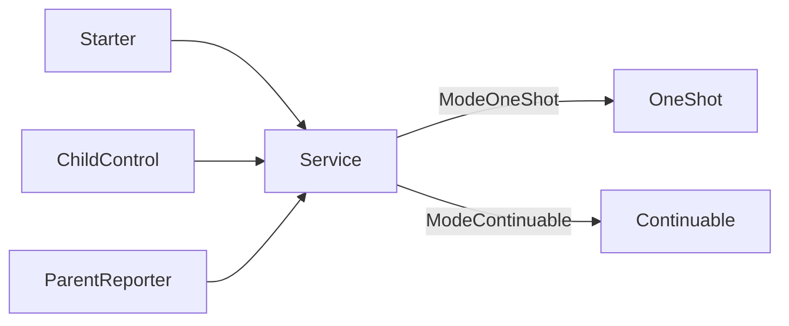

# Subagents Service

本包拥有统一的 Subagent 应用服务。`Service` 以 `Mode -> implementation` 映射选择 OneShot 或 Continuable，不在公开结构中枚举具体实现，也不向 Consumer 暴露两套 Service。

Service 拥有模块级准入状态、已准入调用计数、公共 interrupt lookup 与 ancestor authorization，以及实现的逆序关闭。`Open` 只接收实现集合；实现 `Send` 或 `Report` 的对象会分别成为唯一的消息处理者和报告处理者，重复或缺失都会拒绝打开。调用方不需要把同一个 Continuable Service 以多个参数重复传入。

Service 不拥有 mode-specific 创建、恢复、消息投递或 terminal 规则。

`Close` 先从 accepting 转为 closing，等待已经取得准入的调用返回，再调用实现的 `Close`；重复关闭 join 同一结果。跨包契约见[技术方案](../../../zh-CN/Subagent架构与生命周期重构技术方案.md)，实现证据见[进度矩阵](../../../zh-CN/Subagent重构进度矩阵.md)。
