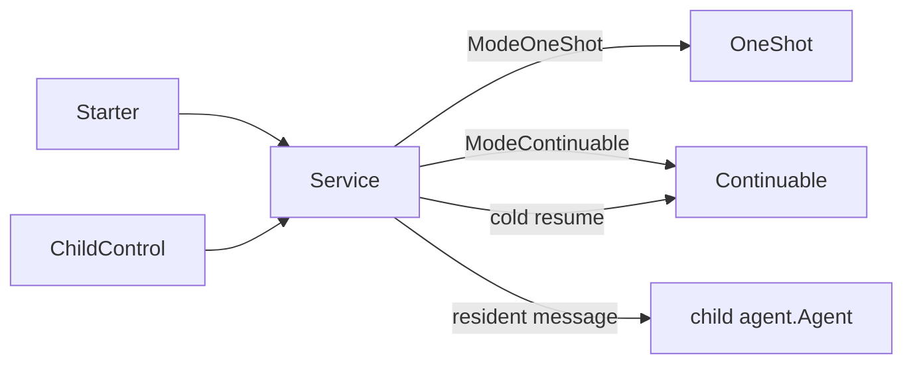

# Subagents Service

本包拥有统一的 Subagent 应用服务。`Service` 以 `Mode -> implementation` 映射选择 OneShot 或 Continuable，不在公开结构中枚举具体实现，也不向 Consumer 暴露两套 Service。

Service 拥有模块级准入状态、已准入调用计数、公共 live Execution lookup、parent/ancestor authorization，以及实现的逆序关闭。`Open` 只接收 `Mode -> implementation` 实现集合；重复 Mode 会拒绝打开，不扫描或缓存实现对象上的附加消息接口。

resident OneShot 与 Continuable 都是普通 child Agent，`Send` 校验 exact parent 后直接调用 `Entry.Subject.Followup`，不读取或解释 Execution 状态，也不等待 `Stopping`；Agent 如何接受、排队或拒绝消息由 Agent 自己决定，Service 只返回投递错误。找不到 resident Execution 时，Service 才把 durable materialization 交给注册的 Continuable 实现；OneShot 不提供 cold resume。Service 不拥有 mode-specific 创建、恢复事务或 terminal 规则，也不承担 child-to-parent report。

`Close` 先从 accepting 转为 closing，等待已经取得准入的调用返回，再调用实现的 `Close`；重复关闭 join 同一结果。跨包契约见[技术方案](../../../zh-CN/Subagent架构与生命周期重构技术方案.md)，实现证据见[进度矩阵](../../../zh-CN/Subagent重构进度矩阵.md)。
