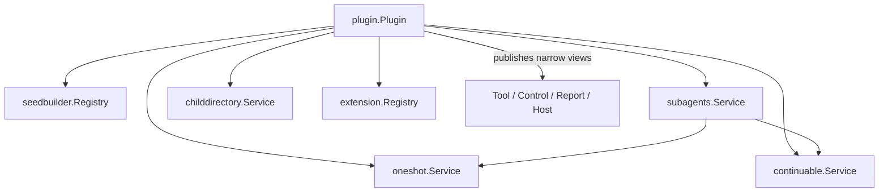

# Subagent Plugin

`plugin.Plugin` 是 Subagent 领域的 Plugin 装配入口。它解析 Agent、Session、Approval 和 Projection 能力，构造普通 Go 业务对象，并发布 `SeedBuilderRegistry`、`Starter`、`ChildControl`、`ParentReporter`、`ExtensionRegistry` 和 `ChildDirectory`。本包不代表或拥有整个 Plugin Runtime。

Apply 顺序是：解析依赖、注册 Projection、启用 ChildDirectory、构造两种实现、最后打开统一 Service 准入。任一步失败都会撤销已取得效果。Plugin 不实现 Start、Send、Report、Interrupt、settlement 或目录查询。

Dispose 先调用统一 Service `Close`：关闭新准入、等待已准入调用返回、让 Continuable 与 OneShot 请求其 exact Agent 停止，并只等待 `ClosingSignal`。它不在当前 Plugin topology 操作中递归卸载 child Scope。随后本 Plugin 停用 ChildDirectory、清理 Extension/SeedBuilder registration，并释放 Projection handle。

`agent/disposed` 是本 Plugin 唯一转接给业务 Service 的 Agent 事件，用来结算由 Agent 结构关闭触发的 exact Execution。跨包契约见[技术方案](../../zh-CN/Subagent架构与生命周期重构技术方案.md)，实现证据见[进度矩阵](../../zh-CN/Subagent重构进度矩阵.md)。
