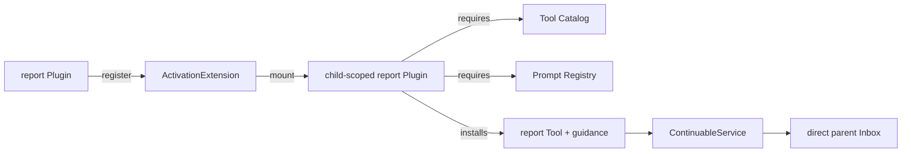

# Subagent Report

本包由 host-plane Plugin 注册一个 `ActivationExtension`。Extension 在每个 unpublished continuable child Scope 中安装 child-local `report` Tool 与提示词；child 调用 Tool 后，`ContinuableService.ReportFrom` 把自包含内容投递给 exact direct parent。

host Plugin Apply 拥有 Extension registration，并提供 private reporter Service。Extension 不在未发布阶段直接解析 Service，而是在 child Scope 挂载 report Plugin；该 Plugin 通过正常 `Apply` 解析 child-local Tool Catalog、Prompt Registry 和 host reporter，再安装 Tool/Prompt。由此 Service 依赖也约束关闭顺序：resident child report Plugin 必须先于 host Plugin 释放。

Registration 撤销时，exact installation 可立即卸载 resident child Plugin；若 Runtime 已开始结构回收，child Plugin 先标记 installation released，后续清理只 join 结果，不再发起嵌套 topology mutation。`quiet` 只追加消息；`next-step` 还调度 parent 的下一 step。report 不结束 child turn，也不暴露给 one-shot child。

跨包合同见[领域设计](../docs/design.zh-CN.md)，实现证据见[进度](../docs/implementation-progress.zh-CN.md)。
