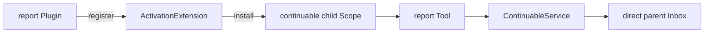

# Subagent Report

本包由 host-plane Plugin 注册一个 `ActivationExtension`。Extension 在每个 unpublished continuable child Scope 中安装 child-local `report` Tool 与提示词；child 调用 Tool 后，`ContinuableService.ReportFrom` 把自包含内容投递给 exact direct parent。

Plugin Apply 只拥有 Extension registration，child 不挂载 report Plugin。Dispose 撤销 registration，并通过 exact installation 立即卸载 resident child 的 Tool/Prompt。`quiet` 只追加消息；`next-step` 还调度 parent 的下一 step。report 不结束 child turn，也不暴露给 one-shot child。

跨包合同见[领域设计](../docs/design.zh-CN.md)，实现证据见[进度](../docs/implementation-progress.zh-CN.md)。
