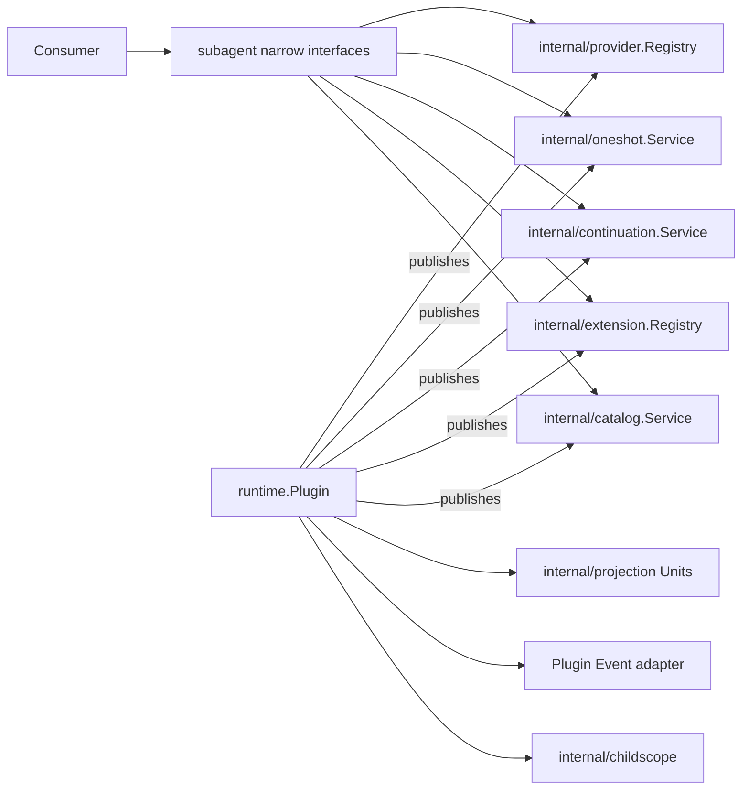

# Subagent Runtime

本包是 Subagent 领域唯一的 Plugin 装配入口。`Plugin` 只负责 Manifest、依赖解析、模块启停、Projection Unit registration 和 Event bus 适配；它的 Fiber 决定 Service binding 的 Scope 可见性及发布/撤销时点。`ProviderRegistry`、`OneShotService`、`ContinuableService`、`ExtensionRegistry` 与 `Catalog` 分别由 `subagent/internal/*` 的独立对象实现，各自拥有业务状态与不变量，再由 Plugin 以 `ProvidedService` 发布。

本包不实现 Provider 注册规则、one-shot/continuable/Catalog 用例、Agent Loop、Session 持久化或 Host 协议，也不注册具体 Provider 与 Consumer。可选 Projection Registry 存在时，Runtime 注册 `subagent` 与 `subagentTiming`；Dispose 逆序释放 registration，并在依赖重新组合前停用 Catalog 与 continuation。

跨包合同见[领域设计](../docs/design.zh-CN.md)，实现证据见[进度](../docs/implementation-progress.zh-CN.md)。
