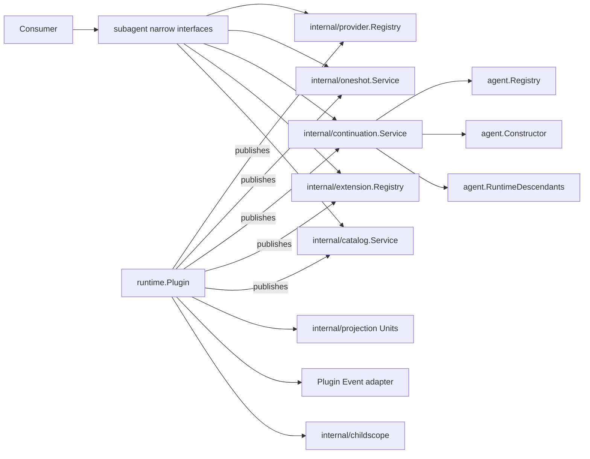

# Subagent Runtime

本包是 Subagent 领域唯一的 Plugin 装配入口。`Plugin` 只负责 Manifest、依赖解析、模块启停、Projection Unit registration 和 Event bus 适配；它的 Fiber 决定 Service binding 的 Scope 可见性及发布/撤销时点。`ProviderRegistry`、`OneShotService`、`ContinuableService`、`ExtensionRegistry` 与 `Catalog` 分别由 `subagent/internal/*` 的独立对象实现，各自拥有业务状态与不变量，再由 Plugin 以 `ProvidedService` 发布。

本包不实现 Provider 注册规则、one-shot/continuable/Catalog 用例、Agent Loop、Session 持久化或 Host 协议，也不注册具体 Provider 与 Consumer。可选 Projection Registry 存在时，Runtime 注册 `subagent` 与 `subagentTiming`。Agent 能力完整时，Runtime 解析 `agent.Registry`、`agent.Constructor` 和只读 `agent.RuntimeDescendants`；前两者用于构造/寻址，后者只用于判断 settlement 条件。Plugin 不再声明私有 Agent owner，也不保存第二套运行期父子关系。

关闭时 Runtime 先停用 Continuation Service；Manager 停止 Subagent 准入，为每个 resident Activation 启动 managed Agent close，并等待 exact Agent 的 `ClosingSignal`，但不在当前 `Plugin.Dispose` 中等待 Scope topology 命令。外层 Runtime 操作返回后，Agent Registry 继续完成 descendant child-first close，AgentLoop 的 `agentScopes` 执行实际 Scope 卸载。随后 Runtime 停用 Catalog，清理 Extension/Provider registration 和 Projection。Plugin 只驱动这些明确的业务关闭入口，不遍历 Agent、不持有 Scope Handle，也不修改 Plugin topology；异步完成阶段的 close failure 通过独立 `failureReporter` 交给 `RuntimeOptions.ObserverError`。

跨包合同见[领域设计](../docs/design.zh-CN.md)，实现证据见[进度](../../zh-CN/08-implementation-progress.md)。
