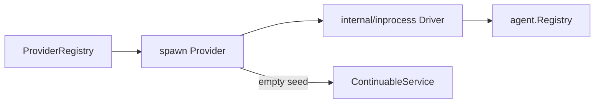

# Spawn Provider

本包实现 `spawn` in-process Provider。one-shot child 使用空 seed；continuable preparation 也只返回空 creation data，因此 child 不继承 parent conversation，但仍通过 shared lineage 继承 cwd、Agent defaults、preset 与 delegation depth。

Plugin Apply 解析 Agent Registry 与可选 delegation policy，构造 Driver 后注册 exact Provider；Dispose 只撤销 Provider registration，不打断已经发布的 Run。Start context 继续作为 Run 的 canonical cancellation channel。

本包不拥有 one-shot admission、continuation residency、Tool 或 Agent Loop。跨包合同见[领域设计](../docs/design.zh-CN.md)，实现证据见[进度](../../zh-CN/08-implementation-progress.md)。
