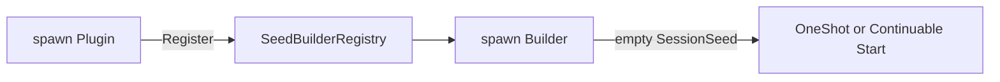

# Spawn Seed Builder

本包实现 `spawn` SeedBuilder。它为 fresh child 返回空 event prefix，因此 child 不复制 parent conversation；cwd、Agent defaults、preset 与 delegation depth 仍由共享 lineage/provisioning 规则处理。

Plugin Apply 只注册 Builder，Dispose 只撤销 exact registration；Builder 卸载不取消已经开始的 Execution。本包不创建 Agent，也不拥有 OneShot/Continuable 生命周期。

跨包契约见[技术方案](../../zh-CN/Subagent架构与生命周期重构技术方案.md)，实现证据见[进度矩阵](../../zh-CN/Subagent重构进度矩阵.md)。
