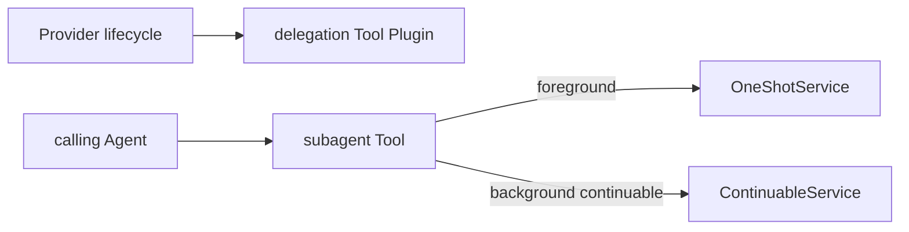

# Subagent Delegation Tool

本包把一个配置指定的 Provider 映射成 model-visible delegation Tool。它观察该 Provider 的 added/removed 生命周期，存在时注册 Tool，不存在时不暴露无效 schema；Provider capability 与 persona、Tool filter、depth policy 不匹配时拒绝挂载。

foreground 调用等待 one-shot `Result` 并始终 Dispose Run；异常停止会保留 diagnostic 和 partial text。continuable background 返回 durable child ID。当前版本不实现 Jobs，因此显式 background one-shot 返回错误，不静默改路由；`run_in_background` 的默认值由 `BackgroundMode` 决定。

本包不实现 Provider、Run、Activation、Jobs 或控制工具。跨包合同见[领域设计](../docs/design.zh-CN.md)，实现证据见[进度](../../zh-CN/08-implementation-progress.md)。
