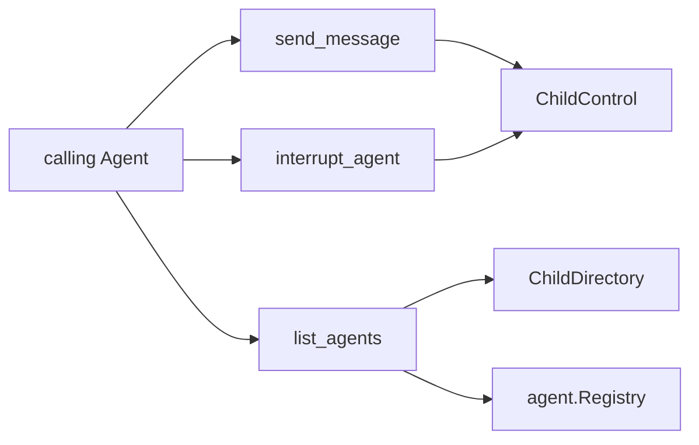

# Subagent Control Tools

本包是模型可见的 Subagent 控制 Tool 适配器，不是控制业务模块。`controlTools` 只负责三项 Tool 的 schema、参数映射、结果渲染和对公开业务能力的调用；`Plugin` 只解析依赖、构造 `controlTools`、注册或撤销 Tool handle。任一注册失败时 Plugin 逆序回滚已经取得的 handle。

`send_message` 使用 exact calling Agent 作为 direct-parent authority；`interrupt_agent` 使用 exact ancestor authority；`list_agents` 只读 durable directory，并组合 live Agent 状态映射为 `running`、`idle`、`ready`。目录查询不会恢复 cold Agent，OneShot child 也不会被映射成可续投目标。

本包不拥有 child lifecycle、目录 projection 或 SeedBuilder 选择。跨包契约见[技术方案](../../../zh-CN/Subagent架构与生命周期重构技术方案.md)，实现证据见[进度矩阵](../../../zh-CN/Subagent重构进度矩阵.md)。
