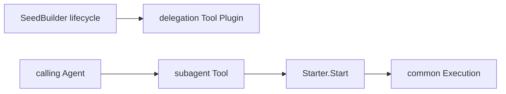

# Subagent Delegation Tool

本包把配置指定的 SeedBuilder 映射为 model-visible delegation Tool。`delegationTool` 负责 schema、参数映射、OneShot/Continuable 选择、调用 `Starter` 和结果渲染；`Plugin` 只观察固定源兼容的 `subagent/provider-added` 与 `subagent/provider-removed` 事件，并管理 Tool/Prompt registration。只有 Builder 可用且能力策略匹配时才发布 Tool。

前台 OneShot 调用等待 `Execution.AwaitTerminal`；Handle 由 OneShot 实现在 terminal 后自动释放，Tool 不执行第二次 Dispose。Continuable background 在初始消息被接受后返回 durable child ID。当前没有 Jobs，因此显式 background OneShot 返回错误，不静默改路由。

本包不实现 SeedBuilder、Execution、Continuable residency 或控制工具。跨包契约见[技术方案](../../../zh-CN/Subagent架构与生命周期重构技术方案.md)，实现证据见[进度矩阵](../../../zh-CN/Subagent重构进度矩阵.md)。
