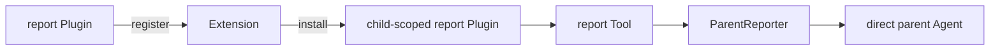

# Subagent Report

本包注册一个 Continuable child extension。Extension 在 unpublished child Scope 中安装 child-local `report` Tool 与提示词；Tool 调用公开 `ParentReporter`，把自包含内容投递给 exact direct parent。

`quiet` 只追加父消息；`next-step` 还请求父 Agent 调度下一步。report 不结束 child turn，也不向祖先广播，不安装到 OneShot child。host Plugin 拥有 extension registration，child Scope 拥有实际 Tool/Prompt effects。

跨包契约见[技术方案](../../../zh-CN/Subagent架构与生命周期重构技术方案.md)，实现证据见[进度矩阵](../../../zh-CN/Subagent重构进度矩阵.md)。
