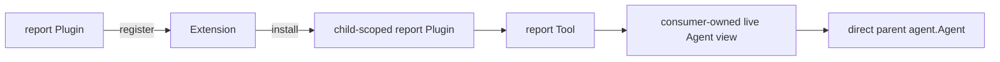

# Subagent Report

本包注册一个 child Extension。Extension 在 unpublished OneShot 或 Continuable child Scope 中安装 child-local `report` Tool 与提示词；Tool 根据当前 exact child Agent 的 Session parent identity 查找 exact live parent，并直接使用 parent Agent 的 Inbox 能力投递自包含内容。

`quiet` 调用 parent Agent 的 `Inject`；`next-step` 调用 `Steer`。report 不结束 child turn，也不向祖先广播。host Plugin 拥有 extension registration 和 report Tool 对 live Agent 窄接口的依赖，child Scope 拥有实际 Tool/Prompt effects。`childPlugin` 只解析依赖并注册 Tool/Prompt；`reportTool` 只负责 schema、parent identity 校验和 Agent Inbox 调用，不参加 Plugin 生命周期。

跨包契约见[技术方案](../../../zh-CN/Subagent架构与生命周期重构技术方案.md)，实现证据见[进度矩阵](../../../zh-CN/Subagent重构进度矩阵.md)。
