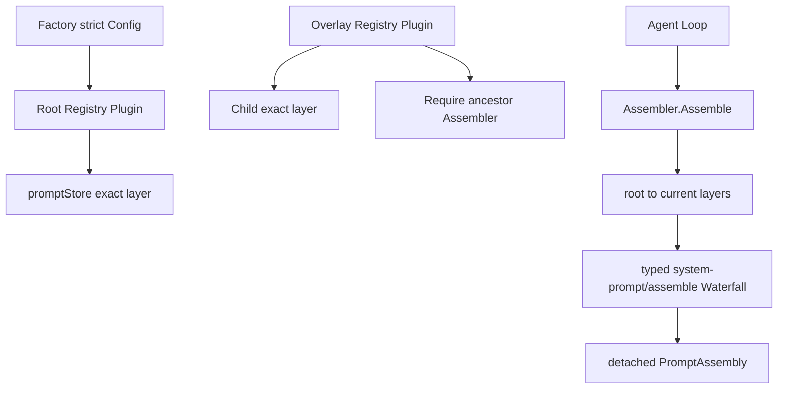

# System Prompt

`systemprompt` 是模型输入中的 Prompt、runtime context、变量和 Tool schema assembly owner。详细契约见[11 System Prompt Registry 与 Assembly](../zh-CN/11-system-prompt-registry-and-assembly.md)，Plugin 生命周期和 overlay 子树见[09 Plugin Runtime 与 Server Assembly](../zh-CN/09-plugin-runtime-and-server-assembly.md)。

## 边界

本包提供 `Assembler` 只读能力和 `PromptRegistry` 精确变更能力。拥有 entry 的 Plugin 保存 `PromptHandle`，在 Dispose 中调用 `Unregister`；System Prompt 不提供按名称删除或公开 Scope 清理 API。Tools、Agent Loop、LLM、Session 和模板脚本不属于本包。

## 流程

Store 只保护 entry membership；每个 exact layer 仅在 section、context、variable、Tool provider 或 suppressor 变更时重建不可变注册快照。这个快照不缓存 assembly 业务结果：每一次 assembly 仍在锁外重新执行 provider 求值和 Waterfall，并在返回边界分离最终 `PromptAssembly`。执行失败返回整体错误，不返回半成品。complete section、suppression、Tool order 和 strict `{{name}}` 插值由本领域 owner 最终校验。

一次 assembly 由具名 `assemblyResolver` 持有请求上下文和固定 layer snapshot，分别求值 variable、section、context 和 Tool schema；它产生的 `preparedAssembly` 同时保留 complete/suppression owner policy。Registry 只编排 resolver、Waterfall 和 `preparedAssembly.finalize`，不再解释多个并行返回值。
