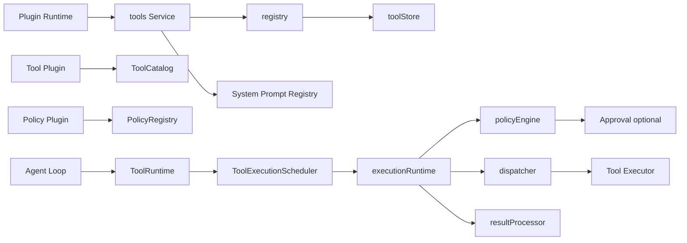
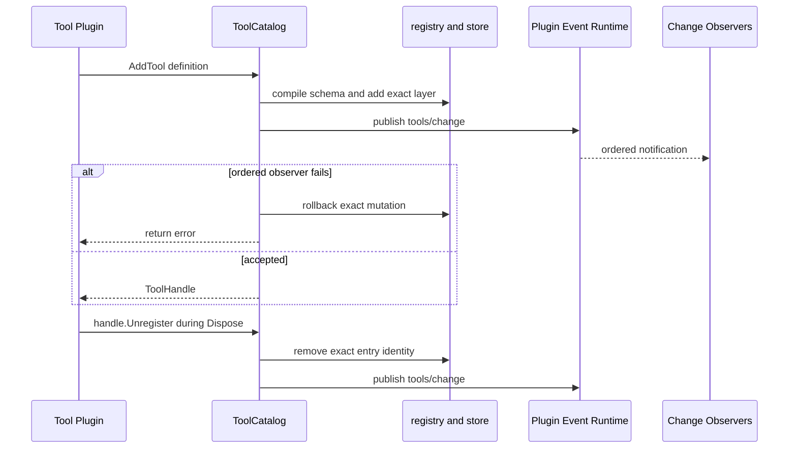
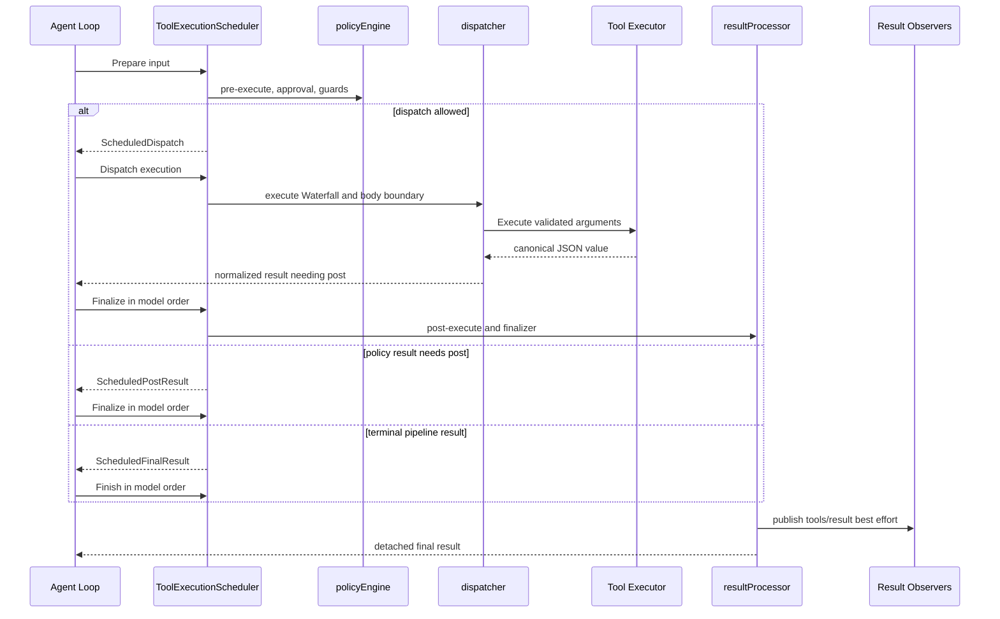

# Tools 工具注册与执行运行时

`tools` 是模型可调用工具的统一能力 owner：它把 Tool Definition、分层可见性、执行策略、规范结果和 System Prompt schema 投影收敛在同一个领域内。跨模块稳定语义由[12 Tools Registry 与执行流水线模块设计](../zh-CN/12-tools-registry-and-execution-pipeline.md)拥有，Plugin 生命周期与 Event/Waterfall 路由见[09 Plugin Runtime 与 Server Assembly](../zh-CN/09-plugin-runtime-and-server-assembly.md)，当前完成度和验证证据只见[08 实施进度](../zh-CN/08-implementation-progress.md)。

## 职责边界

本包负责：

- 编译并保存 Tool Definition，维护稳定注册顺序；
- 组合 root、ancestor 与 exact child layer，计算 shadow、restriction、guard 和可见 schema；
- 执行 `tools/pre-execute`、`tools/execute`、`tools/post-execute` Waterfall；
- 调用 Executor，校验参数与输出，生成 model-facing content 和 presentation metadata；
- 物化不可变结果，发布 `tools/result` 与 `tools/change`；
- 向 System Prompt 只投影 `name`、`description`、`parameters`。

本包不负责：

- Agent Turn、Step、并发池、Session 追加和 durable commit；
- 具体 filesystem、shell、数据库、用户问答等 Tool 业务实现；
- Approval 的策略、审计、UI 或 transport；
- LLM 调用、Provider retry、模型选择和流处理；
- 通用自愈、任务重放或业务补偿。

Tools 的失败策略是“封闭并形成规范结果”，不是自行重试。超时、重试、指标或其他 around-dispatch 行为应由独立 Plugin 通过 `tools/execute` Waterfall 接入；跨 Tool 的恢复与重新调度由 Agent Loop 或更上层 use case 决定。

## 公共能力

| 能力 | 消费者 | 责任 |
| --- | --- | --- |
| `ToolRuntime` | Agent Loop 或直接执行方 | 查询可见定义/schema、判断并发模式、取得 scheduler、执行完整流水线 |
| `ToolExecutionScheduler` | Agent Loop | 顺序 `Prepare`，只并发 `Dispatch`，再按模型顺序 `Finalize` 或 `Finish` |
| `ToolCatalog` | Tool 定义 Plugin | 在当前 Tools layer 增加具名 Tool，并返回精确 `ToolHandle` |
| `PolicyRegistry` | Tool policy Plugin | 增加 restriction、guard，并返回各自的精确 Handle |
| `Service` | Plugin Runtime | 声明依赖与能力，绑定 System Prompt，创建 Registry 和 execution runtime，负责卸载清理 |

`ToolExecutionScheduler` 不直接由 `Service` 摊平实现。调用方通过 `ToolRuntime.Scheduler()` 取得由 `executionRuntime` 实现的 staged capability，避免生命周期 facade 同时成为第二个状态机 owner。

## 包内模块划分

| 组件 | 职责 |
| --- | --- |
| `service.go` | Plugin 生命周期、依赖解析、能力 facade、System Prompt provider 和 change publication |
| `registry.go` | 当前 layer 与 parent lineage 的组合入口、可见性查询和 mutation 规则 |
| `store.go` | 锁保护的 exact-layer Tool、restriction、guard 状态及快照 |
| `runtime.go` | `Prepare -> Dispatch -> Finalize/Finish` 状态机编排 |
| `policy_engine.go` | pre-execute、Approval 解析和 monotonic guard |
| `dispatcher.go` | execute Waterfall、取消融合、schema 校验、Executor 和成功结果规范化 |
| `result_processor.go` | post-execute、finalizer、最终快照和 `tools/result` 发布 |
| `schema.go`、`restriction.go` | Definition/schema 编译和 restriction 校验 |
| `definition.go`、`execution.go`、`policy.go`、`result_types.go` | 按概念拆分的公共契约和值类型 |

依赖关系保持单向：`Service` 组装 `registry` 与 `executionRuntime`；runtime 读取 Registry 快照并委托 policy、dispatch、result 三个阶段对象；Store 不调用 Plugin、Executor 或用户策略。

## 注册与生命周期

Tool 或 policy Plugin 在自己的 `Apply` 中通过 required capability 注册业务 entry，保存成功返回的 `ToolHandle`、`RestrictionHandle` 或 `GuardHandle`，并在幂等 `Dispose` 中调用 `Unregister`。Plugin Runtime 在启动失败时仍会调用 `Dispose`，因此部分注册也能收口；Tools Service 最后卸载时会清空本 layer，防止残留引用。

Guard 不改变模型可见 schema，因此 `AddGuard` 和 `GuardHandle.Unregister` 不发布 `tools/change`。Tool 和 restriction mutation 会发布 ordered change。

新增 Tool 或 restriction 时，change observer 失败会回滚新增并向 owner Plugin 返回错误。撤销时以生命周期清理为优先：即使 change observer 失败，已删除的 entry 也不会恢复，错误仍返回给 `Dispose` 供 Runtime 记录。每个 Handle 绑定具体 entry identity；旧 Handle 不能删除后来注册的同名对象。System Prompt 不缓存另一份 Tool Catalog；下一次 assembly 直接读取当前 provider 的 live view。

## 执行流程

普通调用使用 `ToolRuntime.Execute`。Agent Loop 为了让 Tool body 并发、而 policy 和 Session 提交仍保持模型顺序，使用 staged scheduler。

执行中的关键不变量：

- `ToolExecution` identity、参数和 registry 规范化 success 对 middleware 按不可变值处理；authored success 必须重新经过 output schema 和 renderer；
- prepared execution 的 `Dispatch`、`Finalize` 或 `Finish` 只能按声明阶段消费一次，重复调用不能再次执行 Tool body、finalizer 或结果事件；
- Tool body `DeferContext` 的消息先于 execute wrapper 和 post policy 追加的消息；
- `ConcludeTurn` 只随最终成功结果传播，post value replacement 不能丢失该标记；
- `ConcludesTurn` 只是 Tool 发出的结束信号：Agent Loop 必须先提交 Tool result 和 Session event，再决定结束当前 Turn；Tools Runtime 不拥有 Turn；
- finalizer 使用 Prepare 时捕获的 definition-owned callback，并在一次正常完成路径上恰好调用一次；
- `Finish` 是 total boundary，nil 或非法 staged result 被物化为失败，而不是 panic。

## 取消与失败

- caller 在 body 前取消，结果为 `ABORTED_BEFORE_DISPATCH`；body 已开始且最终成功时取消，等待 body 收敛后结果为 `ABORTED`。
- Executor、renderer、projector、guard、Waterfall 或 finalizer 的 panic 被转换为规范失败，不能击穿 Tools Runtime。
- unknown Tool、参数或输出 schema 失败属于普通 `ToolExecutionResult`，不是 Agent Loop scheduler failure。
- `tools/result` 是 best-effort notification；observer 失败交给 Plugin Runtime reporter，不能替换已经形成的 Tool outcome。
- Go 无法强杀同进程函数。Executor 必须观察 `ToolRunContext.Context`，并在返回前让自己启动的工作达到 quiescence。

具体 Tool Plugin 只需依赖 `ToolCatalog`、构造一个完整 `ToolDefinition`，在 Apply 中保存 `AddTool` 返回的 Handle，并在 Dispose 中调用 `Unregister`。若它还需要 restriction 或 guard，再按需依赖 `PolicyRegistry` 并分别保存 Handle；不需要实现 Tools Runtime、Registry、scheduler 或事件分发。
