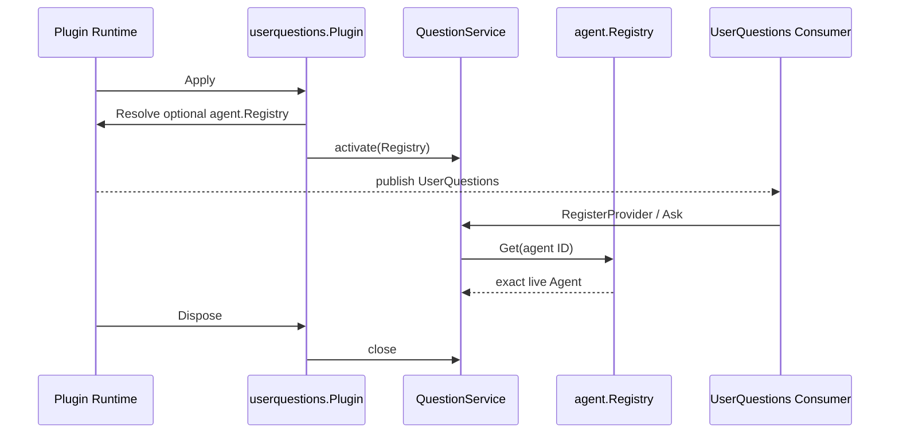

# UserQuestions

`userquestions` 拥有结构化用户问题的业务能力：校验问题与展示意图、登记唯一回答 Provider、校验发起提问的 Agent，并把回答结果与调用方隔离。跨模块契约和交互闭环见[17 Approval、UserQuestions 与 Interaction Gateway](../zh-CN/17-approval-user-questions-and-interaction-gateway.md)，实现证据统一记录在[08 实施进度](../zh-CN/08-implementation-progress.md)。

## 职责边界

- `QuestionService` 是业务实现，拥有 Provider 登记、提问校验、调用者证明和业务可用状态。
- `Plugin` 是 Plugin Runtime 适配器，只声明并发布 `UserQuestions`、解析可选的 `agent.Registry`，以及在挂载和卸载时驱动业务 Service 的启停。
- `factory.Factory` 只负责严格配置校验和构造 `Plugin`。
- `apiproxy` 实现浏览器交互 Provider；`toolaskuser` 消费 `UserQuestions`。二者都只依赖能力接口，不持有 `Plugin` 或 `QuestionService`。

本包不拥有客户端连接、RPC correlation、Question frame、Agent 生命周期或 Session 写入。`Plugin` 也不保存问题、Provider 或 Agent 业务状态。

## 挂载与调用

`QuestionService` 在 `Plugin.Apply` 成功前拒绝 Provider 登记。`Plugin.Dispose` 在所有依赖它的 Plugin 停止后关闭 Service，并清除 Registry 引用和当前 Provider；已持有的能力引用不能在卸载后重新登记 Provider。Provider handle 按登记身份撤销，重复撤销是幂等的，也不会移除后来登记的 Provider。

`Ask` 尊重调用 Context 的取消。传入问题与返回答案都会复制，Provider 不能借用调用方切片，调用方也不能修改 Provider 保存的答案。携带 Agent 的请求必须对应 Registry 中同一实例的 live Agent；Subagent Session 不能直接发起人机交互。
