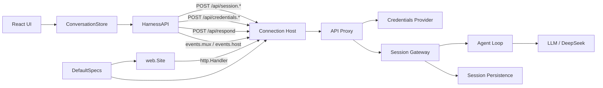
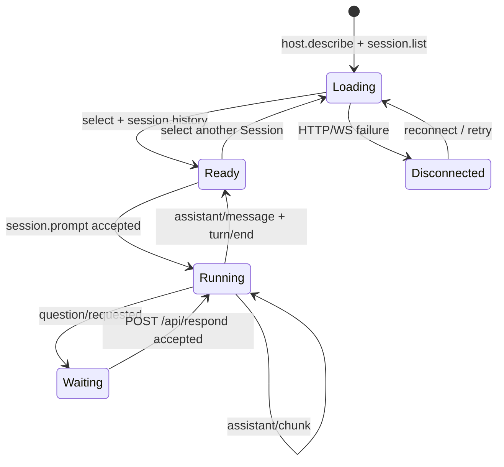
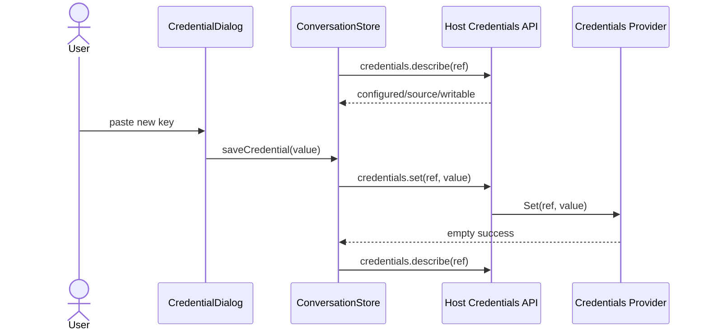

# Web 主会话 UI

`web` 提供随 Go 二进制内嵌的 React 主会话 UI。源码使用 TypeScript、Vite 和 Tailwind CSS 构建；Go 运行时只内嵌 `dist`，不依赖 Node.js。它是主会话的入站适配器，不是 Session、Agent 或 LLM 的业务 owner。跨模块能力范围由[21 Web Agent 主会话闭环与能力边界](../zh-CN/21-web-agent-main-flow.md)拥有，当前完成度与验证证据见[08 实施进度](../zh-CN/08-implementation-progress.md)。

## 职责

- 使用 React 组件组织左侧会话、中央对话与右侧运行事实布局；
- 通过 Vite/Tailwind 生成 `dist`，再由 `embed.FS` 提供 `index.html` 和内容哈希的 JS/CSS assets；
- 展示会话列表、当前会话历史和流式 Agent 输出；
- 创建、选择 Session，并提交纯文本 prompt；
- 展示 `question/requested`，通过 `/api/respond` 回答或取消后继续当前 Agent Turn；
- 读取 value-free credential metadata，并通过 write-only Host API 设置、替换或删除 DeepSeek API Key；
- 封装 Host unary RPC envelope 和 Mux/Host 两条 WebSocket downlink；
- 在连接断开时重连，并从 Host baseline 重建浏览器状态。

本包不拥有 Session 状态机、Agent Loop、模型选择、DeepSeek HTTP、SQLite、完整 Settings、credential precedence/存储、Tool/Approval 业务规则或原版 Client plugin runtime。Question 组件只是 `UserQuestions` Host contract 的入站适配器。模型输出使用 `textContent` 渲染，不执行模型产生的 HTML；API Key 只作为未提交的 password input draft 存在于组件状态。

## 工作原理

`Site` 是唯一 Go 状态对象，只负责读取内嵌资源并实现 `http.Handler`。它拒绝 `/api` fallback，让 Connection Host 始终拥有协议路由；无扩展名的未知 GET 路径回退到 `index.html`，支持会话 URL 的浏览器刷新。

浏览器端有两个状态对象：

- `HarnessAPI` 负责 RPC、保留 server-request `rpcId`、`/api/respond`、WebSocket generation、重连和关闭；
- `ConversationStore` 负责 Session list、selected Session、history、stream draft、pending Question、value-free credential metadata 与可观察状态；React 组件只投影视图并转发用户意图。



## 会话与流式状态

选择 Session 后总是调用 `session.history`，不会把当前 DOM 当成事实来源。`session/event` 按 `seq` 去重并排序：

1. 只有 `source.kind=user` 的 `user/message` 与 role 为 assistant 的 committed `assistant/message` 进入对话展示；plugin runtime-context 与 Tool facts 仍保留在 Session/模型上下文中，但不伪装成用户消息；
2. `assistant/chunk` 只累积为当前 Session 的临时 draft；
3. `assistant/message` 或 `turn/end` 清除 draft；
4. `host/session-status` 更新会话运行状态；
5. `host/session-added`/`removed` 触发 `session.list` baseline 刷新。



## API Key 设置

页面启动时调用 `credentials.describe({refs:["DEEPSEEK_API_KEY"]})`。缺失且可写时自动打开设置对话框；文件来源允许替换和删除；环境来源显示只读提示。`credentials.set` 是秘密值唯一经过 wire 的方向，成功后只重新读取 metadata，不回读明文。



凭据业务与 local Store 由[22 Credentials 与 API Key 管理](../zh-CN/22-credentials-and-api-key-management.md)拥有；Web 不读取文件，也不调用 Credentials Go 包。

## 构建

前端依赖和生产构建只在开发阶段需要：

```sh
cd web
pnpm install --frozen-lockfile
pnpm run build
```

`dist` 必须随源码提交，使 `go build` 和 `go test` 不需要现场安装 Node.js。修改前端后由 `pnpm run build` 同时执行 TypeScript 检查并刷新内嵌产物。`index.html` 使用 `no-cache`，每次加载都会确认入口；Vite 为 JS/CSS 生成内容哈希路径，Host 只对这些不可变路径发送长期缓存。不得重新使用固定 `/app.js` 配合正 `max-age`，否则服务升级后浏览器会继续运行旧协议 adapter。

仓库根执行 `make run` 会先完成上述 Web 构建，再以 `--data-dir "$(CURDIR)"` 启动 Go 服务；可通过 `make run DATA_DIR=/absolute/path` 覆盖数据目录。

## 生命周期和失败边界

- `webFrontendPlugin` 在默认 composition 中构造 `Site`，Connection 只保存其 `http.Handler` 接口；
- 两条 WebSocket 独立建立和重连，页面 `beforeunload` 会关闭 owned sockets；
- WebSocket 断开不调用 `session.cancel`，因此页面刷新不会误取消 Agent；
- pending Question 使用 requested frame 的原 `rpcId` 回答；断线重连后同一请求可重放，等待期间普通 composer 禁用；
- unary failure 和 `stream/error` 只显示错误，不追加伪历史；
- 当前 UI 不回答 `approval/requested`；Approval 仍只由已有 Host contract 和专用客户端验收。

新增页面功能前必须先确认它对应的已纳入 Host capability；不得让 `web` 直接依赖 API Proxy 实现、领域 store、数据库 adapter 或 Provider SDK。
