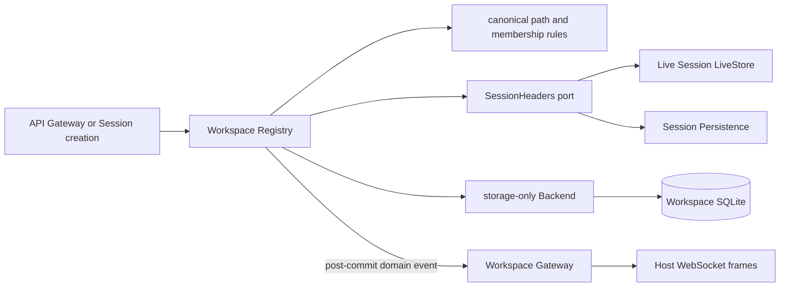

# Workspace 领域模块

`workspace/` 负责把已有项目目录注册成稳定 Workspace，并维护 Workspace 顺序、Session 归属候选和全局归档集合。跨模块权威设计见[20 Workspace Registry、SQLite 与 API Gateway](../zh-CN/20-workspace-registry-and-api.md)，实施状态只见[08 实施进度](../zh-CN/08-implementation-progress.md)。

## 目录与职责

| 路径 | 职责 | 不拥有 |
| --- | --- | --- |
| `workspace` | Registry、Workspace entity、canonical path、顺序、Session accounting、archive set、领域事件 | Session 日志、API DTO、文件内容、数据库驱动 |
| `workspace/persistence/sqlite` | Registry state/record 的 SQLite 事务、schema、sqlc query 与 row mapping | 路径验证、成员规则、排序策略、事件发布 |
| `workspace/persistence/sqlite/internal/dbsql` | sqlc 生成的 repository-private 查询代码 | 业务接口或跨包模型 |

Workspace 表示“已注册目录及其 Session 账户”，不是目录内容仓库。删除 Workspace 只删除注册记录；不会删除目录、用户文件或 Session facts。

## 工作原理



`Registry.Create` 用 `filepath.EvalSymlinks` 和目录检查建立唯一 canonical path。重复路径返回同一 Workspace；新 Workspace 以前插方式进入 durable display order，默认标题取目录 basename。

Session accounting 不读取 Session 内容，只消费 `SessionHeaders`：Session 必须已知、Header 必须带 `cwd`，且其 canonical cwd 必须等于 Workspace path。attach 前插、manual move 使用 DOM `insertBefore` 语义、detach 幂等。对外 `Snapshot` 会过滤当前无法由 Header index 证明归属的 durable candidate；下一次真实 mutation 才把失效 candidate 从存储记录中清除。

## 启动与历史 bootstrap

SQLite 的 `initialized` 区分“合法空 Registry”和“仍需从历史 Session Header 构建”。首次启动时：

1. `SessionHeaders.List` 合并 live Session 与持久化 Header；
2. 按 canonical cwd 分组；
3. 每组 Session 按 `createdAt` 新到旧排列，同时间按 ID；
4. 缺少 Workspace 的目录创建注册，已有 Workspace 合并未重复 accounting；
5. Workspace 按每组最新 Session 时间、既有顺序和 ID 稳定排序；
6. 同一事务写入完整记录、顺序、archive set 和 `initialized=true`。

已初始化且没有 Workspace 的数据库不会再次扫描 Session Header。已初始化且有记录时仍读取 Header index，用于过滤和后续 membership 校验，但不会重新运行 bootstrap。

## 持久化边界

```text
workspace/persistence/sqlite/
├── sql/schema.sql
├── sql/query.sql
├── sqlc.yaml
└── internal/dbsql/
```

从仓库根目录运行：

```text
sqlc generate -f workspace/persistence/sqlite/sqlc.yaml
```

`Backend` 只执行 Registry 已决定的 `Initialize/Create/Update/Delete/SetOrder/SetArchivedSessionIDs`。它不调用文件系统、不读取 Session Header、不判断成员、不生成 ID、不更新时间，也不发布领域事件。`Backend` 是 Workspace 消费方拥有的 Go interface，不是 Plugin Service；Workspace 插件在 composition root 内构造 SQLite adapter，并只向 Runtime 发布 `workspaceRegistry`。Workspace SQLite 与 Session facts SQLite 是两个 owner 和两个数据库文件；前者保存注册与分组状态，后者保存完整 Session Header/Event。

## API 与 Session 集成

`apiproxy.WorkspaceGateway` 映射七个方法：`workspace.list/create/rename/delete/insertBefore/insertSessionBefore/archiveSession`。成功 mutation 后，领域通知被投影为：

- `host/workspace-changed`；
- `host/workspace-removed`；
- `host/workspace-order-changed`；
- `host/archived-sessions-changed`。

Host stream 只发送变化，重连 baseline 由 `workspace.list` 获取。

`session.create({workspaceId})` 先从 Workspace snapshot 取得 canonical path 作为 Session `cwd`，创建成功后再 `AttachSession`。`workspaceId` 与显式 `cwd` 同时出现属于 `bad-request`；attach 失败返回 `workspace-attach-failed`，已经创建的 live Session 不被伪装成未创建。

## 并发、失败与生命周期

Registry 在同一写锁内重新读取最新 record、决定 mutation、调用 Backend 并替换内存状态，因此并发 attach、move、archive 和 order mutation不会用旧 snapshot 覆盖新值。领域事件只在 Backend 成功后发布；observer failure 被报告但不回滚已提交状态。

API Gateway 额外串行 create/rename/delete，使标题唯一性检查与路径注册观察前一项操作的最终状态。SQLite 使用单连接和原子事务；Plugin Scope 在 shutdown 时先停止 Consumer，再关闭 Workspace Backend。

业务错误由 owner 保持明确类型：未知 Workspace、未知 Session、无效移动、cwd attach 失败；API Gateway 才把它们映射为 canonical RPC error。SQLite、文件系统和 durability failure 保持技术错误，不伪装成业务 miss。
