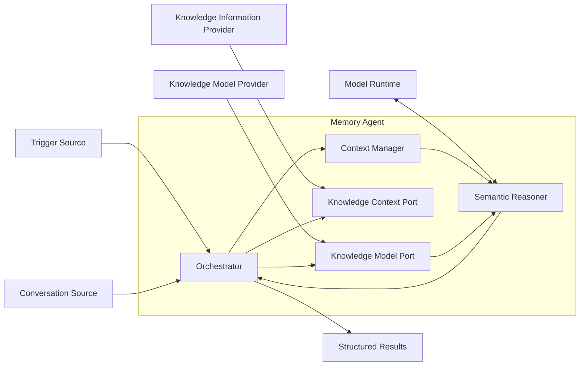

# 01 架构与边界

状态：Draft

本文负责 Memory Agent 的目标、术语、系统边界与组件职责。工作流、接口契约和运行保障分别由后续专项文档维护；项目背景见根目录 [README.zh-CN.md](../README.zh-CN.md)。

## 1. 背景

Agent Memory 的静态记忆产品通常重点解决长期事实、偏好、指令或摘要如何存储、组织和召回。它们需要一个独立、可复用的 Agent，从对话中理解可记忆内容，并判断用户对每项内容的最终立场。

Memory Agent 负责：

- 根据当前 Context Window 抽取配置允许的知识对象；
- 通过只读接口获取判断所需的已有 Knowledge；
- 合并当前输入中的重复表达；
- 让 LLM 直接输出每个知识对象及用户的最终立场；
- 校验并返回结构化结果和 Evidence。

Memory Agent 不固定知识对象的种类。`Entity`、`Relation`、`Claim` 可以由某个 Provider 配置，也可以配置为偏好、用户事实、长期指令或其他静态记忆类型。

## 2. 核心结论

1. Memory Agent 采用明确 Workflow，而不是自由 Tool Loop。
2. 一次 Run 固定一个 Knowledge Model 版本；该版本提供知识类型、Prompt、输出 Schema 和解析规则。
3. Agent 核心不依赖任何具体知识类型，也不针对具体 `kind` 编写判断分支。
4. Knowledge Context Port 是只读接口，只返回 LLM 判断所需的信息。
5. LLM 直接输出知识对象和最终立场，不引入中间领域对象或关系状态。
6. 最终立场只有 `support`、`oppose`、`uncertain`。
7. 没有长期记忆价值的内容不进入结果，不需要额外的 `ignore` 状态。
8. Memory Agent 不创建、更新、删除或发布 Knowledge，也不关心 Knowledge 如何管理。
9. Model Runtime 只提供推理、token 计数和 Context 硬上限；Memory Agent 管理硬上限内的实际 Context。

## 3. 目标与非目标

### 3.1 目标

- 把知识抽取、当前输入内去重、已有信息补充和最终立场判断封装为独立 Agent 能力；
- 允许部署方通过接口、Prompt、Schema 和 Parser 自定义知识类型；
- 由 Memory Agent 管理每次模型调用的 Context 内容和 token 预算；
- 通过只读接口获取已有 Knowledge，同时隐藏其内部实现；
- 每项返回结果都能追溯到原始对话 Evidence；
- 支持重试、回放以及模型、Prompt 和 Knowledge Model 版本比较。

### 3.2 非目标

Memory Agent 不负责：

- 保存原始 Conversation 或 Message；
- 决定主 Agent 如何回答用户；
- 决定返回结果是否应成为长期 Knowledge；
- 创建、更新、删除、合并或发布 Knowledge；
- 定义 Knowledge 的身份、版本、生命周期或一致性模型；
- 管理数据库、索引、缓存、召回视图或审计历史；
- 在核心中定义固定的知识对象类型；
- 在 Context 不充分时无限等待或自主轮询。

## 4. 术语

### 4.1 Context Window

Context Window 是 Memory Agent 一次 LLM 调用实际可见的完整上下文，包括：

- System 和 Agent 指令；
- Knowledge Model 提供的类型说明、Prompt 和输出 Schema；
- 当前对话及必要的历史消息；
- Knowledge Context Port 返回的相关信息；
- Tool 调用结果和策略约束。

Memory Agent 负责选择内容、分配 token、为输出预留空间、执行过滤和压缩。Model Runtime 只提供硬限制、tokenizer 和推理能力。

一次调用满足：

```text
model_context_limit
  = input_budget
  + reserved_output_budget
```

不得为了节省 token 丢弃当前消息的 Evidence 锚点，也不得把摘要当成原始 Evidence。

### 4.2 Knowledge Model

Knowledge Model 是一次 Run 使用的版本化配置，包含一个或多个知识类型定义。它决定允许抽取什么、向 LLM 注入什么 Prompt、模型应按什么 Schema 输出，以及如何解析和校验响应。

Knowledge Model 不决定知识如何存储或管理。

### 4.3 知识类型定义

每个知识类型至少提供：

- 稳定的 `kind` 和 Schema 版本；
- 应抽取内容和非目标；
- 注入 LLM 的 Prompt；
- 结构化输出 Schema；
- 响应 Parser；
- payload 和 Evidence Validator。

Provider 可以配置任意静态记忆类型。Agent 核心只按通用信封处理结果。

### 4.4 结构化结果

LLM 对每项知识直接输出：

- `kind`；
- 符合对应 Schema 的 `payload`；
- `stance`；
- 当前对话中的 `evidence`；
- 判断时实际使用的已有 `knowledge_refs`，可为空。

同一语义在当前输入中重复出现时只返回一项，并合并 Evidence。

### 4.5 Stance

`stance` 只有三种：

- `support`：用户在当前 Context 中最终支持、确认或陈述该知识；
- `oppose`：用户在当前 Context 中最终反对、否认或撤回该知识；
- `uncertain`：当前 Context 无法确定用户的最终立场。

纯询问、临时推理和无长期记忆价值的内容不返回结果。

### 4.6 Evidence

Evidence 指向产生判断的原始来源，例如 Message ID 及其中的字符或 token 范围。已有 Knowledge 的来源可以由只读接口提供，但返回结果必须至少绑定当前对话 Evidence。

### 4.7 Knowledge Context

Knowledge Context 是只读接口提供给 LLM 的相关已有信息。Agent 只使用其内容和不透明引用辅助判断，不解释其持久化状态，也不依赖数据库、版本、索引或生命周期实现。

## 5. 系统边界



Memory Agent 是系统本体。Trigger Source、Conversation Source、Knowledge Model Provider、Knowledge Information Provider 和 Model Runtime 都是外部边界。结果返回后如何处理不属于本设计。

### 5.1 Trigger Source

提供 Scope、新增 Message 引用、触发原因以及可选成本或延迟策略。它不组装 Context，也不决定 Knowledge 如何变化。

### 5.2 Conversation Source

保存原始消息并按引用返回消息顺序、角色、时间和 Evidence 范围。它不管理 Context token，也不判断什么应成为长期知识。

### 5.3 Knowledge Model Provider

按版本返回启用的知识类型定义，并保证 Prompt、Schema、Parser 和 Validator 属于同一兼容版本。它不读取用户 Knowledge，也不判断具体对话。

### 5.4 Knowledge Information Provider

根据 Scope、输入 Focus 和 token 预算返回相关 Knowledge Context。它自行决定 Knowledge 的组织、检索和管理方式；Agent 只依赖接口响应。

### 5.5 Memory Agent

#### Orchestrator

- 固定输入版本并控制运行阶段；
- 管理消息读取、Knowledge 查询和模型调用顺序；
- 执行结构校验和有限重试；
- 返回最终结果。

#### Context Manager

- 从 Conversation Source 和 Knowledge Context 中选择材料；
- 注入 Knowledge Model 的 Prompt 与 Schema；
- 分配 token、预留输出并执行裁剪、压缩和分段；
- 保存实际使用的来源引用和 token 统计。

#### Semantic Reasoner

- 使用完整 Context 调用 Model Runtime；
- 让 LLM 直接抽取知识并判断最终立场；
- 解析、校验并返回结构化结果。

#### Knowledge Model Port

- 按版本加载知识类型定义；
- 提供 Prompt、Schema、Parser 与 Validator；
- 隔离自定义类型与 Agent 核心。

#### Knowledge Context Port

- 接受 Scope、类型、输入 Focus 和返回预算；
- 返回判断所需的最小 Knowledge Context；
- 使用不透明引用保留来源可追溯性；
- 不提供任何 Knowledge 管理能力。

### 5.6 Model Runtime

提供模型推理、Context 硬上限、输出限制、token 计数以及结构化模型响应和用量。它不选择消息，也不查询 Knowledge。
