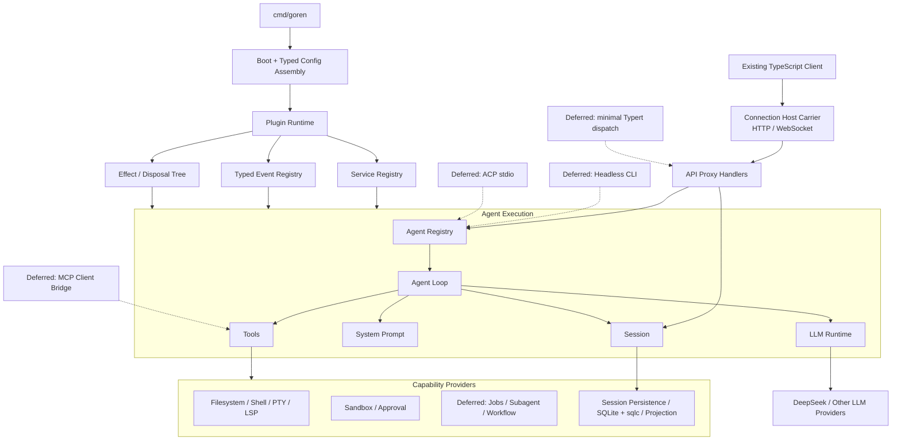

# 02 Go 运行时架构与插件模型

状态：Accepted / Implemented

本文拥有 Go Runtime 的模块边界、依赖方向、Plugin interface、typed config、Service/Event Registry、Scope、effect 生命周期和服务端组合。哪些源包进入范围由[01 复制范围与兼容基线](./01-porting-scope-and-baseline.md)决定；wire 与 API 兼容规则由[03 协议与 API 兼容设计](./03-protocol-and-api-compatibility.md)拥有。

## 1. 总体结构



Runtime 本身只拥有组合、依赖满足、Scope 和生命周期，不拥有 Agent、Session、Tool 或 LLM 业务规则。所有核心服务也以 Plugin 形式挂载，因此没有可以被其他 Plugin 绕过的特权内核。

### 1.1 源职责是默认边界

DeepSeek Harness 的职责划分是 Go 实现的起点，不只是行为参考：

- 保持 Service Definition / Provider / Consumer 的所有权与依赖方向；
- 保持事件由定义该状态转换的能力 owner 声明；
- 保持 Plugin effect 与资源生命周期的归属；
- 保持 Agent、Session、System Prompt、Tools、LLM 与 deployment composition 等独立职责；
- 排除 Web UI、SDK 和浏览器客户端实现时删除相应适配器，不把其职责并入 Core；
- `packages/client/connection` 的 Host carrier 虽位于 `client` 目录，仍按其服务端职责保留。

Go 可以合并只为 TypeScript 构建、声明合并或 npm 发布而存在的物理包，也可以拆出有独立平台依赖的 Provider，但不能借“Go 惯用”重新定义领域职责。任何偏离源边界的设计必须同时给出源符号、依赖问题、目标 owner 和兼容影响。

## 2. 所有权边界

### 2.1 Composition 与 Plugin Runtime

**Composition 拥有**：Factory Catalog、部署配置、静态 Factory 白名单和完整 Server Plugin 树构造。

**Plugin Runtime 拥有**：Plugin 状态、Service 可用性、Scope、binding、调用准入、依赖结算、回滚和 shutdown。

**不拥有**：会话事件、模型消息、Tool 权限、Provider wire、持久化 schema。

独立原因：composition 的语言是 `Factory / Config / PluginSpec`，Runtime 的语言是 `Plugin / Fiber / Scope / Binding`；Agent Execution 的语言是 `Turn / Step / Inbox / Request`。三者的变化原因和一致性边界不同。合并会让配置读取进入 Runtime，或让 Plugin rollback 与 Turn transaction 混为一体。

### 2.2 Agent Execution

**拥有**：Agent handle、inbox、turn/step 状态机、Prompt/Tool/LLM 的协调、取消和 idle settlement。

**不拥有**：Event 的长期存储、Provider HTTP、Tool 的业务副作用和 inbound 协议。

独立原因：Agent loop 是同步热路径，必须在一次 Turn 中保持顺序；Session 是追加事实，Provider 与 Consumer 可以独立演进。把它们合并会迫使每个新能力修改 Loop。

live Registry、durable Inbox、Agent-scoped event、initiator attribution 与 model selection snapshot 由[14 Agent Registry、Inbox 与实时事件模块设计](./14-agent-registry-inbox-and-events.md)拥有；concrete Agent、Turn/Step、request reconstruction 与 Tool-call scheduling 由[15 Agent Loop 与请求驱动模块设计](./15-agent-loop-and-request-driver.md)拥有。

### 2.3 Session Data Plane

**拥有**：Session Header、Event envelope、连续 `seq`、surface、fork、append/flush 和派生历史；Persistence application owner 另行拥有 cold repair 编排。

**不拥有**：谁触发 Turn、Event 业务决策、JSONL/SQLite 具体 I/O。

独立原因：Session 同时被 Agent、持久化、projection 和 API Proxy 消费，且 append 的串行一致性与后台 projection 不同。把 storage driver 放入 Session core 会阻止替换并污染 replay。

已进入实现的 Header/Event、内存 log、surface 和 LiveStore 生命周期由[10 Session Core 与生命周期模块设计](./10-session-core-and-lifecycle.md)拥有；cold repair 由[19 Session Persistence 与 SQLite 事实存储设计](./19-session-persistence-and-sqlite.md)拥有。fork 与派生查询仍按各自 use case 边界进入。

### 2.4 Storage Adapter

存储依赖保持：

```text
Agent / API consumer
  -> session/persistence.Persistence
  -> SessionLogStore
  -> storage-only Backend
  -> SQLite fact adapter (default) or JSONL (optional replacement)

Projection use case
  -> consumer-owned ProjectionStore interface
  -> SQLite + sqlc adapter
```

JSONL、SQLite 和未来其他 adapter 只拥有序列化、文件/数据库 I/O、被请求的事务执行、storage record 映射、durability 机制和技术错误转换。它们不拥有：

- Session Event 的业务类型、`seq` 分配和 turn/step 状态机；
- 开放 turn 是否以及如何 repair；
- 哪些 Event 形成何种业务 projection；
- retention、authorization、permission 或 workflow policy；
- use case 的原子边界。

Session `SessionLogStore` 检测开放轮次并决定追加 closing events；Projection owner 把 Event 转换为明确的 projection mutation。Adapter 只持久化调用者已经决定的数据。sqlc 生成类型和 driver 类型必须在 adapter 内映射，不能成为 `Persistence`/`Backend` 或领域模型。插件以 Session Persistence capability 为身份；默认 SQLite 只是 composition root 选择的 `Backend` 实现，不单独进入插件依赖图。

### 2.5 Capability Plane

每项能力由 Service Definition、Provider 和 Consumer 组成。Definition 拥有最小接口与领域词汇；Provider 拥有外部依赖；Consumer 通常把能力暴露成 Tool、Command 或 Agent policy。

例如 filesystem：

```text
fs Service Definition
  <- local / sandbox Provider
  <- tool-fs / tool-fs-search Consumer
  <- observation policy listener
```

Provider 与 Consumer 不能互相导入。组合根选择它们共享哪个 Service instance。

### 2.6 Client Protocol Plane

Client Protocol Plane 按源职责拆成：

```text
Connection Host carrier
  -> HTTP/WebSocket、trust fence、rpcId、独立 downlink 取消与 teardown
API Proxy contract/handlers
  -> method/payload/result、RpcError、MuxFrame/HostFrame
Core ports
  -> Agent、Session、Interaction、Model directory
Existing TypeScript ConnectionController
  -> 双流 readiness、connection generation、断线重连与 backoff
```

Connection 和 API Proxy 不拥有 Agent 或 Session。它们把 wire 请求翻译为核心调用，并把 committed event、live state 与 interaction 翻译为 frame。每条 WebSocket 断开只取消对应的服务端 stream；Host teardown 才关闭全部 owned socket 并等待 source 清理。两条流的 generation/readiness 是现有 TypeScript Client 的职责，Go Host 不增加服务端 generation 状态或跨 socket 耦合。连接断开不能关闭共享 Runtime。

Typert 不是 Protocol Plane 的必要入口。固定源基线中只有部分 auxiliary Remote endpoint 经 Typert interceptor 进入共享 `/api` channel；这些 endpoint 进入 capability matrix 前，不实现通用 Typert Registry/Gateway。

## 3. 边界判断

| 边界 | Language | Change rate | Actor | Consistency | NFR | External dependency |
| --- | --- | --- | --- | --- | --- | --- |
| Plugin Runtime / Agent | Plugin lifecycle vs Turn | 配置与业务循环独立变化 | 部署者 vs 用户请求 | mount transaction vs turn sequence | 启动/热替换 vs hot path | typed config decoder vs LLM |
| Agent / Session | live coordination vs durable fact | Loop 与 event vocabulary 独立 | Agent driver vs replay consumer | mutable state vs append-only | latency vs durability | 无 vs storage |
| Service / Provider | stable capability vs vendor implementation | Definition 慢、Provider 快 | Consumer vs external system | caller contract vs I/O | portable vs provider-specific | SDK/OS/API |
| Core / Client Protocol | in-process semantics vs wire | Core 与 Client contract 独立 | Agent vs TypeScript Client | direct call vs correlated request/frame | low overhead vs reconnect/transport limits | HTTP/WebSocket |

每条边界至少存在一个强信号和另一个中等信号；不是为了对应源目录而拆包。

## 4. Plugin interface

API 分为三个边界：Factory 构造实例，Plugin 拥有自己的资源，Runtime 私有管理 Fiber、Scope 和 binding。

```go
type Plugin interface {
    RuntimePlugin() *Base
    Manifest() Manifest
    Apply(context.Context) error
    Dispose(context.Context) error
}

type Factory interface {
    Name() string
    Create(context.Context, json.RawMessage) (Plugin, error)
}
```

Plugin 以指针对象嵌入 `Base`，直接实现业务 Service interface。Manifest 完整声明 Service、Event、Waterfall 和 Child Plugin；Runtime 在 Apply 成功后自动发布 binding。Plugin 不接收公开 Runtime Context，不执行 `Provide`、`Observe` 或 `Use`，也不保存 registration/disposer。

Plugin 对象拥有自己在 Apply 中打开的数据库、listener、worker 等资源，并由幂等 Dispose 释放；长期工作观察 `plugin.Lifetime(owner)`。若 Apply 失败，Runtime 取消 lifetime、撤销已发布 binding并调用 Dispose。

每个领域 Factory 使用源 canonical Plugin name，严格把 raw JSON 解码为 owner-defined Config，应用默认值、校验并构造未激活 Plugin。Catalog 只注册和查找 Factory；Runtime 不依赖 Catalog 或配置。

### 4.1 为什么不用标准库 `plugin`

Go 标准库 `plugin` 只支持部分平台、不能卸载、race detector 支持不足，而且要求主程序与插件使用完全相同的 toolchain、build tags 和依赖源码。它不满足 Windows、单文件部署、可撤销 lifecycle 和稳定交付要求。

外部扩展的交付方式是：Go module 实现公开 interface，应用装配者在自定义 composition root 中显式加入 Factory，再构建新的静态二进制。Runtime 热替换的是已编译实例和 typed config，不是任意新代码。

## 5. Service Registry

每项 Service 是嵌入 `plugin.Service` 的具名业务 interface。Provider 和 Consumer 共同导入该 interface，并通过 `ServiceOf[S]()` 得到相同类型身份。反射只建立 `reflect.TypeFor[S]()` 类型键，不调用业务方法。

Provider 在 Manifest 的 `Provides` 中声明接口并直接实现它。Consumer 在 `Requires` 或 `Optional` 中声明依赖，只能在 Apply 中调用 `Require[S](owner)` 或 `Resolve[S](owner)` 取得已结算 snapshot。Apply 返回后，普通业务调用直接使用保存的 interface。

同一 exact Scope 与 Service 类型最多有一个 active Provider。required Provider 未激活时 Consumer 等待；确定不存在时启动失败。Provider 撤回时 Runtime 先停止依赖方，再停止 Provider，并在其他 Provider 可用后重新结算仍挂载的 Consumer。

## 6. Typed Event 与 Waterfall

Event 与 Waterfall 是不同机制。Event 是 owner 已提交事实的进程内通知：具名 struct 实现稳定 `EventName` 和 `EventDelivery`，Observer Plugin 通过多个 `EventOf[E]()` 声明类型，却只实现一个统一 `ObserveEvent` 入口。Runtime 支持 ordered、parallel 和有 reporter 的 best-effort 投递。

Waterfall 是 owner 主动运行的洋葱扩展点。具名 input/output 实现语义 marker；`WaterfallMiddleware[I,O]` 用 `Intercept` 包裹同一 `WaterfallAction[I,O]`，因此最内层动作和 Runtime chain step 不需要 Terminal/Next 两套接口。每个 step 只能执行一次。

公共泛型参数都受 `Event`、`WaterfallInput`、`WaterfallOutput` 等业务约束，不使用 `any`。Event Sourcing 仍由 Session 等业务 owner 的 append-only log 负责，Plugin Runtime 不存储或重放 Event。

## 7. 生命周期与调用排空

每次 Plugin activation 对应一个 Fiber。Runtime 自动拥有 Manifest 声明产生的 Service/Event/Waterfall binding和 Child Fiber；Plugin 对象自行拥有 Apply 中启动的数据库、listener、goroutine、timer、watcher、subprocess 或临时文件，并在 Dispose 中幂等释放。Effect/release stack 是 Runtime 私有实现，不是插件作者接口。

### 7.1 Plugin 状态

```text
declared
  -> waiting-dependencies
  -> starting
  -> active
  -> stopping
  -> stopped

starting --failure--> rolling-back -> failed
active --replacement--> starting(candidate) -> commit -> stopping(old)
```

候选实例在 shadow Scope 完成配置、依赖与 invariant 检查后才能成为 active。若源语义要求注册期间不能同时存在两个相同 Service，则 Runtime 采用短临界区完成旧/新 owner swap，而不是先卸载旧实例造成空窗。

### 7.2 Shutdown 顺序

Runtime 先撤销 binding 并关闭 Event/Waterfall 的新调用准入，再取消 Fiber lifetime 和已准入调用的 Context，等待调用排空，最后执行 Dispose 和 detach。停止顺序是 commit-first、dependent-first、child-first。

普通 Waterfall 调用由 `Run` 自动释放。只有方法返回后仍继续工作的惰性结果使用 `RunRetained`；其包装器在终态、错误或关闭时调用幂等 `InvocationLease.Release`。Release 只结束该次调用，不停止 Plugin 或资源。

## 8. Scope 与 isolation

组合型 Plugin 在进入 Runtime 前构造 Child 对象，并通过 `Manifest.Children` 声明 `SameScope` 或 `NestedScope`。Runtime 外部只看到 root Plugin；Tree 与 Scope 对象保持私有。确需动态子生命周期时，使用 `MountChild`、`MountScopedChild` 和 `UnloadChild`。

Service 和 Event 从 source 向 root 查找；Waterfall 从 root 向 source 组装。最近 Service Provider 覆盖祖先，Event/Waterfall 只接纳 exact、ancestor 和 global owner，拒绝 sibling 与 descendant。业务 Service 不保存 Scope，也不关心自己位于哪个 Plugin Context。

禁止用 `context.Context.Value` 充当 Service Registry。标准 Context 只传播 deadline、cancellation 和 request metadata。

## 9. Typed config 与服务端组合

```text
CLI / environment / optional config file
  -> process-level typed settings
  -> PluginSpec
  -> Catalog.Lookup
  -> owner Factory strict decode and Create
  -> detached Server Plugin tree
  -> Runtime.Start
```

Factory 名称目录、配置解码和 Plugin Runtime 是独立责任。每个 Plugin 的完整 Config 由其领域 Factory 定义；raw JSON 只存在于 PluginSpec 与 Factory 边界。Catalog 不解码、不创建、不 mount。`internal/assembly.BuildServer` 只调用 Factory并构造 `Server.Manifest.Children`，不实现业务能力。

未知字段、duplicate key、错误类型、非法范围、多 JSON value 和无效字段组合必须失败。默认值和平台选择由显式 Go 函数处理；credential 使用引用或受控来源。`!!js`、配置脚本、Cordis Profile evaluator 和另一套表达式语言均不支持。

## 10. Go 包边界

只在实现相应阶段时创建实际包。以下结构以源 Harness 的职责为默认映射，同时去掉 TypeScript/npm 专属层和明确排除项：

```text
cmd/goren/               TypeScript-client-compatible Agent server entry
plugin/                  public Plugin Runtime, Service/Event/Waterfall contracts
plugin/factory/          statically linked Factory and strict config boundary
connection/              RPC envelopes, receipts, frame unions and protocol constants
apiproxy/                included method contracts and core-facing handlers
session/                 public Session log contract and in-memory service
agent/                   public Agent contract and registry
agentloop/               default Agent provider
systemprompt/            prompt assembly service
tools/                   tool definition, registry, execution pipeline
llm/                     Harness-compatible LLM service and vocabulary
<capability>/            public Service and Plugin owner
<capability>/<provider>/ optional reusable Provider plugins
internal/connection/     Echo v5 and coder/websocket Host carrier
internal/assembly/       shipped Factory Catalog and detached Server composition
tests/architecture/      repository-wide dependency and policy verification
```

公开包只承载外部 Plugin 真正需要实现或消费的 extension contract。内置且不承诺复用的 Provider 留在 `internal/`。不创建 `common`、`helpers`、全局 DTO 包或一个包含所有可选字段的通用 Service。

## 11. Agent loop 依赖方向

```text
inbound adapter
  -> AgentRegistry interface
  -> AgentLoop provider
       -> Session interface
       -> SystemPrompt interface
       -> Tools interface
       -> LLM interface
  -> outbound capability interfaces
  -> provider adapters
```

Agent loop 不导入 Connection、API Proxy、JSONL、SQLite、OpenAI SDK、ACP、MCP、CLI、filesystem Provider 或 sandbox driver。它只通过 Consumer-owned interfaces 与事件交互。

## 12. Runtime invariants

Runtime 为每个包保留 source 中 `./invariant` 的设计意图，但 Go 不要求每个包机械创建同名文件。Invariant 必须检查 owned relationship，例如：

- 模型请求能由 Session Event 重建；
- Tool Registry 中的 definition 与执行 owner 同时存在；
- Adapter route 与 provider metadata 一致；
- active Plugin 的 required Services 全部可解析；
- Plugin `Dispose` 完成后 Registry 不再含该 owner 的 binding。

仅检查方法“存在”或固定纯示例没有价值。Invariant failure 是编程错误，不能降级为 warning。
