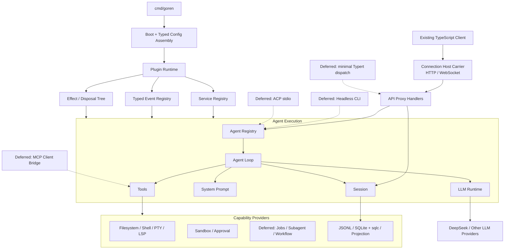

# 02 Go 运行时架构与插件模型

状态：Draft

本文拥有 Go Runtime 的模块边界、依赖方向、Plugin interface、typed config、Service/Event Registry、Scope、effect 生命周期和服务端组合。哪些源包进入范围由[01 复制范围与兼容基线](./01-porting-scope-and-baseline.md)决定；wire 与 API 兼容规则由[03 协议与 API 兼容设计](./03-protocol-and-api-compatibility.md)拥有。

## 1. 总体结构



Runtime 本身只拥有组合、依赖满足、Scope 和生命周期，不拥有 Agent、Session、Tool 或 LLM 业务规则。所有核心服务也以 Plugin 形式挂载，因此没有可以被其他 Plugin 绕过的特权内核。

### 1.1 源职责是默认边界

DeepSeek Harness 的职责划分是 Go 实现的起点，不只是行为参考：

- 保持 Service Definition / Provider / Consumer 的所有权与依赖方向；
- 保持事件由定义该状态转换的能力 owner 声明；
- 保持 Plugin effect 与资源生命周期的归属；
- 保持 Agent、Session、System Prompt、Tools、LLM 与 deployment composition 等独立职责；
- 排除 Web UI、SDK 和浏览器客户端实现时删除相应适配器，不把其职责并入 Core；
- `packages/client/connection` 的 Host carrier 虽位于 `client` 目录，仍按其服务端职责保留。

Go 可以合并只为 TypeScript 构建、声明合并或 npm 发布而存在的物理包，也可以拆出有独立平台依赖的 Provider，但不能借“Go 惯用”重新定义领域职责。任何偏离源边界的设计必须同时给出源符号、依赖问题、目标 owner 和兼容影响。

## 2. 所有权边界

### 2.1 Composition 与 Plugin Runtime

**拥有**：Factory Catalog、typed config 解码/校验、Plugin 状态、Service 可用性、Scope、effect、settlement 和 shutdown。

**不拥有**：会话事件、模型消息、Tool 权限、Provider wire、持久化 schema。

独立原因：它的语言是 `Factory / Plugin / Effect / Scope`，变化来自部署和扩展；Agent Execution 的语言是 `Turn / Step / Inbox / Request`，一致性边界也不同。合并会让业务调用依赖动态装载细节，并使 Plugin rollback 与 Turn transaction 混为一体。

### 2.2 Agent Execution

**拥有**：Agent handle、inbox、turn/step 状态机、Prompt/Tool/LLM 的协调、取消和 idle settlement。

**不拥有**：Event 的长期存储、Provider HTTP、Tool 的业务副作用和 inbound 协议。

独立原因：Agent loop 是同步热路径，必须在一次 Turn 中保持顺序；Session 是追加事实，Provider 与 Consumer 可以独立演进。把它们合并会迫使每个新能力修改 Loop。

### 2.3 Session Data Plane

**拥有**：Session Header、Event envelope、连续 `seq`、surface、fork、repair、append/flush 和派生历史。

**不拥有**：谁触发 Turn、Event 业务决策、JSONL/SQLite 具体 I/O。

独立原因：Session 同时被 Agent、持久化、projection 和 API Proxy 消费，且 append 的串行一致性与后台 projection 不同。把 storage driver 放入 Session core 会阻止替换并污染 replay。

已进入实现的 Header/Event、内存 log、surface 和 Store 生命周期由[10 Session Core 与生命周期模块设计](./10-session-core-and-lifecycle.md)拥有；fork、repair 和派生历史仍按本边界后续进入，不因首个切片尚未包含而转移 owner。

### 2.4 Storage Adapter

存储依赖保持：

```text
Session / Application use case
  -> consumer-owned Store interface
  -> JSONL adapter

Projection use case
  -> consumer-owned ProjectionStore interface
  -> SQLite + sqlc adapter
```

JSONL、SQLite 和未来其他 adapter 只拥有序列化、文件/数据库 I/O、被请求的事务执行、storage record 映射、durability 机制和技术错误转换。它们不拥有：

- Session Event 的业务类型、`seq` 分配和 turn/step 状态机；
- 开放 turn 是否以及如何 repair；
- 哪些 Event 形成何种业务 projection；
- retention、authorization、permission 或 workflow policy；
- use case 的原子边界。

Session Recovery owner 检测开放轮次并决定追加 `interrupted` 等事件；Projection owner 把 Event 转换为明确的 projection mutation。Adapter 只持久化调用者已经决定的数据。sqlc 生成类型和 driver 类型必须在 adapter 内映射，不能成为 Store interface 或领域模型。

### 2.5 Capability Plane

每项能力由 Service Definition、Provider 和 Consumer 组成。Definition 拥有最小接口与领域词汇；Provider 拥有外部依赖；Consumer 通常把能力暴露成 Tool、Command 或 Agent policy。

例如 filesystem：

```text
fs Service Definition
  <- local / sandbox Provider
  <- tool-fs / tool-fs-search Consumer
  <- observation policy listener
```

Provider 与 Consumer 不能互相导入。组合根选择它们共享哪个 Service instance。

### 2.6 Client Protocol Plane

Client Protocol Plane 按源职责拆成：

```text
Connection Host carrier
  -> HTTP/WebSocket、trust fence、rpcId、独立 downlink 取消与 teardown
API Proxy contract/handlers
  -> method/payload/result、RpcError、MuxFrame/HostFrame
Core ports
  -> Agent、Session、Interaction、Model directory
Existing TypeScript ConnectionController
  -> 双流 readiness、connection generation、断线重连与 backoff
```

Connection 和 API Proxy 不拥有 Agent 或 Session。它们把 wire 请求翻译为核心调用，并把 committed event、live state 与 interaction 翻译为 frame。每条 WebSocket 断开只取消对应的服务端 stream；Host teardown 才关闭全部 owned socket 并等待 source 清理。两条流的 generation/readiness 是现有 TypeScript Client 的职责，Go Host 不增加服务端 generation 状态或跨 socket 耦合。连接断开不能关闭共享 Runtime。

Typert 不是 Protocol Plane 的必要入口。固定源基线中只有部分 auxiliary Remote endpoint 经 Typert interceptor 进入共享 `/api` channel；这些 endpoint 进入 capability matrix 前，不实现通用 Typert Registry/Gateway。

## 3. 边界判断

| 边界 | Language | Change rate | Actor | Consistency | NFR | External dependency |
| --- | --- | --- | --- | --- | --- | --- |
| Plugin Runtime / Agent | Plugin lifecycle vs Turn | 配置与业务循环独立变化 | 部署者 vs 用户请求 | mount transaction vs turn sequence | 启动/热替换 vs hot path | typed config decoder vs LLM |
| Agent / Session | live coordination vs durable fact | Loop 与 event vocabulary 独立 | Agent driver vs replay consumer | mutable state vs append-only | latency vs durability | 无 vs storage |
| Service / Provider | stable capability vs vendor implementation | Definition 慢、Provider 快 | Consumer vs external system | caller contract vs I/O | portable vs provider-specific | SDK/OS/API |
| Core / Client Protocol | in-process semantics vs wire | Core 与 Client contract 独立 | Agent vs TypeScript Client | direct call vs correlated request/frame | low overhead vs reconnect/transport limits | HTTP/WebSocket |

每条边界至少存在一个强信号和另一个中等信号；不是为了对应源目录而拆包。

## 4. Plugin interface

目标 API 由三个层次组成：Factory 创建实例，Plugin 挂载行为，Runtime 拥有 effect。以下是语义草图，不锁定最终 Go 字段布局：

```go
type Plugin interface {
	Manifest() Manifest
	Apply(context.Context, *Scope) error
}

type Factory[C any] interface {
	Name() string
	DecodeConfig(json.RawMessage) (C, error)
	New(context.Context, C) (Plugin, error)
}

func RegisterFactory[C any](registry *Catalog, implementation Factory[C]) error

type Disposer func(context.Context) error
```

`Factory.Name()` 使用源实现 canonical plugin name，例如 `@deepseek-ai/dsh-agent`。Go import path 不需要模仿 npm scope，但 deployment config 中的 `name` 保持一致，使源职责和 Go 配置可追踪。

`Plugin.Apply` 不返回裸 Service，也不负责把自身加入全局 Registry。它通过 `Scope` 注册 effect；Runtime 在 `Apply` 返回后一次性发布成功状态。若 `Apply` 失败，Scope 立即按逆序执行本次获得的 disposer。

每个 Factory 的类型参数 `C` 是该能力 owner 定义的命名配置类型。`DecodeConfig` 必须拒绝未知字段、错误类型与无效组合；`New` 只接收已经校验的 `C`。Catalog 为保存不同 `C` 的 Factory 可以在内部擦除类型，但裸 `json.RawMessage` 只能存在于入站解码/注册边界，不能进入 Plugin 业务逻辑。默认值、环境变量解析、平台选择和派生值由显式 Go 函数完成。

### 4.1 为什么不用标准库 `plugin`

Go 标准库 `plugin` 只支持部分平台、不能卸载、race detector 支持不足，而且要求主程序与插件使用完全相同的 toolchain、build tags 和依赖源码。它不满足 Windows、单文件部署、可撤销 lifecycle 和稳定交付要求。

外部扩展的交付方式是：Go module 实现公开 interface，应用装配者在自定义 composition root 中显式加入 Factory，再构建新的静态二进制。Runtime 热替换的是已编译实例和 typed config，不是任意新代码。

## 5. Service Registry

每项 Service Definition 声明一个稳定 key 和 Go interface。Go 不支持带独立类型参数的方法，因此 typed registry 使用泛型自由函数，而不是 `Scope.Get(key) any` 后让调用者反射：

```go
type ServiceKey[T any] struct { /* opaque */ }

func Provide[T any](pluginScope *Scope, key ServiceKey[T], instance T) (Disposer, error)
func Require[T any](pluginScope *Scope, key ServiceKey[T]) (T, bool)
```

关键规则：

- Service key 的字符串值与源 `ctx` key 对齐，例如 `sessions`、`agents`、`tools`、`llm`；
- 同一 Scope 中重复 Provider 在激活时失败，不使用 last-write-wins；
- Consumer 声明 required 与 optional dependencies；required Service 未就绪时等待，不靠文件顺序；
- Service 撤回后，依赖它的 Plugin 先停止，再停止 Provider；
- 若未来纳入 Typert Remote，Typert lookup 不得缓存业务对象；每次调用读取 live Service；
- 只有所有者包创建 `ServiceKey[T]`，其他包导入 key，不能用相同字符串重建一个不兼容类型。

## 6. Typed Event Registry

源 Cordis 的 declaration merging 在 Go 中映射为 owner-defined typed key：

```go
type EventKey[P, R any] struct { /* name + mode + owner token */ }
type Waterfall[P, R any] func(context.Context, P, Next[P, R]) (R, error)
```

注册和 dispatch 同样使用泛型自由函数。Event key 持有私有、非零大小的 owner token，并通过泛型固定 payload/result type；相同字符串若由其他调用者重新创建，或以不同 mode 再次注册，Runtime 在启动期失败。payload/result 的匹配由 Go 编译器和 typed handler interface 保证，不使用 `reflect.Type`。异构 listener 只在 Runtime 私有表内短暂擦除为 `any`，业务代码不接触断言。

| 源模式 | Go 语义 |
| --- | --- |
| `emit` | 同步按注册顺序通知；非 veto；listener failure 被 owner 规定的 containment policy 处理 |
| `parallel` | 启动所有 listener，等待全部完成并聚合错误 |
| `serial` | 按顺序等待；首个明确 bail 结果停止 |
| `bail` | 同步首个 bail 结果停止，仅用于需要同步决策的事件 |
| `waterfall` | outer-to-inner middleware；只有调用 `next` 才委托下游 |

`waterfall` 不能用一个共享可变对象加普通 `emit` 模拟，因为这样无法表达短路、返回值包装和 listener 顺序。`agent/pre-step`、`agent/request`、`llm/stream`、`tools/pre-execute`、`tools/execute`、`tools/post-execute` 必须保留 waterfall 语义。

## 7. Effect 与生命周期

### 7.1 Effect Tree

每个 Plugin instance 有独立 Scope 和 LIFO disposer stack。以下操作必须通过 effect 完成：

- 提供 Service；
- 注册 Event listener；
- 注册 LLM adapter、Tool、Prompt section、Provider 或 policy；
- 启动 goroutine、timer、watcher、subprocess、PTY、数据库连接或网络连接；
- 创建临时文件或占用外部资源。

Disposer 必须幂等、接受 shutdown context，并等待其 owned operation 停止。Runtime 不以 process exit 代替 cleanup。

### 7.2 Plugin 状态

```text
declared
  -> waiting-dependencies
  -> starting
  -> active
  -> stopping
  -> stopped

starting --failure--> rolling-back -> failed
active --replacement--> starting(candidate) -> commit -> stopping(old)
```

候选实例在 shadow Scope 完成配置、依赖与 invariant 检查后才能成为 active。若源语义要求注册期间不能同时存在两个相同 Service，则 Runtime 采用短临界区完成旧/新 owner swap，而不是先卸载旧实例造成空窗。

### 7.3 Shutdown 顺序

1. 停止接收新 inbound request；
2. 取消 Root Context；
3. 等待 Agent、Tool 及当前已纳入 adapter 的 pending operation 结算；
4. flush Session 和 telemetry；
5. 按依赖图的反向顺序卸载 Plugin；
6. 对仍未停止的资源报告明确失败并返回非零退出码。

## 8. Scope 与 isolation

Root Scope 拥有全局 Provider、Store 和配置。每个 Agent 创建 Child Scope；Agent Preset 在 Child Scope 中挂载 Prompt、Tools、Model selection 和局部 policy。

`isolate(serviceKey, label)` 的 Go 语义是为指定 Service key 创建新的 resolution namespace。相同 label 的 Child Scope 可以共享实例；不同 label 不能看到彼此注册。Scope 过滤也应用到 scoped Event listener，避免一个 Agent 的 Tool、Prompt 或 lifecycle listener 观察另一个 Agent。

禁止用 `context.Context.Value` 充当 Service Registry。标准 `context.Context` 只传播 deadline、cancellation 和 request-scoped metadata；Service 与 Plugin ownership 由 `Scope` 表达。

## 9. Typed config 与服务端组合

配置流水线固定为：

```text
CLI / environment / optional config file
  -> strict ingress decode
  -> ServerConfig
  -> owner-defined Plugin Config
  -> Validate
  -> Factory.New
  -> shadow Scope activation
```

ServerConfig 只描述部署选择，例如监听地址、trusted hosts、启用的 Factory、持久化位置和 credential reference。每个 Plugin 的完整配置由其 Factory owner 定义；不得建立包含所有能力可选字段的全局配置对象。

不同 Factory 的配置在 Catalog 内部可以通过已注册的 decoder/constructor closure 做类型擦除，但类型擦除不能越过创建边界。运行时替换必须重新完成严格解码、默认值计算、校验和 shadow activation，成功后才切换 last-known-good instance。

外部输入规则：

- CLI 与环境变量只在 `internal/config` 转换为 typed fields；
- 可选 YAML/JSON 文件必须严格解码，未知字段和重复 key 失败；
- platform-specific 选择由 composition root 或 build-tagged Provider 完成；
- 派生默认值由显式、可单测的 Go 函数计算；
- credential 使用引用或受控来源，不进入 config dump；
- `!!js`、模板脚本、`ctx` 插值和任意代码执行一律不支持。

源 Cordis Profile 若需要迁移，必须把每个动态表达式显式翻译成字段、环境变量绑定、默认值函数或 composition 选择。Goren 不承诺直接加载源 Profile，也不提供另一种表达式语言替代 `!!js`。

## 10. Go 包边界

只在实现相应阶段时创建实际包。以下结构以源 Harness 的职责为默认映射，同时去掉 TypeScript/npm 专属层和明确排除项：

```text
cmd/goren/               TypeScript-client-compatible Agent server
plugin/                  public Plugin, Factory, Scope, Service/Event keys
connection/              RPC envelopes, receipts, frame unions and protocol constants
apiproxy/                included method contracts and core-facing handlers
session/                 public Session log contract and in-memory service
agent/                   public Agent contract and registry
agentloop/               default Agent provider
systemprompt/            prompt assembly service
tools/                   tool definition, registry, execution pipeline
llm/                     Harness-compatible LLM service and vocabulary
<capability>/            public Service Definition
<capability>/<provider>/ optional reusable Provider plugins
internal/boot/           CLI/server lifecycle
internal/config/         strict ingress decode and typed assembly
internal/connection/     Echo v5 and coder/websocket Host carrier
internal/assembly/       shipped server composition; optional adapters later
internal/compat/         source-baseline fixture verification
```

公开包只承载外部 Plugin 真正需要实现或消费的 extension contract。内置且不承诺复用的 Provider 留在 `internal/`。不创建 `common`、`helpers`、全局 DTO 包或一个包含所有可选字段的通用 Service。

## 11. Agent loop 依赖方向

```text
inbound adapter
  -> AgentRegistry interface
  -> AgentLoop provider
       -> Session interface
       -> SystemPrompt interface
       -> Tools interface
       -> LLM interface
  -> outbound capability interfaces
  -> provider adapters
```

Agent loop 不导入 Connection、API Proxy、JSONL、SQLite、OpenAI SDK、ACP、MCP、CLI、filesystem Provider 或 sandbox driver。它只通过 Consumer-owned interfaces 与事件交互。

## 12. Runtime invariants

Runtime 为每个包保留 source 中 `./invariant` 的设计意图，但 Go 不要求每个包机械创建同名文件。Invariant 必须检查 owned relationship，例如：

- 模型请求能由 Session Event 重建；
- Tool Registry 中的 definition 与执行 owner 同时存在；
- Adapter route 与 provider metadata 一致；
- active Plugin 的 required Services 全部可解析；
- disposer 完成后 Registry 不再含该 owner 的 contribution。

仅检查方法“存在”或固定纯示例没有价值。Invariant failure 是编程错误，不能降级为 warning。
