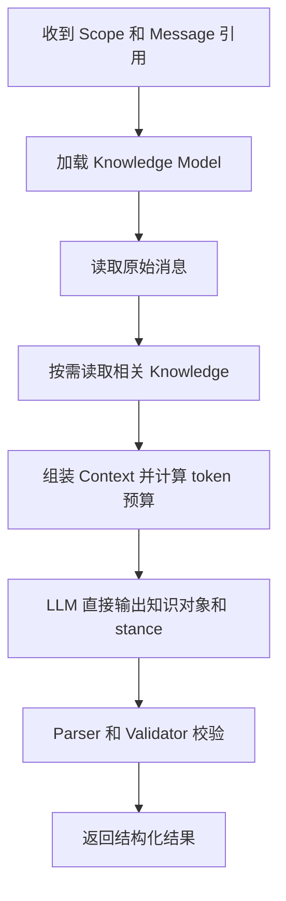
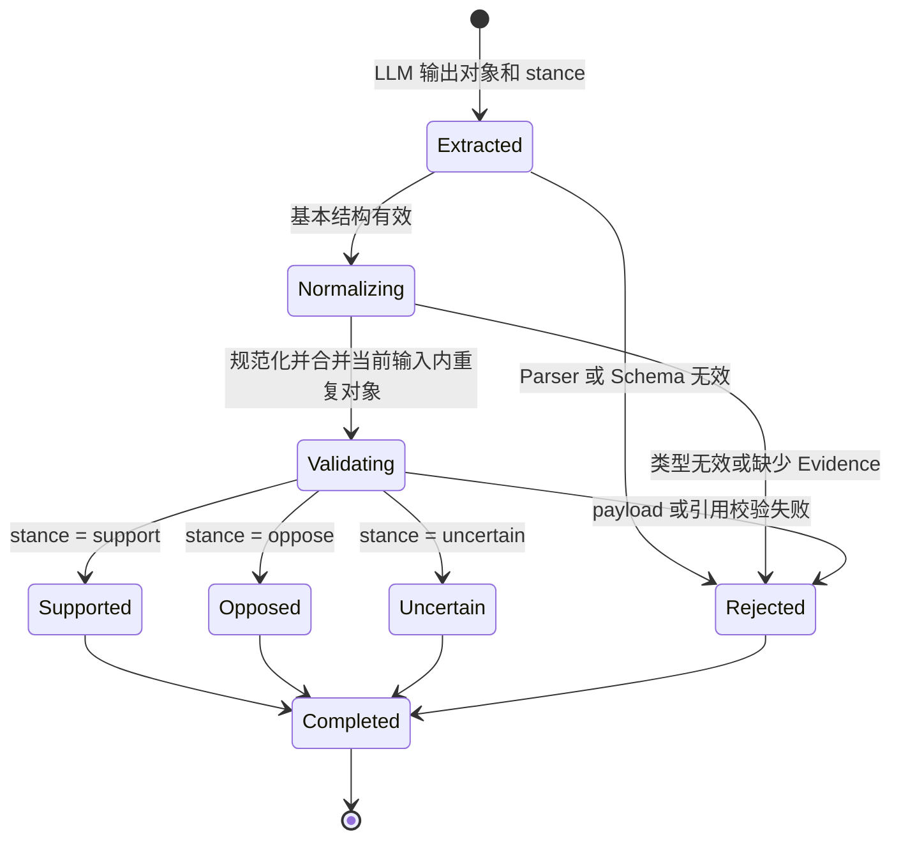
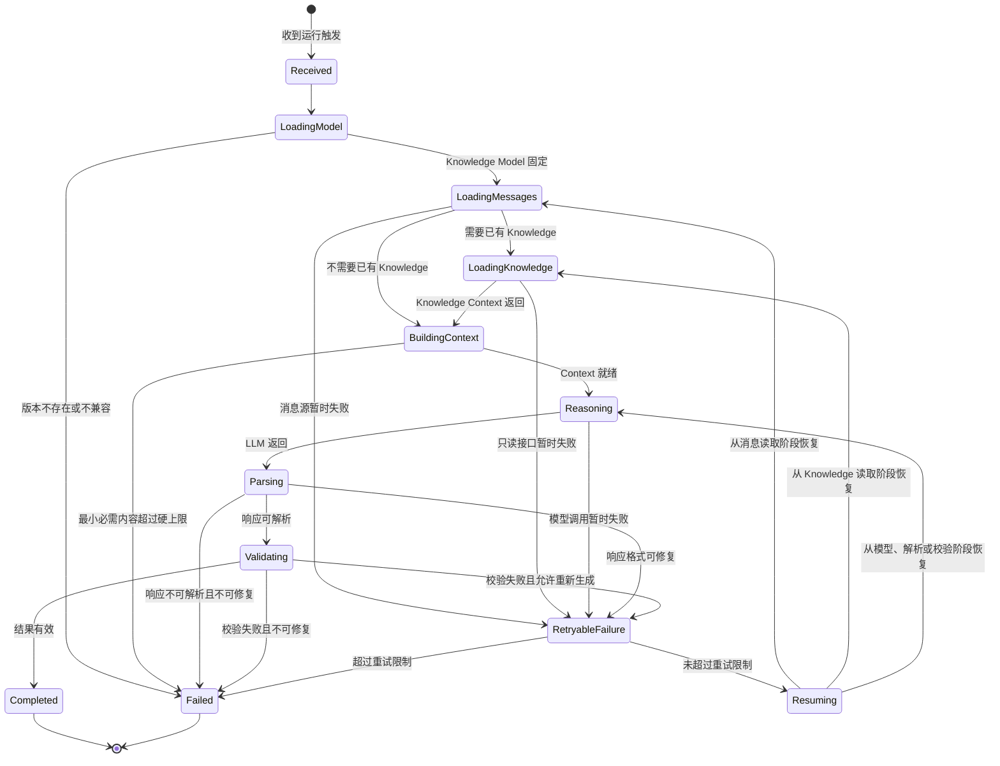

# 02 工作流与立场判断

状态：Draft

本文负责一次 Memory Agent Run 的处理步骤和三种最终立场。系统边界见[架构与边界](./01-architecture-and-boundaries.md)，接口形态见[接口与数据契约](./03-tools-and-contracts.md)。

## 6. 总体工作流



Run 在返回结果时结束，不包含 Knowledge 写入或验证阶段。

### 6.1 加载 Knowledge Model

Orchestrator 按输入版本加载 Knowledge Model，固定本次启用的知识类型、Prompt、Schema、Parser 和 Validator。加载失败或版本不存在时，Run 失败；不得自动改用其他版本。

### 6.2 读取消息

Orchestrator 从 Conversation Source 读取原始消息。当前新增消息及其 Evidence 范围必须完整保留，Trigger Source 不负责预先拼装 Prompt。

### 6.3 获取相关 Knowledge

当已有 Knowledge 可能影响立场判断、对象归一化或当前输入去重时，Agent 通过只读 Knowledge Context Port 获取信息。

请求只表达 Scope、启用类型、输入 Focus 和返回预算。Agent 不请求 Knowledge 的版本、生命周期、索引或存储信息，也不通过接口执行修改。

如果无需已有信息即可判断，Agent 可以不调用该接口。

### 6.4 组装 Context

Context Manager 将以下内容装入同一次最终判断所需的 Context：

- System 和 Agent 指令；
- 启用类型的 Prompt 与输出 Schema；
- 当前消息及必要历史；
- 相关 Knowledge Context；
- 输出预留和安全余量。

超出预算时优先裁剪低相关 Knowledge，再压缩较早历史。当前消息、Evidence 锚点、必需指令、输出 Schema 和最小输出预留不得丢失。

### 6.5 LLM 直接判断

LLM 直接完成：

- 抽取启用类型允许的知识对象；
- 规范化同一对象的重复表达；
- 结合完整 Context 判断用户最终立场；
- 按 Schema 输出 `kind`、`payload`、`stance`、`evidence` 和可选 `knowledge_refs`。

Workflow 不在 LLM 输出之后再引入额外的语义关系转换。

### 6.6 解析、校验和返回

Parser 将模型响应转换为结构化结果，Validator 只做确定性检查：

- `kind` 和 Schema 版本属于本次 Knowledge Model；
- payload 符合对应 Schema；
- `stance` 只能是 `support`、`oppose` 或 `uncertain`；
- Evidence 指向本次输入消息；
- `knowledge_refs` 只能引用本次接口返回的信息；
- 同一知识对象在结果中只出现一次。

校验通过后直接返回。Parser 和 Validator 不重新判断立场，也不把结果转换为 Knowledge 操作。

## 7. Stance 规则

### 7.1 support

用户在当前 Context 结束时支持、确认或明确陈述该知识。

例如：

```text
“我主要使用 Go。”
```

对应知识对象的 `stance` 为 `support`。

### 7.2 oppose

用户在当前 Context 结束时反对、否认或撤回该知识。

例如已有信息是“用户主要使用 Go”，当前输入为：

```text
“我已经不用 Go 了。”
```

“主要使用 Go”对应对象的 `stance` 为 `oppose`。

### 7.3 uncertain

当前 Context 无法确定用户是否支持或反对该知识。

假设、转述、语义含糊或 Knowledge Context 不足时返回 `uncertain`，不得猜测为 `support` 或 `oppose`。

### 7.4 不返回结果

以下内容不返回知识结果：

- 纯询问；
- 临时任务步骤；
- 无关内容；
- 不属于启用知识类型的内容；
- 无法绑定当前消息 Evidence 的内容。

“不返回”不是第四种 stance。

## 8. 重复与修正

### 8.1 当前输入内重复

同一知识被多次表达时只返回一个规范化对象，并合并相应 Evidence。

### 8.2 修正

修正直接拆成最终立场结果。例如：

```text
“我已经不用 Go 了，现在主要使用 Rust。”
```

输出：

- “主要使用 Go”：`oppose`；
- “主要使用 Rust”：`support`。

无需输出“取代”“冲突”或“撤回”等额外关系。

### 8.3 已有 Knowledge

已有 Knowledge 只是 LLM 判断的 Context。是否已经存在相同对象，不改变 `stance` 的含义，也不要求 Agent 输出新增、保留、更新或删除动作。

### 8.4 抽取对象生命周期

抽取对象具有处理生命周期，用来说明 LLM 输出经过解析、规范化和校验后是否进入最终结果。它不描述 Knowledge 的持久化生命周期。



`Supported`、`Opposed`、`Uncertain` 只是三种 stance 在处理流程中的对应节点，不是额外状态。`Rejected` 对象不进入最终结果；是否重试整个 Run 由 Agent 状态机决定。

## 9. Agent 状态机

Agent 状态机描述一次 Run 的执行阶段、重试和终态，不描述 Knowledge 如何管理。



### 9.1 运行终态

一次 Run 只有：

- `Completed`：成功返回零项或多项结构化结果；
- `Failed`：无法完成读取、模型调用、解析或确定性校验。

结果中包含 `uncertain` 仍属于 `Completed`。

## 10. 对话行为

- 赞成或确认：对应知识返回 `support`。
- 反对、否认或撤回：对应知识返回 `oppose`。
- 无法确定最终立场：对应知识返回 `uncertain`。
- 纯询问或忽略：不返回知识结果。
- 修正：旧知识返回 `oppose`，新知识返回 `support`。
