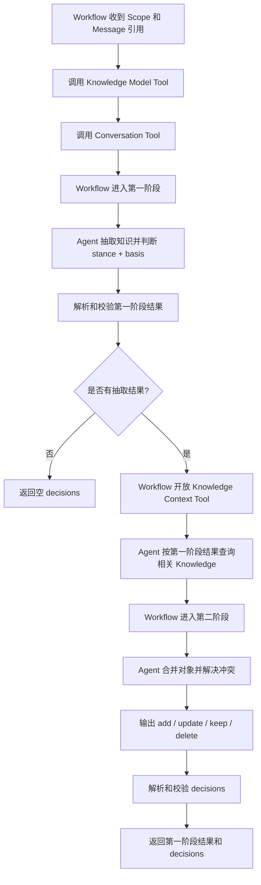
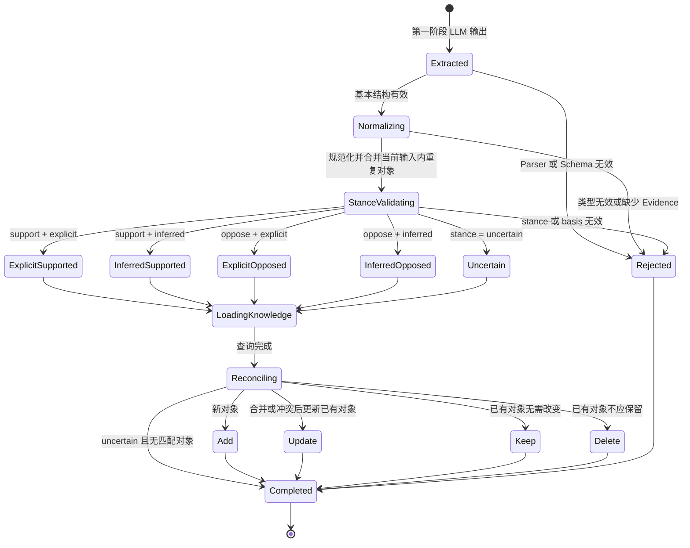
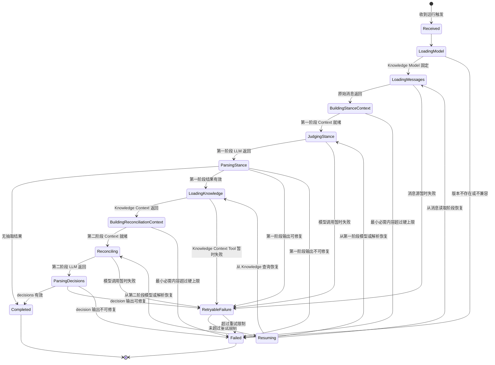

# 02 两阶段工作流与知识决策

状态：Draft

本文负责第一阶段立场判断、第二阶段 Knowledge 合并与冲突解决、抽取对象生命周期和 Agent 状态机。系统边界见[架构与边界](./01-architecture-and-boundaries.md)，接口形态见[接口与数据契约](./03-tools-and-contracts.md)。

## 6. 总体工作流



Run 在返回 decisions 时结束，不执行 Knowledge 写入，也不验证下游是否已经执行决策。Agent 结果不携带记忆对象版本或 `expected_version`；下游只有在构造数据库写命令时才注入 `expected_version`。

### 6.1 Agent、Tools 与 Workflow 的协作

| 阶段 | Workflow 约束 | 可用 Tools | Agent 职责 |
| --- | --- | --- | --- |
| 初始化 | 固定版本、Scope 和输入引用 | Knowledge Model、Conversation | 获取本次运行配置和消息 |
| 第一阶段 | 禁止 Knowledge 查询；校验 stance 结果后才能转移 | Knowledge Model、Conversation | 抽取对象并判断 stance 与 basis |
| 第二阶段 | 只处理已校验的第一阶段结果；校验四种 decision | Knowledge Context | 查询相关 Knowledge，结合已加载的信息合并或解决冲突并作出决策 |
| 完成 | 禁止进一步 Tool 调用 | 无 | 返回第一阶段结果和 decisions |

Workflow 不是替代 Agent 推理的脚本，Agent 也不是不受约束的 Tool Loop。两者通过阶段输入、Tool 权限和结构化结果协作。

## 7. 第一阶段：抽取与立场判断

### 7.1 输入

第一阶段只使用 Conversation Context：

- System 和 Agent 指令；
- 启用类型的第一阶段 Prompt 与输出 Schema；
- 当前消息及必要的 Conversation 历史；
- 输出预留和安全余量。

第一阶段不得读取或包含已有 Knowledge；Workflow 在该阶段不开放 Knowledge Context Tool。

### 7.2 Agent 语义输出

Agent 通过 LLM 直接完成：

- 抽取启用类型允许的知识对象；
- 规范化当前输入内同一对象的重复表达；
- 判断用户对每个对象的最终 stance；
- 区分用户直接表态和基于 Conversation Context 的推断；
- 输出 `result_ref`、`kind`、`payload`、`stance`、可选 `basis` 和 `evidence`。

### 7.3 Stance 与 basis

- `support + explicit`：用户直接支持、确认或陈述该知识；
- `support + inferred`：Agent 根据 Conversation 指代、前文问答或多条消息推断用户支持；
- `oppose + explicit`：用户直接反对、否认或撤回该知识；
- `oppose + inferred`：Agent 根据 Conversation Context 推断用户反对；
- `uncertain`：无法确定用户最终立场，不设置 basis。

已有 Knowledge 不能参与第一阶段 inferred 判断。

### 7.4 不返回结果

纯询问、临时任务步骤、无关内容、不属于启用类型的内容和无法绑定当前 Message Evidence 的内容不进入第一阶段结果。“不返回”不是第四种 stance。

## 8. Knowledge 查询

第一阶段校验完成后，Workflow 才进入第二阶段并开放 Knowledge Context Tool。Agent 使用第一阶段结果构造语义查询；Tool 负责执行 Scope、类型和预算约束。

请求由第一阶段结果生成，至少包含：

- Scope；
- `knowledge_model_version`；
- 每项 `result_ref`、`kind`、payload、stance 和 basis；
- 用于相关性检索的 Focus；
- Evidence 深度和返回 token 预算。

Provider 返回相关 Knowledge 的不透明引用、payload、已有 stance、可选 basis 和 Evidence。Agent 不请求其存储、对象版本、索引或生命周期信息。

即使没有匹配项，Provider 也应为每个 `result_ref` 返回明确的空匹配结果，供第二阶段产生 add 或不产生决策。

## 9. 第二阶段：合并与冲突解决

### 9.1 输入

第二阶段 Context 包含：

- 第二阶段 Prompt 与 decision Schema；
- 已校验的第一阶段结果；
- 相关已有 Knowledge；
- 当前 Message Evidence；
- 输出预留和安全余量。

第二阶段不重新抽取无关知识，只处理第一阶段 `result_ref` 覆盖的对象及其相关 Knowledge。

### 9.2 LLM 处理

LLM 负责：

- 判断第一阶段对象与已有对象是否表达同一知识；
- 合并当前输入内或 Knowledge 中可合并的重复内容；
- 判断新旧 stance 是否一致或冲突；
- 在类型规则允许时生成规范化后的最终对象；
- 为每项变化输出 `add`、`update`、`keep` 或 `delete`。

### 9.3 Decision 规则

#### add

不存在可复用的已有对象，且第一阶段结果足以形成可保存知识时使用。决策携带完整新对象和来源 `result_ref`。

#### update

已有对象应保留身份，但 payload、stance、basis 或 Evidence 需要替换或合并时使用。决策携带 `target_ref`、合并后的完整对象和来源 `result_refs`，不携带当前版本或 `expected_version`。

#### keep

已有对象已经正确表达最终结果时使用。它携带 `target_ref` 和支持该判断的 `result_refs`，不创建重复对象。

#### delete

已有对象不应继续保留，且没有同一身份下需要保留的替代结果时使用。它携带 `target_ref` 和来源 `result_refs`，不携带当前版本或 `expected_version`；当前 Evidence 通过第一阶段结果追溯。

### 9.4 不得机械映射

- `support` 可能产生 add、update 或 keep；
- `oppose` 可能产生 add、update、keep 或 delete，取决于该类型是否保存反对立场以及当前语义；
- `uncertain` 不得直接产生 add、update 或 delete；有匹配对象时可以 keep，没有匹配对象时不产生 decision。

第二阶段必须通过 LLM 和类型规则判断，不能仅用 stance 编写固定映射表。

### 9.5 修正示例

已有 Knowledge：用户主要使用 Go，stance 为 support。

当前输入：

```text
“我已经不用 Go 了，现在主要使用 Rust。”
```

第一阶段输出：

- “主要使用 Go”：`oppose + explicit`；
- “主要使用 Rust”：`support + explicit`。

第二阶段可以输出：

- 对已有 Go 对象执行 update，将 stance 更新为 oppose；
- 对 Rust 对象执行 add。

若某个知识类型规定反对只表示移除而不保存反对立场，则 Go 对象也可以产生 delete。选择 update 还是 delete 属于第二阶段类型规则和冲突解决，不由 stance 单独决定。

## 10. 生命周期与状态机

### 10.1 抽取对象生命周期

抽取对象生命周期覆盖从第一阶段 LLM 输出到第二阶段 decision。它只描述语义对象在 Agent Run 内的状态，不描述或推进 Knowledge 的持久化版本。



第一阶段 stance 节点和第二阶段 decision 节点属于两个不同阶段。一个 stance 不能直接决定下一步 decision。

### 10.2 Agent 状态机

Agent 状态机描述 Memory Agent 一次 Run 的执行阶段、阶段内重试和终态，由 Workflow 维护。它覆盖 Agent、Tools 和 Workflow 的协作状态，不描述 Knowledge 如何执行 decisions。



#### 10.2.1 运行终态

- `Completed`：成功返回零项或多项第一阶段结果以及零项或多项 decisions；
- `Failed`：无法完成读取、任一阶段模型调用、解析或确定性校验。

第一阶段含 `uncertain` 或第二阶段返回空 decisions 仍可以是 `Completed`。
