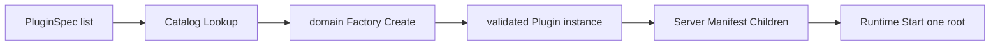
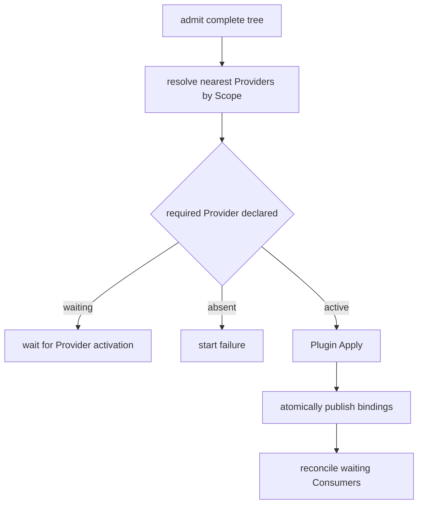
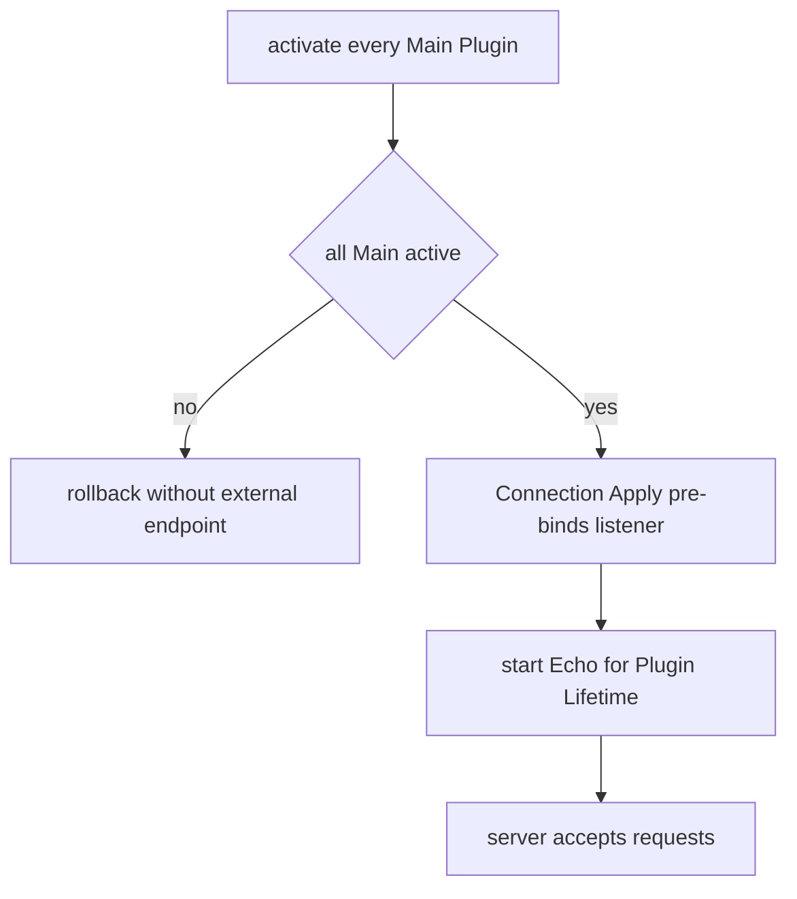
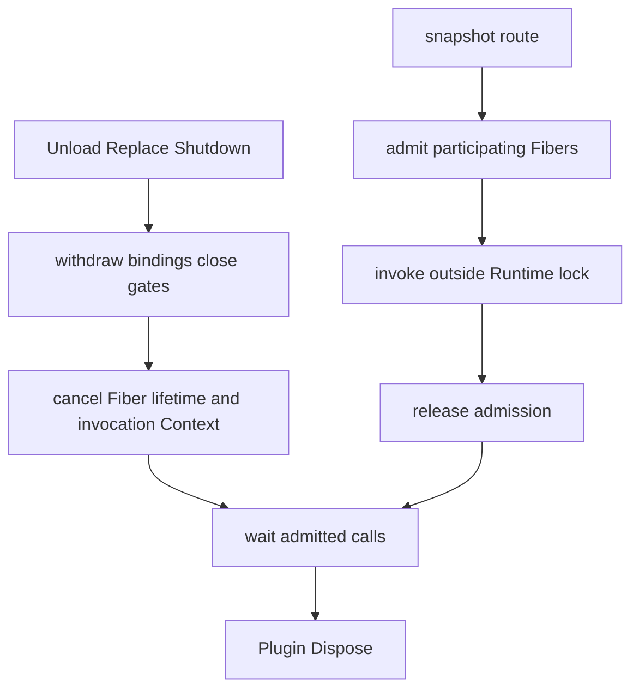

# 09 Plugin Runtime 与 Server Assembly 模块设计与实现

状态：Accepted / Implemented，2026-08-20 已复核

本文拥有 Goren 的 Plugin Runtime、Factory 构造边界和默认 Server composition。通用框架目标与插件开发方式见[Go Cordis 风格通用 Plugin 事件领域框架设计](./Go_Cordis_风格插件事件领域运行时设计方案.md)；当前测试证据见[08 实施进度](./08-implementation-progress.md)。各业务能力的规则仍由自己的模块设计拥有，本文不重新定义 Agent、Session、LLM、Tools 或 wire contract。

## 1. 来源与 Go 取舍

固定 DeepSeek Harness 基线是 `47f943859bef60e4160492346772ded9b24f765a`。

| 源责任 | Go owner | 保留语义 |
| --- | --- | --- |
| Cordis Plugin / Registry | `plugin.Plugin`、`plugin.Runtime` | 模块生命周期、依赖结算、动态 mount |
| Cordis Fiber / effect | Runtime 私有 Fiber、binding、调用 gate | 回滚、dependent-first stop、逆序清理 |
| Cordis provide / notify | Manifest、`ServiceOf`、`Require`、`Resolve` | Provider/Consumer 分离与依赖重结算 |
| Cordis events | typed Event 与 Waterfall | 事实通知和洋葱控制分离 |
| Cordis Context / scope | 私有 mount tree 与 Scope | 继承、覆盖、可见性和子生命周期 |
| Harness `packages/host/apiproxy` | `apiproxy` 与 `apiproxy/host` | Host API 与事件流能力 |
| Harness Connection Host | `internal/connection` | Echo HTTP/WebSocket carrier 生命周期 |
| Harness 各 core package | 对应 Go 领域 package 与 `factory` 子包 | Service、Provider、Consumer 和 canonical name |

Go 不复制 Proxy 属性查找、decorator、declaration merging、npm loader、Profile evaluator、`!!js` 或解释性 Context 链。Service 身份来自具名 Go interface；Factory 静态注册；Plugin 对象直接实现能力和生命周期。

## 2. 责任边界

### 2.1 `plugin`

`plugin` 负责：

- 读取完整 Plugin 树的 Manifest snapshot；
- 校验对象身份、循环、子树 placement、phase 和声明接口；
- 维护 mount tree、Scope、Service graph、Event/Waterfall binding；
- 按依赖顺序激活、停止、替换和回滚 Fiber；
- 自动管理 Event、Waterfall 及 retained 调用的准入和排空；
- 提供不泄漏内部表的 `FiberStatus` 诊断。

`plugin` 不读取配置、不访问 Catalog、不构造业务 Plugin，不拥有 HTTP、Agent turn、Session 事务、Tool policy、LLM wire 或存储。

### 2.2 各领域 `factory` 子包

每个领域 Factory 负责且只负责：

- canonical Plugin 名称；
- 自己的具名 Config；
- strict JSON decode、默认值、范围和组合校验；
- 把已验证设置及显式技术依赖组装为未激活 Plugin。

Factory 不打开 listener、不启动 goroutine、不 mount Plugin。需要 I/O 的 adapter 以 opener 或配置保存在 Plugin 中，到 `Apply` 才真正获取资源。raw JSON 在 Factory 终止，不进入 Plugin 或 Runtime。

`plugin/factory.Catalog` 只维护 Factory 名称唯一性和查找。公共配置 helper 只处理所有 Factory 共享的 JSON object、duplicate field、空配置和 Create Context 规则；字段语义仍属于领域 owner。

### 2.3 `internal/assembly`

`internal/assembly` 是 Goren 进程的 composition root，只负责：

- 建立 shipped Factory Catalog；
- 把进程环境和统一 diagnostics adapter 交给需要它的 Factory；
- 形成默认 `PluginSpec` 部署声明；
- 逐项调用 Factory，构造完整且尚未激活的 `Server` Plugin 树；
- 验证 Factory 名与返回 Plugin 的 `Manifest.Name` 一致；
- 把 Connection 标记为 commit-phase 外部入口。

它不实现任何领域 Service，不声明替领域管理的生命周期，不读取 Plugin 私有字段，也不直接创建 Echo、SQLite、Agent 或 LLM 业务对象。原来散落在 assembly 的逐领域 `newXPlugin`/`loadX` 构造流程已删除。

### 2.4 `cmd/goren`

命令入口只解析进程级 flags、解析存储路径和信号，然后执行：

```text
NewDiagnostics
  -> NewCatalog(Environment)
  -> DefaultSpecs(...)
  -> BuildServer(context, catalog, specs)
  -> plugin.NewRuntime(...)
  -> Runtime.Start(server)
  -> wait signal
  -> Runtime.Shutdown(deadline)
```

入口不注册路由、不解析领域 Config、不持有业务 Service，也不手工安排 Provider 的启动顺序。

## 3. Server 是组合 Plugin，不是第二个 Runtime

`assembly.BuildServer` 在 Runtime 外调用 Factory，返回一个 `*assembly.Server`。Server 只保存 `[]plugin.ChildPlugin` 和可选的 bound endpoint 只读视图；它的 `Apply`/`Dispose` 没有业务行为。



这满足两个边界：

1. Runtime 接收的永远是已构造完成的对象树，不耦合配置或 Catalog；
2. 业务服务不自行拼 Tree，Goren 的 composition root 负责构造 Server 子树。

`PluginSpec` 只有 Factory name、raw JSON 和 activation phase。raw JSON 是 assembly 与 Factory 之间的擦除边界，不会穿过 `Factory.Create`。

Build 阶段不产生运行时 effect，因此任一配置或构造失败可以直接丢弃整棵候选树；Start 后的资源和 binding 才由 Runtime 统一回滚。

## 4. Service 依赖与激活

能力 owner 定义嵌入 `plugin.Service` 的最小业务 interface。Provider Plugin 直接实现 interface，并在 Manifest 声明 `Provides`；Consumer 声明 `Requires` 或 `Optional`，在 Apply 中取得 typed snapshot。



声明列表只决定 mount ordinal，不决定依赖启动顺序。Provider 不可用时，已声明的 Consumer 等待；整个启动批次最终仍无法满足时，Start 失败并回滚。Provider 卸载或替换时，Runtime 先停止依赖方，再重新结算仍挂载的 Consumer。

`Require`/`Resolve` 只在 Runtime 调用该 Plugin `Apply` 时开放；Apply 保存得到的业务 interface，运行期普通调用不再查 Runtime。

## 5. Main、Commit 与 Connection

默认业务 Plugin 都属于 `ActivationMain`。Connection 是唯一 `ActivationCommit` Plugin，因为它在 TCP 端口上暴露外部流量：



Connection Manifest 依赖 `apiproxy.Service`，启用 Web 时再依赖 `web.Frontend`。它在 Apply 内构造 Echo carrier、同步 `net.Listen`，然后以 `plugin.Lifetime` 启动 Serve。端口占用或权限错误因此属于 activation failure，而不是无 owner 的 goroutine 错误。

停止时 Runtime 先撤销 Connection 的调用资格并取消 lifetime；Connection 等待 Echo 和 WebSocket downlink 清理。调用方 deadline 到期时关闭 listener 和 sockets，并把 deadline、serve 与 cleanup 错误聚合返回。Connection 不提供 Service，避免 Main Consumer 反向依赖 commit phase。

## 6. 调用准入与停机

Event 和 Waterfall dispatch 会把 source Fiber 与所有目标 Fiber 一次性纳入调用 gate。Runtime 在锁内完成 route snapshot 和准入，在锁外调用业务代码。



普通 `Run` 在调用返回时自动释放。LLM 的惰性 `ChunkStream` 使用 `RunRetained`，并由 `invocationChunkStream` 在流完成、失败或关闭时自动 `Release`。Release 只结束该次调用，不是停机 API。外部不需要、也不能手工执行 Runtime 的调用准入与排空。

生命周期回调或 Event/Waterfall handler 同步修改同一 Runtime 拓扑会返回 `ErrTopologyMutation`。调用方可在回调返回后再发起 mount、replace 或 unload。

## 7. Scope、Child 与 replacement

声明式 Child 由父 Plugin 在 Manifest 中持有。`SameScope` 共享父 Scope；`NestedScope` 创建私有子 Scope。运行期确有动态子生命周期时，才使用 `MountChild`、`MountScopedChild` 与 `UnloadChild`。

Scope 路由规则是：Service 与 Event 从 source 向 root 查找，Waterfall 从 root 向 source组装。最近 Service Provider 覆盖祖先；Event 的 exact/ancestor/global Observer 可见；sibling 和 descendant 不可见。

Replacement 校验完整 Main 子树的名称、Service、Event、Waterfall 与子拓扑契约。候选先在私有 binding 视图准备；失败不影响旧实例，成功才切换 binding 并重新激活依赖方。包含 Commit 节点的子树禁止 replacement。

## 8. 默认 Factory 与部署顺序

shipped Catalog 注册以下静态 Factory：

- Agent、Agent Default Model、Agent Loop；
- Session、Session Persistence、Session Projection、Session Query、Session Title；
- LLM、DeepSeek、LLM Retry；
- System Prompt、Tools、Approval、UserQuestions、Tool Ask User；
- Commands、Token Meter、Tool Result Pruner、Basic Compaction、Compact Command；
- Workspace、Web、API Proxy、Connection Host。

SQLite adapter 不单独成为 Plugin 或 Factory。Session Persistence 与 Workspace Factory 只把 SQLite opener 放进各自能力 Plugin；数据库在 Plugin Apply 中打开，并由该 Plugin Dispose。

`DefaultSpecs` 当前按业务阅读顺序声明 Main Plugin，最后声明 Web、API Proxy 和 commit-phase Connection。正确性不依赖这个顺序：Runtime 仍按 Service graph 结算。

原版浏览器 Connection runtime、SDK、Tools Code Mode、ACP、MCP、通用 Typert auxiliary endpoint 和脚本配置没有进入 Catalog，也没有占位 Plugin。`commands/list` 与 `commands/execute` 是 `/compact` 纵向切片明确准入的两个 Remote endpoint，不代表通用 Typert Gateway 已进入。

## 9. 失败与诊断

- Factory strict decode 失败：没有 Plugin，没有运行时清理；
- BuildServer 中途失败：未激活对象树直接丢弃；
- Main Apply 或 binding 校验失败：完整启动批次逆序回滚，不激活 Connection；
- Commit Apply 失败：先清理部分外部资源，再回滚 Main 树；
- Event BestEffort、LLM observer、Session post-commit/background write 和 Title async failure：由 `assembly.Diagnostics` 适配到进程 sink，策略仍属于原 owner；
- Shutdown：先 commit、再 dependent/child、最后 provider，聚合 cleanup error。

`Runtime.Status`/`Statuses` 只暴露 mount/fiber identity、状态、依赖、Service、Event、Waterfall、缺失依赖和最后错误，不暴露 Registry 或业务实例。

## 10. 实现与验证证据

| 行为 | 实现 | 验证 |
| --- | --- | --- |
| 完整树准入与回滚 | `plugin/tree.go`、`runtime_activation.go` | `plugin/tree_test.go`、`runtime_test.go` |
| Service graph | `plugin/dependency.go`、`service.go` | `plugin/runtime_test.go` |
| Event/Waterfall dispatch | `plugin/event.go`、`waterfall.go` | 对应 package tests 与 `plugin/example` |
| 调用准入与 retained stream | `plugin/invocation.go`、`llm/runtime_service.go` | Plugin/LLM race tests |
| Factory strict boundary | `plugin/factory`、各领域 `factory` | Factory tests、`internal/assembly/assembly_test.go` |
| detached Server composition | `internal/assembly/server.go`、`catalog.go` | assembly tests、默认主链 contract test |
| Connection commit lifecycle | `internal/connection/plugin.go` | connection 与 assembly tests |
| 固定源 observable contract | 各 owner package 与 `internal/assembly` | 普通 Go golden、表驱动与真实 carrier E2E |

更细的完成状态和命令证据只在[08 实施进度](./08-implementation-progress.md)维护，避免本文成为第二份进度表。
