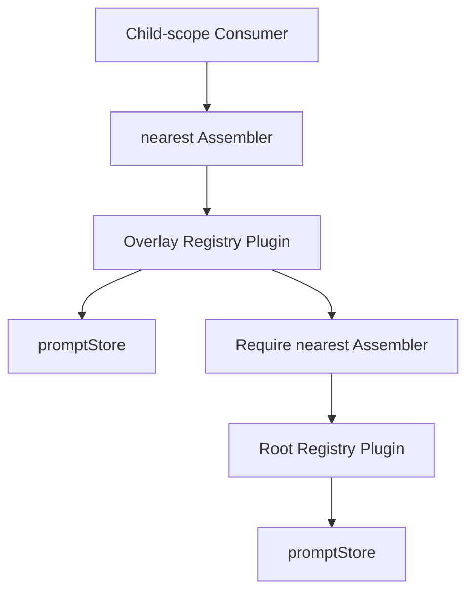
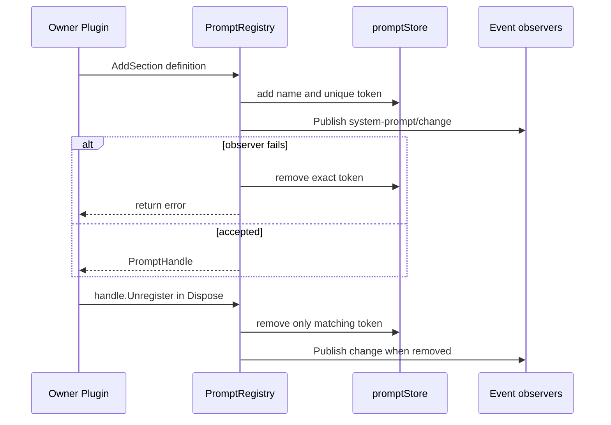
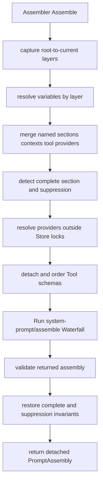

# 11 System Prompt Registry 与 Assembly 模块设计

状态：Accepted / Implemented，2026-08-20 已复核

本文拥有 `systemprompt` 的 Prompt entry、overlay、assembly、Tool schema 排序、变量插值和渲染边界。Plugin Scope、Event、Waterfall 与生命周期见[09 Plugin Runtime 与 Server Assembly](./09-plugin-runtime-and-server-assembly.md)；Tool definition、可见性和执行见[12 Tools Registry 与执行流水线](./12-tools-registry-and-execution-pipeline.md)；完成状态见[08 实施进度](./08-implementation-progress.md)。

## 1. 固定源与职责

固定 DeepSeek Harness 基线是 `47f943859bef60e4160492346772ded9b24f765a`。

`systemprompt` 保留源 `packages/core/system-prompt` 的以下职责：

- section、runtime context、variable、Tool schema provider 的注册；
- parent-to-child overlay、具名 shadow 与稳定排序；
- provider membership snapshot 和锁外求值；
- `system-prompt/change` Event 与 `system-prompt/assemble` Waterfall；
- complete section、runtime-context suppression 和 Tool order invariant；
- strict single-pass `{{name}}` 渲染；
- owner-defined typed Config。

它不拥有 Tool 执行或权限、Agent Turn、模型选择、LLM stream、Session append、模板脚本、Web、wire 或持久化。

## 2. 公共 Service 边界

读写能力分开：

```go
type Assembler interface {
    plugin.Service
    Assemble(context.Context, AssembleContext) (PromptAssembly, error)
}

type PromptRegistry interface {
    plugin.Service
    AddSection(context.Context, PromptSection) (*PromptHandle, error)
    AddContext(context.Context, PromptContext) (*PromptHandle, error)
    AddRuntimeContextSuppressor(context.Context, string) (*PromptHandle, error)
    AddToolProvider(context.Context, string, ToolProvider) (*PromptHandle, error)
    AddVariable(context.Context, string, VariableProvider) (*PromptHandle, error)
}
```

Agent Loop 只依赖 `Assembler`；拥有 Prompt entry 的 Plugin 才依赖 `PromptRegistry`。`SystemPrompt` 是 `Registry` 实现的组合接口，不要求普通 Consumer 获得 mutation API。

`AssembleContext` 只包含 assembly 所需业务数据，不含 Plugin Context 或 Scope。调用哪个 `Assembler` 已由 Plugin Runtime 的 Service resolution 决定。

静态和动态文本统一实现 `TextProvider`；`VariableValue.Defined` 区分空字符串和 undefined。简单无状态函数可以显式适配为 `TextFunc`、`VariableProviderFunc` 或 `ToolProviderFunc`，但 Registry 与 assembly 仍由具名对象拥有状态和流程。

## 3. Root、Overlay 与 Plugin Scope

`systemprompt.Registry` 本身是 Plugin，同时提供 `Assembler` 与 `PromptRegistry`。

- `New` 创建 root Registry，并在 Apply 中安装 Harness identity、persona 和配置的 runtime-context suppression；
- `NewOverlay` 创建 child Registry，在 Manifest 中依赖祖先 `Assembler`，并在自己的 exact `NestedScope` 提供同一 Service；
- Apply 解析最近祖先并保存只读 layer source；
- Dispose 清空本层 Store 并断开 parent。



Registry 不保存 `plugin.Scope`，Store 也不知道 ScopeKey。父子关系由 Plugin Service resolution 和 overlay Plugin 对象表达，不另建 System Prompt scope registry。

可见 layer 从 root 到当前 overlay 排列。section、context、variable 和 Tool provider 都按 name 由近层覆盖远层；suppressor 只要任一可见层存在即生效。Sibling 与 descendant 不进入当前链。

## 4. PromptHandle 与精确所有权

每次 Add 返回一个 `*PromptHandle`。Handle 绑定：

- 具体 Registry layer；
- entry kind；
- entry name；
- Store 生成的非零大小私有 token。

`PromptHandle.Unregister` 幂等，只删除这个 Handle 创建的精确 entry。若旧 Plugin 已停止、同名 entry 后来由新 Plugin 注册，旧 Handle 的 token 不匹配，不能误删新对象。



按名字公开 `RemoveSection` 或按 Scope 批量 `RemoveScope` 都会模糊所有权，当前 API 不提供。每个注册 Plugin 保存自己成功取得的 Handle，并在幂等 Dispose 中撤销。Registry Plugin 自己停止时 `store.clear` 作为最终兜底。

Add 后首次 ordered change observer 失败时，本次 entry 立即回滚。Unregister 已精确删除后，即使 change observer 失败也不恢复旧 entry；错误返回给 owner Dispose/Runtime 记录。

## 5. Store 与并发边界

`promptStore` 只拥有一个 exact layer 的 map、稳定插入顺序和 token。共享锁只保护 membership；Text/Variable/Tool Provider、Event、Waterfall 和渲染都不在锁内执行。

`capture` 复制当前 layer 的 provider membership。并发 Add/Unregister 只影响后续 assembly；已经捕获的 provider 仍完成本次调用。Provider 回调可以重入注册而不死锁，也不会改变当前 snapshot 的成员集合。

注册前校验：entry name 非空且 trim 后不变，section/context order 是有限数，variable name 匹配 `^[a-z][a-z0-9_]*$`，provider 非 nil。同一 exact layer 的同 kind/name 重复失败。

## 6. Assembly 流程



Variables 按 root 到 current 求值，近层覆盖同名值。section/context/Tool provider 先完成 name shadow，被覆盖的 provider 不执行。section 和 context 分别按 `Order` stable sort，同 order 保持有效注册顺序。

Waterfall 返回值是 authoritative assembly，但 owner 在返回前再次校验 section/context name 唯一、Tool name 非空、variable name 合法，并恢复两项不能被 Middleware 绕过的规则：

- 只有一个 effective `Complete=true` section 时，最终 sections 必须精确等于它；多个 complete section 失败；
- 任一可见 suppressor 存在时，context provider 不执行，最终 contexts 仍为空。

所有 slice、map 和 Tool schema JSON bytes 在返回前复制，Consumer 不能改写 Registry 状态。

## 7. Tool schema 排序

每个 `ToolProviderResult` 返回当前可见 `Schemas` 和可选的 restriction 前 `KnownNames`。后者区分“配置引用未知工具”和“已注册但当前不可见”。省略时由 Schemas 推导。

- 未配置 `toolOrder`：按 Tool name 稳定字典序；
- 已配置：必须且只能有一个 `<unlisted-tools>`；
- 显式名字按配置顺序，其他 schema 在 marker 位置按 name 排序；
- 未知名字失败，已知但不可见可以没有 schema；
- 真实 Tool 不能使用 marker 名；
- `Parameters` 必须是 JSON object，并被复制。

System Prompt 不校验 Tool 调用参数、不执行 Tool，也不根据 prompt 中出现 schema 推断 Tool 一定可执行。

## 8. 渲染边界

`RenderPrompt` 和 `RenderContextSections` 只识别完整 `{{name}}`。未知、undefined、非法名字或 malformed group 失败；没有闭合 `}}` 的孤立 `{{` 作为普通文本。替换值不二次扫描，因此没有递归展开、control flow、function 或任意代码执行。

非空 prompt section 以一个空行连接。runtime context 保留 entry name，并由 `JoinContextSections` 加 canonical superseding-snapshot 前缀。

不引入 Gonja、Jinja 或 JavaScript evaluator。需要复杂生成的 Plugin 应在 typed `TextProvider` 内产生普通字符串，不能扩大配置或核心渲染语义。

## 9. Typed Config 与 Plugin 构造

`Config` 只有 `includeHarnessIdentity`、`includeRuntimeContext`、`persona` 和 `toolOrder`。Factory 严格拒绝 unknown、duplicate、错误类型、显式 null 和多 JSON value，再调用 owner validation 得到 `ValidatedConfig`。

omitted 与 explicit empty `toolOrder` 语义不同：空数组缺少 rest marker，必须失败。默认启用 Harness identity 和 runtime context；persona 使用 `deployment:persona`、order `0`。

Factory 只构造 root Registry；built-in entry 在 Apply 中安装，失败由 Runtime 调用 Dispose。业务对象不接触 `map[string]any`、YAML node、`!!js` 或 raw JSON。

## 10. 失败、取消与验证

- Context 取消传给所有 provider 和 Waterfall Middleware；
- 任一 provider、Tool schema、Waterfall 或 invariant 失败，本次 assembly 整体失败；
- callback panic 保持编程错误语义，不伪装成空内容；
- System Prompt 不建立 retained signal，普通 assembly 在方法返回时结束；
- Tool Registry 只通过 `AddToolProvider` 的 Handle 接入，不把执行或 policy 塞入 System Prompt；
- Agent preset 需要局部 Prompt 时声明 overlay Child Plugin，不传递公开 Scope 参数。

实现位于 `systemprompt/*.go`，主要行为由 `systemprompt/systemprompt_test.go`、Factory tests 和固定源 `TestPinnedSourceSystemPromptMatchesGo` 验证。
