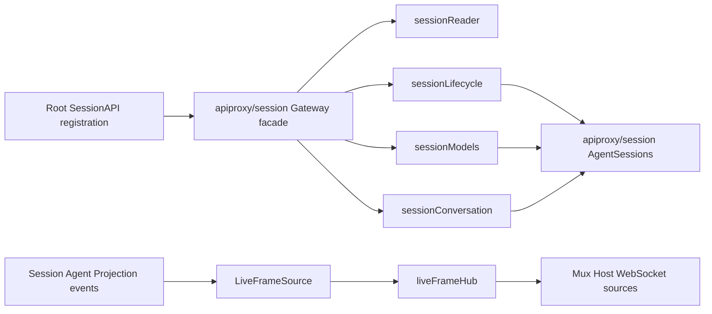

# 16 Session API Gateway 与实时 Frame 投影

状态：Accepted

本文拥有浏览器可达的 `session.*` API adapter、`agentDefaultModel`、Session/Agent 到 Mux/Host frame 的投影，以及这些边界的生命周期和失败语义。通用 method Catalog、RPC outcome 与 pending response 由[07 API Proxy 模块设计与实现](./07-api-proxy-module.md)拥有；Approval/Question 交互及其 pending replay 由[17](./17-approval-user-questions-and-interaction-gateway.md)拥有；Session Projection 与 Title 事实/调度由[18](./18-session-projection-and-title.md)拥有；Session Query 与可重建索引由[23](./23-session-query-and-search.md)拥有；Session 事实、Agent capability 和 Turn/Step 驱动分别由[10](../session/docs/design.zh-CN.md)、[14](./14-agent-registry-inbox-and-events.md)和[15](./15-agent-loop-and-request-driver.md)拥有；当前实施状态与验证证据只见[08 实施进度](./08-implementation-progress.md)。

## 1. 固定源与职责映射

固定源基线：`47f943859bef60e4160492346772ded9b24f765a`。

| 源 owner / symbol | Go owner | 保留职责 |
| --- | --- | --- |
| `packages/host/apiproxy/src/api/sessions.ts` | `apiproxy.SessionAPI`、`apiproxy/session.Gateway` façade 与 capability objects | Session 生命周期、历史、模型和输入 method 的业务错误与 capability 映射 |
| `packages/host/apiproxy/src/api-proxy.ts` 的 `sessions.search` | `apiproxy.SessionSearchAPI`、`apiproxy/session.SearchGateway` | `session.search` 固定产品范围、可见性过滤、分页消耗与 wire 映射 |
| `packages/host/apiproxy/src/api/sessions.schema.ts` | `apiproxy/session_decode.go`、`session_api.go` | request/result union、字段缺失和 closed discriminant |
| `packages/host/apiproxy/src/api-proxy.ts` 的 `sessions` 与 `events` | `apiproxy.LiveFrameSource`、`live_frame_hub.go` | Session baseline/live 与 Host edge frame 投影 |
| `packages/core/agent-default-model/src/index.ts` | `agentdefaultmodel.DefaultModel` | 未显式选择或未记录模型时的 live deployment default |
| `packages/core/agent/src/model-selection.ts` | `agent.ModelSelectionRef` | 当前选择的优先级与单步 assembly snapshot |
| 源 Web Client 的 `WebApiClient.sessions/events` | 仅作为 contract oracle | method/path/payload/frame 的兼容验证，不进入 Go 运行时 |

Go 不复制 Typert Host Gateway、schema 代码生成或浏览器 Connection。现有 TypeScript Client 直接使用相同 HTTP/WebSocket wire contract；Go 侧用显式 request decoder、consumer-owned interface 和 Echo carrier 完成服务端职责。

## 2. 职责与非职责

Session API adapter 层拥有：

- `apiproxy/session.Gateway` façade 实现 `session.list`、`session.create`、`session.rename`、`session.history`、`session.models`、`session.selectModel`、`session.prompt`、`session.updateQueue` 和 `session.cancel`，但不集中持有各 method 的依赖；
- `sessionReader`、`sessionLifecycle`、`sessionModels` 与 `sessionConversation` 分别拥有读取、生命周期、模型和对话用例；
- `apiproxy/session.AgentSessions` 拥有 Session 对应 Agent 的并发 acquisition、cold activation、adoption 校验与 `ModelSelectionRef` 生命周期；
- `apiproxy/session.SearchGateway` 中独立的 `session.search`，包括 list-equivalent 可见性、固定 user/assistant current-surface 范围和结果裁剪；
- wire DTO 到 `agents`、`sessions`、`llm`、`agentDefaultModel`、`sessionProjections`、`sessionTitle` capability 的映射；
- attached Session summary、history page、model directory、pending queue 等浏览器消费方 projection；
- `LiveFrameSource` 拥有 scoped observer，并把 Mux 的 Session baseline/live frame 和 Host 的 membership/status/error edge 交给内部 `liveFrameHub`；
- 每个 stream subscriber 的有序投递、Session `seq` high-water mark 和 shutdown；
- API 层业务错误到 canonical RPC error 的转换。

Session API Gateway 不拥有：

- Session event 的产生、排序和持久化；
- Agent Turn/Step、LLM retry、Tool 执行或 durable Inbox mutation；
- Echo、WebSocket、Origin policy 或 RPC envelope；
- provider model catalog 的来源和模型解析规则；
- Workspace registry、Attachment service、Agent Preset roster、Settings、approval/question、Jobs 或 persistence repair。

因此 `apiproxy/session.Gateway` 只是实现稳定 `apiproxy.SessionAPI` method set 的 inbound façade，不是 Session 或 Agent 的第二套领域服务，也不拥有实时订阅。内容检索有独立的 Query 与可见性依赖，所以由同子包的 `SearchGateway` 承担；连接级实时状态由根 `apiproxy.LiveFrameSource` 承担；Agent activation 状态由 `AgentSessions` 承担。没有真实 Provider 的能力必须返回明确业务失败，不能以空结果或固定成功占位。

### 2.1 实现对象与依赖方向

| 对象 | 拥有的变化原因 | 直接下游 |
| --- | --- | --- |
| `apiproxy/session.Gateway` | `SessionAPI` façade compatibility | 四个 unary capability objects |
| `sessionReader` | list、history、visibility 的读取与 wire projection | Agent Registry、Session LiveStore、Persistence、Projection Registry |
| `sessionLifecycle` | create、rename 与 Workspace accounting | `AgentSessions`、Title Service、Workspace Registry |
| `sessionModels` | model catalog、route validation 与 selection | `AgentSessions`、LLM Runtime、Default Model |
| `sessionConversation` | prompt、queue mutation 与 cancel | `AgentSessions`、LLM Runtime、Agent capability |
| `apiproxy/session.AgentSessions` | create/resume/adopt 串行化和 selection ref 生命周期 | Agent Registry、Session LiveStore、Persistence、Default Model、Directory Provisioner |
| `LiveFrameSource` | scoped observer 与 Mux/Host/interaction frame publication | Session LiveStore、Projection Registry、`liveFrameHub` |
| `liveFrameHub` | subscriber baseline、ordering、high-water 与 pending replay | subscriber delivery queue |



`apiproxy/session` 不含 wire DTO，也不复制根 `session` 领域。实现子包依赖根 `apiproxy` 的 typed protocol contract；根包不依赖实现子包。Assembly 同时导入两者，把 `Gateway`/`SearchGateway` 注册为根接口，因此不存在 import cycle 或 ownerless global model。

## 3. 十个 `session.*` method

| Method | 下游 capability | 核心语义 |
| --- | --- | --- |
| `session.list` | Session LiveStore、Agent Registry | 只列 attached 且有 `cwd` 的 Session；`blank` 由是否出现 `turn/start` 决定，`running` 读取 live Agent，`updatedAt` 取最近 direct user message，按新到旧返回 |
| `session.create` | Directory Provisioner、Agent Registry | 生成或采用指定 ID，确定 `cwd` 并确保目录存在；相同 ID/`cwd` 幂等，subagent、preset 或 `cwd` 不一致时拒绝 |
| `session.rename` | Agent Registry、Session Title | 只接受 ordinary live Session；把 raw title 交给 Title Service 规范化和 pin，返回 accepted `{title, seq}`；控制字符归一为空时返回 `title-invalid` |
| `session.history` | Session LiveStore、Session Projection | 不激活或 resume Agent；按 append-origin message 边界向前分页，返回 raw event projection 与 `hasMore`；tail page 携带与同一 event cut 对齐的 projection block |
| `session.search` | Session Query、Session Visibility | 搜索固定的 current user/assistant message surface；消费 Provider 全局排序页后执行与 `session.list` 相同的可见性校验，返回至多 20 个 Session ID 与 240 Unicode code point snippet |
| `session.models` | Agent、LLM Runtime | 返回 Session 当前选择和逐 Provider model group；一个 Provider 目录失败不阻断其他 Provider |
| `session.selectModel` | LLM Runtime、Model Selection、Default Model | 精确解析 provider/model/effort；Session 已含 image 时检查输入模态；更新下一步选择，保存默认选择失败不回滚本次选择 |
| `session.prompt` | Agent capability | 校验当前 route、时区和 content；以 `rpcId`/`clientTimeZone` 形成 user provenance，按 `queue` 或 `steer` 进入 Agent |
| `session.updateQueue` | Agent Inbox | 按 exact message occurrence 执行 `edit`、`remove` 或 `steer`；编辑只接受 text，但保留已接受 text block 的扩展字段 |
| `session.cancel` | Agent capability | 发布 `UserCancel`，并以 `KeepInbox=true` 停止当前 Turn 而保留尚未消费的后续输入 |

`session.create` 的并发去重只共享同一 ID 的 acquisition，不共享调用者的 adoption policy。等待者在得到已创建对象后仍重新检查自己的 `cwd` 与 `agentPreset`，避免一个宽松请求替另一个冲突请求作出决定。

当前 Workspace Service 已进入默认组合：`session.create({workspaceId})` 读取 Workspace canonical path 作为 Session `cwd`，创建后执行 accounting；未知 ID 与 attach failure 使用各自稳定错误，完整边界见[20](./20-workspace-registry-and-api.md)。没有 Attachment Service，因此 prompt image 和非 text queue edit 返回 attachment failure。history 中的 Tool view 只有对应 presenter/provider 进入组合后才出现，不能由 API adapter 猜测。Title 的规范化、fallback、Provider 调度、source union 与 projection fold 均由[18](./18-session-projection-and-title.md)拥有，Gateway 只做调用和 wire 映射。

## 4. 默认模型与 Session 选择优先级

`agentDefaultModel` 是独立 Service Definition。当前 shipped Provider 从 typed config 提供 deployment default；未来 Settings Provider 可替换其读取/保存实现，而不改变 Session API 或 Agent Loop。

`ModelSelectionRef.Current()` 按以下优先级解析下一步选择：

1. 当前进程中由 `session.selectModel` 显式设置的选择；
2. Session 已记录的最近 request/header 选择；
3. 调用时读取的 live `agentDefaultModel`。

空白 Session 因而会读取最新 default；已经记录 request/header 的 Session 保持其可重建选择。System Prompt assembly 开始时捕获一次 selection，当前 Step 的 request 始终使用该 snapshot；并发切换只影响后续 Step。默认值读取、模型目录和 exact route resolution 仍由各自 owner 提供，Gateway 不维护硬编码 model catalog。

## 5. Mux baseline 与 live projection

Mux WebSocket 打开时先把订阅者登记到 hub，再在同一同步边界读取 Session baseline：

```text
GET /api/events.mux
  -> register subscriber
  -> each attached Session: session/subscribed(lastSeq)
  -> each pending question: question/requested(stable rpcId)
  -> each pending approval: approval/requested(stable rpcId)
  -> each non-empty pending Inbox: session/queue(items)
  -> drain ordered live delivery queue
```

`session/subscribed.lastSeq` 是该 subscriber 的 per-Session high-water mark。后续 committed event 仅在 `event.seq > highwater` 时投递；baseline 读取期间迟到的同一 callback 不会重复发送已经纳入 snapshot 的 event。pending 交互的内容、结算与 replay identity 由[17](./17-approval-user-questions-and-interaction-gateway.md)拥有；本模块的 `liveFrameHub` 只通过 `InteractionFrameBroker` 在同一个 subscriber registration/publish 临界区插入其 baseline，避免 open 与 live publish 之间丢帧。

Inbox mutation 的 live 顺序为：

```text
Session append commits agent/inbox/spliced
  -> durable queue fold
  -> session/queue complete snapshot
  -> session/event committed event
```

queue snapshot 必须先于对应 event，客户端看到 event 时不会短暂保留旧队列。投影从 durable Session facts fold，不以 callback 时刻的可变 Inbox 为真相，因此 Session observer 先于 Inbox apply 执行也不会得到错误快照。

通用 projection 使用另一条 whole-value feed：

```text
Session event committed
  -> SessionProjection Unit fold
  -> session/projection(sessionId, key, value, causing seq)
```

`session.list.items[].projections` 是当前 attached Session 的 snapshot；`session.history.projections` 只出现在没有 `beforeSeq` 的 tail page。History 先取得 detached events，再从这同一份 events 恢复 projection，因而 `asOfSeq` 与响应日志尾一致。older page 不携带 baseline。客户端按 key 保存 `{value, seq}`，只有更高 seq 可覆盖现值；`session.rename` 成功结果与随后 frame 使用同一 title event seq。

纯 frame 的 `rpcId` 在 API Proxy 出口生成。ID 生成失败会通过 observer/reporting 链返回；event frame 未成功生成时不能推进 high-water mark，否则该 subscriber 会永久漏失 committed event。

## 6. Host edge 与 reconnect

Host WebSocket 只发送进程级变化：

- `host/session-added` 与 `host/session-removed`；
- `host/session-status`；
- `host/session-error`。

Host stream 不重复发送全量 baseline。重连后的 authoritative baseline 由 `session.list` 获取，单 Session 历史由 `session.history` 获取；Mux 通过 `session/subscribed(lastSeq)`、pending interaction replay 和 queue snapshot 重建当前进程内的订阅位置。Gateway 的 list 合并 live LiveStore 与 cold Persistence，history 对 cold Session 使用 validated inspection，create 指定已有 cold identity 时通过 Agent Factory resume。这样 Host edge 不伪装成持久化日志，也不会与 list baseline 形成双重 owner；live replay table 仍不冒充进程重启后的 callback/socket 恢复。

## 7. 并发、背压、失败与生命周期

Session/Agent callback 不能被某个慢 WebSocket 的写入阻塞。每个 subscriber 因此拥有独立的有序 delivery queue：producer 只在 hub lock 下生成并入队 frame，Connection goroutine 再按序写 socket。该 queue 是进程内实时传递机制，不是业务存储，也不改变 Session durability。

`AgentSessions` 在 API Proxy Plugin Scope 内安装 Agent dispose listener，只清理与被释放实例匹配的 selection ref。`LiveFrameSource` 在同一 Scope 内安装 Session/Agent/Projection listener，并由该 Scope 关闭 `liveFrameHub` 和 subscriber queue。socket disconnect 只取消该 stream source；它不会推断用户要取消 Agent Turn。只有显式 `session.cancel` 才映射为 `UserCancel`。Session commit 已经发生后，projection observer error 只能被报告，不能否决或回滚业务事实。

## 8. 上下游交互流程

请求方向：

```text
TypeScript WebApiClient
  -> Echo Connection Host
  -> API Proxy Catalog + method-owned decoder
  -> apiproxy/session.Gateway facade
  -> reader / lifecycle / models / conversation object
  -> AgentSessions or direct consumer-owned capability
  -> typed Outcome
  -> ServerResponse
```

事件方向：

```text
Agent Loop
  -> Session append / Agent status
  -> LiveFrameSource scoped listeners
  -> Session/Host projection
  -> liveFrameHub + per-subscriber delivery queue
  -> API Proxy EventStreams
  -> Connection WebSocket carrier
  -> TypeScript WebApiClient
```

wire DTO 止于 `apiproxy`；Agent、Session、LLM 和默认模型包不依赖 Connection 或 frame type。反方向的 Session facts 也不为浏览器 projection 增加字段。

搜索请求走独立链路：

```text
session.search
  -> apiproxy/session.SearchGateway
  -> Gateway.VisibleSessionIDs
  -> session/query.QueryService.SearchSessions
  -> disposable SQLite FTS index
  -> visibility and fixed-surface validation
  -> SessionSearchValue
```

`SearchGateway` 不复用 `session.list` 的 wire DTO 作为授权 contract，只通过最小 `Visibility` 接口取得 ID 集合；Query Service 也不认识浏览器权限或 wire result。

## 9. 后续能力进入规则

- Approval/Question 已由[17](./17-approval-user-questions-and-interaction-gateway.md)持有 pending、requested/resolved frame、replay 和 result schema；新增 interaction 必须复用同一 generic correlation 与 broker seam，不能把具体 schema 塞回 Session Gateway；
- `session.search` 已通过独立 `apiproxy/session.SearchGateway` 注册；它的 Query 语义见[23](./23-session-query-and-search.md)，不能回收到主 `Gateway` 或 SQLite fact Backend；
- Session Fork 明确排除，不注册 method、Factory 或占位；attachment method 只有在真实 Attachment capability 进入后才注册；
- Session Title 的 first-prompt/all-prompts LLM 生成由同一个 Session Title 插件内的策略对象拥有；不能把模型调用塞进 `Gateway`；
- JSONL、SQLite/sqlc 只实现业务事实存取 adapter，resume/load/repair 由 `session/persistence.SessionLogStore` 决定；
- Tool view、projection、remote event 和 Workspace frame 由相应 Provider 贡献，不能在 `Gateway` 中加入 optional global model；
- 新增 method 必须经过 method-owned typed decoder、业务 success/failure/cancel 和固定源 Client/schema contract；
- 浏览器 Connection、Web UI、SDK、Typert generator 和 `!!js` 不因 Session Gateway 扩展而进入 Go 依赖闭包。
