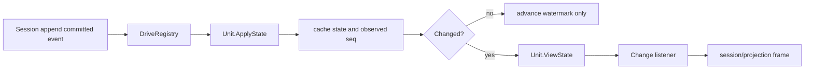

# 18 Session Projection 与 Session Title 模块设计

状态：Accepted

本文拥有通用 Session Projection Registry、`session/title` 事实、标题规范化与自动调度、`title` projection，以及它们进入 `session.*` wire contract 的边界。Session append 与生命周期由[10](./10-session-core-and-lifecycle.md)拥有，API 与 frame 映射由[16](./16-session-api-gateway-and-live-frames.md)拥有，实施证据只见[08](./08-implementation-progress.md)。

## 1. 固定源与职责映射

固定源基线为 `47f943859bef60e4160492346772ded9b24f765a`。

| TypeScript owner | Go owner | 保留职责 |
| --- | --- | --- |
| `packages/session/session-projection` | `session/projection`（alias `sessionprojection`） | projection unit 注册、live fold、snapshot、checkpoint/restore 与 change feed |
| `packages/session/session-title`、`session-title-llm` 与两种 LLM Provider | `session/title`（alias `sessiontitle`） | `session/title`、fallback、rename/refresh、Provider 调度、模型请求策略与 `title` unit |
| `packages/host/apiproxy` 的 Session API | `apiproxy.SessionGateway` | list/history baseline、`session.rename`、`session/projection` frame |
| Client `ProjectionValueStore` 与 `Session.rename` | 固定源码 contract oracle | `key -> {value, seq}` 的 higher-seq-wins 与 rename 即时折入验证 |

TypeScript 的开放 projection key map 在 Go 中以 `json.RawMessage` 穿过框架边界。它是受 JSON 验证约束的 typed-erasure seam，不是业务回调中的 `any`：每个 domain unit 仍在自己的实现内解码和编码具体状态。

## 2. 责任边界

`sessionprojection` 只拥有框架机制：

- 注册 `Unit`，按 key 与 `StateVersion` 管理生命周期；
- 对 committed Session events 同步驱动每个 unit；
- 返回一个 log cut 上的 whole-value `Snapshot`；
- 生成或恢复非权威 `Checkpoint`；
- 发布带 `Session/key/value/seq` 的 whole-value change。

它不定义任何业务 key，不持久化 Session facts，不决定 API 字段，也不拥有数据库 transaction。

`sessiontitle` 只拥有标题能力：

- `session/title` 的 payload、source union 与不变量；
- 标题规范化、UTF-8 byte 上限和 deterministic fallback；
- `fallback`、`provider`、`user` provenance；
- Provider 注册、自动生成调度、supersession、refresh 与 user pin；
- `LLMProvider` 的 First-Prompt/All-Prompts 消息选择、route、预算、超时、流组装与输出校验；
- 分发前的 `session/title-llm-request` 模型可见请求事实；
- `title` projection unit。

它只通过 consumer-owned `LLMStreamer` 调用 provider-neutral LLM capability，不调用 HTTP、不依赖具体 adapter，也不产生 wire DTO。First-Prompt 与 All-Prompts 是同一个 `sessionTitlePlugin` 内的可配置策略对象，不是独立插件；具体 Provider/Model route 来自成对配置或 Session 已记录的 request route。

## 3. Projection Unit 契约

一个 `Unit` 提供：

- `Key()`：稳定、非空且去除首尾空白的 projection key；
- `StateVersion()`：checkpoint 失效版本；
- `InitialState()`：初始 plain JSON state；
- `ApplyState(state, event)`：对一条 committed event 计算下一状态；
- `ViewState(state)`：把内部 state 投影为客户端 whole value。

Go 没有 TypeScript `Object.is` 的 reference identity 语义，因此 `Transition.Changed` 必须显式声明这条 event 是否产生新 whole value。Registry 不通过反射或深比较猜测变化，也不会因 `Changed=false` 阻止 state watermark 前进。

同 key、同 `StateVersion` 的重复注册按引用计数共享定义；同 key 不同版本立即拒绝。最后一个 disposer 释放后，该 key 从后续 snapshot 中消失。

## 4. Live fold、cut 与恢复



首次读取或晚注册时，Registry 从 Session 的 detached event snapshot 建 cell；后续 live append 只折入尚未观察的 seq。`Snapshot` 在同一 Registry lock 内读取全部 unit，返回 `AsOfSeq` 与 whole values。

`Checkpoint` 只缓存 `{ver, seq, val}`。它可以丢弃、失效或从日志重建，不能成为业务事实。`RestoreFloor` 找出最低可用读取点；`Restore` 只接受连续 suffix，版本不兼容且缺少从 `seq=0` 的事实时拒绝，不能用空 state 伪造恢复成功。

当前内存 Registry 与未来 SQLite/sqlc projection adapter 是不同职责：Registry 决定 fold；adapter 只保存可重建 checkpoint。默认 Session Persistence 插件内部装配的 SQLite adapter 只保存 Header/Event facts，见[19](./19-session-persistence-and-sqlite.md)，不能被描述为 projection store 或独立 SQLite 插件。

## 5. `session/title` 事实

标题事件是 log-only 普通事件，不进入 model-visible surface：

```json
{
  "title": "重命名",
  "messageSeqs": [],
  "source": { "kind": "user" }
}
```

不变量如下：

- `title` 已规范化、非空且不超过配置的 UTF-8 byte 上限；
- `messageSeqs` 始终是 JSON array，严格递增、唯一且非负；
- `fallback` 恰好引用第一条 eligible user message；
- `provider` 至少引用一条请求内 message，并记录 Provider ID，可选记录实际 model route；
- `user` 必须使用空 `messageSeqs`，表示显式 rename。

最新合法 `session/title` 是当前 title。`titleProjectionUnit` 初始 whole value 为 JSON `null`，遇到标题事件后变为 JSON string，`StateVersion=1`。

## 6. 规范化、fallback 与 Provider 调度

规范化按固定源顺序去除 OSC/ANSI 控制序列、方向控制字符和其他不可见控制字符，再折叠空白、trim，并按 UTF-8 byte 边界截断。只含控制字符的 rename 因而归一为空并返回 `title-invalid`。

第一条 eligible direct user text 在 append publication 结束后生成 deterministic fallback。Go 使用 `session.DeferAfterEvent` 表达 TypeScript microtask 的时序：先让原 event 的全部 observer 完成并释放 append 重入 guard，再追加 `session/title`；不使用 sleep、重试或不受控 goroutine。

可选 `Provider` 声明 `AutomaticFirstPrompt` 或 `AutomaticAllPrompts`。Service 在 request header 与主 `llm/stream` route 对齐后才启动生成，向 Provider 传 detached messages 与 route。新请求、显式 rename、refresh、Session dispose、Provider dispose 或 Service close 都会使旧 revision 失效并取消 active call；迟到结果不能覆盖新标题。

默认组合在 Session Title typed config 中选择 First-Prompt；All-Prompts 使用同一 `LLMProvider` 对象和调用策略，只改变自动节奏与消息选择。两者都先记录完整 `session/title-llm-request`，其中包含 Provider ID、来源 seq、route、system、模型消息与 token 上限；验证失败发生在分发前时不写该事实，分发后的模型失败则保留请求事实和既有 fallback。

## 7. Rename 与客户端一致性

```mermaid
sequenceDiagram
    participant C as TypeScript Session
    participant A as API Proxy
    participant T as sessiontitle
    participant S as Session log
    participant P as sessionprojection

    C->>A: session.rename(raw title)
    A->>T: Rename(session, raw title)
    T->>T: normalize and pin user title
    T->>S: append session/title
    S->>P: committed event
    P-->>C: session/projection(key=title, value, seq)
    A-->>C: {title, seq}
    C->>C: apply title immediately; higher seq wins
```

`session.rename` 只对 ordinary live Agent Session 生效。成功结果返回规范化 title 与产生事实的 event seq；客户端 `Session.rename()` 可立即用该结果更新本地 `ProjectionValueStore`，随后到达的同 seq frame 是幂等 replay。

`session.list` 的 attached row 可携带当前 projection snapshot；`session.history` 只在 tail page 携带 projection block，older page 不携带。History 使用同一份 event cut detached fold，保证 `events` 与 `projections.asOfSeq` 描述同一日志位置。

## 8. 失败、取消与生命周期

- unit 初始值、transition、view 或 checkpoint 不是合法 plain JSON 时，当前 projection 操作失败；Registry 不保存半个 transition；
- list 的 projection 读取失败按源行为对该 row fail-soft，history 的一致 cut 失败映射为 RPC internal；
- projection frame 是 committed fact 的派生通知，推送失败不能回滚 title event；
- user rename supersede 所有 pending/active 自动生成，且 user title 保持 pinned，直到显式 `Refresh`；
- Provider disposer 先阻止新请求，取消 active work，再等待其退出；Service close 同样 drain；
- Session dispose 删除 Registry cell 并取消该 Session 的 title work；
- request cancellation 只控制显式 refresh/Provider call，不删除已经 committed 的 fallback 或 user title。

## 9. 依赖方向与后续进入规则

```text
sessiontitle -> sessionprojection -> session
sessiontitle -> llm event seam
apiproxy -> sessiontitle + sessionprojection
internal/assembly -> connect providers and consumers
```

Domain packages 不依赖 `apiproxy`、Echo、WebSocket、数据库 driver 或客户端类型。后续新增 projection key 时，由该业务 domain 提供 `Unit`；不得修改 Registry 为 optional-field global model。LLM title 功能由 `sessiontitle.LLMProvider` 状态对象消费窄 `LLMStreamer` port，`LogService` 只协调 revision 与事实提交；模型调用不得进入 `SessionGateway`。
