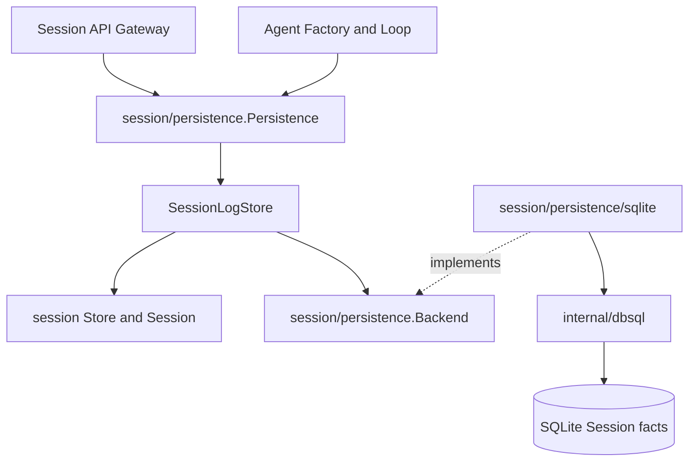
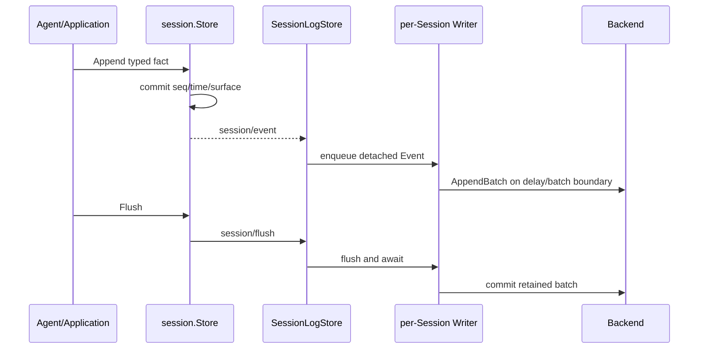
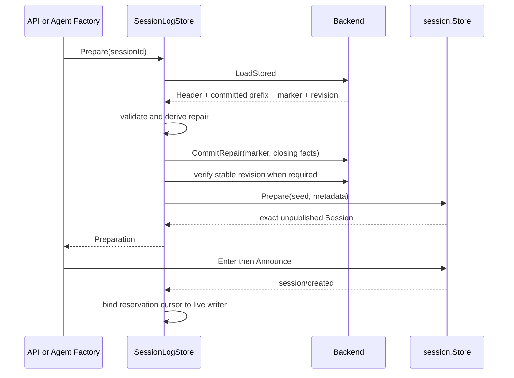

# 19 Session Persistence 与 SQLite 事实存储设计

状态：Accepted

本文拥有 durable Session facts、cold inspection/load、resume preparation、recovery 编排、write-behind 与 SQLite/sqlc storage adapter 的跨模块设计。Session core 的 Header/Event/surface/live Store 由[10](./10-session-core-and-lifecycle.md)拥有；Agent resume 与 API 映射分别由[15](./15-agent-loop-and-request-driver.md)和[16](./16-session-api-gateway-and-live-frames.md)拥有；Projection/Title 由[18](./18-session-projection-and-title.md)拥有；实施状态与验证证据只见[08](./08-implementation-progress.md)。

## 1. 固定源基线

设计以固定 TypeScript commit `47f943859bef60e4160492346772ded9b24f765a` 的下列 owner 为证据：

| TypeScript owner | Go owner | 保留职责 |
| --- | --- | --- |
| `packages/session/session-persistence/src/index.ts` | `session/persistence/contracts.go` | `Persistence` capability、stored/log view 与错误边界 |
| `coordinator.ts` | `session/persistence/session_log_store.go` | live/cold 协调、恢复、revision 与 preparation；Go 以对象身份命名为 `SessionLogStore` |
| `write-behind.ts` | `session/persistence/write_behind.go` | bounded-delay batch、flush、failure retention 与 drain |
| `invariant.ts` | `session/persistence/recovery.go` | Header/Event/seq/turn/tool invariant 与 recovery plan |
| `preparations.ts` | `SessionLogStore` reservation | unpublished Session identity 与 publication handoff |
| `session-persistence-sqlite/src/index.ts` | `session/persistence/sqlite` | SQLite fact backend、事务、revision 与 row mapping |
| `schema.ts` / `invariant.ts` | `sql/schema.sql`、`schema.go` | schema identity/version、打开时验证与存储不变量 |

Go 不复制 Node file API、TypeScript 类型生成或浏览器 Connection。公共 wire 字段、Session event envelope 与 Service 名 `sessionPersistence` 保持 canonical。源 SQLite package 同时承担插件与后端角色；Go 将插件身份收敛为 `@deepseek-ai/dsh-session-persistence`，把 SQLite 保留为 composition root 内的 `Backend` adapter，避免基础设施实现进入 Service graph。

## 2. 边界与依赖方向



依赖规则：

- `session` core 不依赖 persistence、SQLite、sqlc、API Proxy 或 Agent Loop；
- `Persistence` 是上游 Consumer 使用的完整 durability capability；
- `Backend` 是 `SessionLogStore` 拥有的 storage-only port，adapter 不决定业务恢复；
- SQLite/sqlc 类型止于 `session/persistence/sqlite`，映射后才返回 owner-defined contract；
- API Gateway、Agent Loop 不导入 SQLite driver，不按表结构编排 use case；
- JSONL、SQLite 和未来其他实现若进入，只能作为同一个 `Backend` port 的替换 adapter。

Plugin Runtime 只解析 Session Persistence capability：Factory 解码 `SessionPersistenceConfig`，构造当前内置 SQLite adapter 和 `SessionLogStore`，最终只 `Provide(sessionPersistence)`。SQLite 没有独立 Factory、Manifest、Service key 或依赖结算状态。这样更换 Backend 只改变 composition root 的构造选择，不要求 Agent、API、Workspace 或 Plugin Runtime 认识存储技术。

## 3. Store、Persistence 与 Backend

| 抽象 | 回答的问题 | 生命周期 | 数据 |
| --- | --- | --- | --- |
| `session.Store` | 当前进程有哪些已 attached 的 live Session？ | Plugin Scope / Session attachment | `*session.Session`、live membership、created/event/flush/disposed |
| `Persistence` | 跨进程有哪些 durable Session？如何检查、修复并恢复？ | durability plugin | detached Header/Event logical view、preparation |
| `Backend` | 如何原子读取或写入物理 records？ | `SessionLogStore` | stored prefix/suffix、revision、repair marker |

这三者不能合并。Store 中没有 cold record；Persistence 不能替代 live membership；Backend 不能创建 Session、选择 recovery event 或发布业务生命周期。

## 4. Persistence contract

| 方法 | 语义 |
| --- | --- |
| `Create` | 建立尚未 materialize 的 durable identity/cursor；不能覆盖已有事实 |
| `Append` | 验证连续 seq 后追加 detached events；不重新分配 seq |
| `Prepare` | 读取并提交必要 repair，再由 Store 创建唯一 unpublished Session，保留到 Enter/Announce 或 Dispose |
| `Load` | 返回 validated logical log；cold open state 的 recovery 会提交到 Backend |
| `Inspect` | 返回 validated 逻辑视图，但不改写 cold store；可包含按规则推导的临时 closers |
| `ReadFrom` | 从指定 seq 返回逻辑后缀；不是面向消息的 history pagination |
| `List` / `ListSnapshots` | 枚举 cold Header，或 Header 加 source-qualified revision |
| `Locate` / `ReadRaw` | 仅对能暴露 per-Session artifact 的 Backend 可用；SQLite 明确不支持 raw artifact |

`Load` 与 `Inspect` 不带 limit，因为它们验证的是完整 Session log 不变量。`session.history` 的 `beforeSeq/maxMessages` 属于 API consumer，不能下推后改变 recovery 或 surface 语义。后续可以让 `ReadFrom` 使用 Backend seek 优化，但返回的逻辑契约不变。

## 5. 正常写入与 durability



Event 在进入 persistence listener 前已是 committed fact，因此 storage failure 不能倒转 Session memory。write-behind 必须保留失败 batch、保持原顺序并让显式 flush 报错；不能推进 durable cursor 或伪报成功。第一次 materialization 的 Header 和首批 Events 必须处于同一 Backend transaction。

每个 Session ID 有独立串行 gate，不同 Session 可并行。同一 live Session 只有一个 writer owner；duplicate listener、不同 seed prefix、CWD 冲突或 durable identity collision 明确失败。

## 6. Cold load、recovery 与 resume



Recovery 检查：

- Header identity、format version 与 metadata canonical form；
- Event `seq` 从零连续、payload 为 lossless JSON、surface/provenance 合法；
- required event type 已由当前 build 注册；未知但 `ignorable=true` 的 extension 可跳过；
- torn physical tail 与 committed prefix 分离；
- open Turn/Step 和未闭合 Tool call 按 source invariant 生成 ordinary closing Events；
- repair 后完整日志再次通过相同 invariant。

Backend 只返回 marker 或 corruption 技术事实。`SessionLogStore` 决定删除哪段 torn tail、追加哪些 closers，并通过 `CommitRepair` 请求一个事务完成。`Prepare` 返回的必须是最终 Enter 的同一个 Session 对象；reservation 在 publication 或显式 Dispose 时释放，防止两个 Agent 同时恢复同一 identity。缓存 prepared read 只能是受 revision 校验和容量限制的优化，不是第二个真相。

## 7. SQLite/sqlc adapter

SQLite 是当前默认 Session fact Backend，不是插件或 projection cache。JSONL 若后续因 raw artifact、可移植导出或运维需求进入，是可替换 Backend；二者不双写，也不形成“JSONL 真相 + SQLite 影子”的强制架构。独立的 `session-query-sqlite` 仍是可从 facts 重建的查询索引。

### 7.1 目录所有权

```text
session/persistence/sqlite/
├── sql/schema.sql
├── sql/query.sql
├── sqlc.yaml
└── internal/dbsql/
```

`sqlc.yaml` 位于所属领域 adapter，不在仓库根目录。`schema.sql` 与 `query.sql` 是生成输入；`internal/dbsql` 是 repository-private 结果，不能手改或被业务包导入。

### 7.2 Schema

| 表 | 作用 |
| --- | --- |
| `persistence_state` | 单例 store identity，防止 revision 跨数据库误比较 |
| `sessions` | canonical Header fields、incarnation、monotonic revision |
| `events` | 以 `(session_id, seq)` 为主键的 Event envelope |

数据库使用 application id `0x44534850` 与 schema version 15。空数据库可初始化；已有对象但没有正确 identity/version、版本不匹配或 application id 不匹配时拒绝打开，不猜测 migration。

### 7.3 事务与 I/O

- 完整 prefix 读取在同一只读事务中取得 Header 与 Events；
- `AppendBatch` 原子插入首个 Session row、Events 并递增 revision；
- `CommitRepair` 原子删除 tail、追加 closers 并递增 revision；
- `foreign_keys=ON`、`busy_timeout=5000`、`synchronous=FULL`；journal mode 由 typed config 在允许集合内选择；
- 数据库连接限制为一个，避免 adapter 内无意引入跨连接写并发；
- 新目录和文件使用 owner-only 权限；credentials 不写入数据库。

sqlc 只生成查询调用；事务边界由 `Backend` method contract 与 `SessionLogStore` use case 决定，不能藏进 SQL trigger。Row decoder 验证 JSON、integer range、nullable field、surface operation 和 ignorable marker，再映射成 detached domain types。

## 8. API 与 Agent 集成

- `session.list` 合并 live Store 与 cold Persistence Header，并按 Session ID 去重；
- `session.history` 对 live Session 读 detached events，对 cold Session 用 `Inspect`，之后才执行 message pagination 与 projection restore；
- `session.create` 指定已有 cold identity 时走 `Prepare` 和 Agent Factory resume，不新建同 ID；
- 其他需要 Agent 的 `session.*` 调用可先恢复 cold Agent，再执行原 use case；
- Agent Loop 只接收已经 prepared 的 Session，恢复最后 Turn、Inbox、surface/header fold，并在下一次模型请求记录 `request/header(reason=resume)`；
- WebSocket reconnect baseline 仍由 list/history 和 Mux high-water 拥有，Persistence 不保存 socket、subscriber、pending callback 或 rpcId。

## 9. 生命周期、取消与失败

Persistence plugin 的 Scope 按 LIFO 停止：先释放 listener、拒绝新 admission，再 flush/关闭所有 writer，最后关闭 Backend。dispose 单个 Session 先 flush，再解除 live writer；durable facts 保留供 cold resume。

调用方 Context 控制 gate 等待、Backend read/write transaction 与显式 flush。定时 batch 使用服务生命周期；取消不能丢弃已经 committed 但尚未落盘的 batch。后台错误进入 observer/reporting，并在后续 flush 再返回；磁盘满、锁冲突、commit failure 和 shutdown timeout 都不能编码为空成功。

## 10. 后续能力进入规则

- 新 Backend 先实现同一 storage-only port，不复制 `SessionLogStore`/recovery；
- migration 只有在明确版本转换与 crash atomicity 后进入；不能自动接受未知 schema；
- projection checkpoint/query index 使用自己的 schema、owner 和 transaction，不向事实表加入 optional global model；
- raw artifact/export 是 capability，不为 SQLite 伪造 per-Session 文件；
- retention、fork、权限、workspace scope 和 search 由对应 use case owner 决定，Backend 只执行明确的 record operations；
- prepared cache、suffix seek、batch tuning 属于可验证优化，不能改变公开语义或绕过 revision/invariant。
